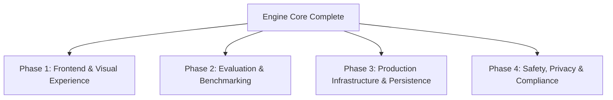

# ASKTHEPEOPLE: Next Tasks & Product Roadmap

Following the successful implementation of the **Core AI Simulation Engine Upgrade** (Memory Stream & Reflection Engine, Dynamic Topologies & Homophily Rewiring, Multi-Model Complexity Tiering, and Counterfactual Scenario Branching), this document outlines the next logical priorities to achieve full production readiness and a best-in-class user experience.

---

## 🗺️ Task Categories at a Glance

---

## 🎨 Phase 1: Frontend UI & Interactive Visualization

Now that the backend supports scenario branching, dynamic topologies, and reflection streams, the frontend needs rich visual controls to surface these features to users.

> [!IMPORTANT]
> The frontend is **Vue 3 + Vite** (`frontend/src/**/*.vue`), not React. Library
> suggestions below are framework-neutral or Vue-compatible for that reason; an
> earlier revision of this document named React-only packages, which would have
> sent the first implementer down a rewrite.

### 1. Counterfactual Scenario Branching UI
- [ ] **Simulation Timeline & Tree View**: Build an interactive tree diagram (e.g. using `Vue Flow` or `D3.js`, both of which mount inside a Vue component) representing simulation branches. The data is ready: `/api/simulation/list` and `/history` carry `forked_from` and `forked_at_turn`, so the tree is assemblable from one request.
- [x] **Fork Action Button**: `frontend/src/components/ForkRunControl.vue`, mounted in `SimulationRunView.vue` and shown once the run has stopped (branching mid-run would copy a directory the runner is still writing to). Branch provenance is shown on the recent-runs list in `Home.vue`.
- [ ] **Branch Comparison View**: Side-by-side metric comparison card allowing users to compare outcomes between Branch A (e.g. control) and Branch B (e.g. injected event).

### 2. Network Topology & Emergent Bubble Visualizer
- [ ] **Live Agent Graph Canvas**: Render an interactive network graph of agents and edges using `Cytoscape.js` or `Force-Directed D3` (both are framework-agnostic; `frontend/src/components/GraphPanel.vue` is the existing mount point).
- [ ] **Real-Time Edge Rewiring Animation**: Animate unfollow actions when homophily rewiring drops an edge between disagreeable peers.
- [ ] **Community & Cluster Highlights**: Color-code agent nodes by their political/social stance to visually highlight emerging filter bubbles.

### 3. Agent Inspector Drawer & Reflection Stream
- [ ] **Agent Profile Inspector**: Clicking an agent node opens a drawer displaying their `user_char`, current stance, and relationship edges.
- [ ] **Reflection Memory Timeline**: Display the agent's periodic reflection stream with importance scores and memory synthesis history.

---

## 📊 Phase 2: Evaluation & Benchmark Suite

To validate the synthetic simulation against real-world opinion distributions while abiding by the Product Truth Contract.

### 1. Persona Consistency & Drift Metric
- [ ] **Automated Persona Drift Evaluator**: Implement an evaluation module that scores agent persona retention over 20+ simulation turns.
- [ ] **Baseline Benchmarks**: Run regression tests against standardized survey benchmarks (e.g. ANES, Pew Research open datasets) to measure aggregate fidelity.

### 2. Multi-Model Comparison Testing
- [ ] **Provider Benchmarking Harness**: Automated test suite comparing simulation outcomes when using OpenAI, Anthropic, or local open-weights models (via Ollama/vLLM) for the `complex` and `routine` tiers.

---

### 3. Behavioural modules awaiting a data seam

Three modules under `backend/app/services/` are implemented and tested but have
no production importer. Each is blocked on **inputs the product does not have**,
not on plumbing — wiring them today would mean inventing the quantities they
consume and then letting those invented numbers drive agent behaviour.

| Module | Consumes | Why it is not wired |
|---|---|---|
| `constraint_engine.py` | `check_feasibility(actor, action)` — actors with typed, **numeric** capacities (budget, time, authority) and Actions with numeric requirements | Agent profiles carry persona text, Big Five traits and an entity role. There are no capacity figures. `trait_behavior_projection.py` already expresses role limits as prose, labelled "design choices, not measured values"; replacing that with invented numbers that gate behaviour would be a stronger claim on a weaker basis. Its real seam is an action-proposal loop where agents attempt actions and the engine gates them — a feature that does not exist yet. |
| `game_theory.py` | `NormalFormGame` — explicit players, strategy sets and **payoff matrices** | No payoffs exist anywhere in the simulation. They would have to be authored per scenario, which is a methodology decision (ADR territory), not an integration. |
| `calibration_metrics.py` | `brier_score`, `expected_calibration_error`, `auc_roc` — (probability, **realised outcome**) pairs | The product has no ground truth and says so: `claim_boundary.py` discloses `"forecast_status": "not a forecast"` and `"calibration": "not_calibrated"`. Publishing a Brier score would contradict the Product Truth Contract, which AGENTS.md rule 2 calls non-negotiable. Its seam is **Phase 2's benchmark work** below — real survey data (ANES, Pew) gives outcomes to score against, and only then is calibration a truthful claim. |

Until then they are a staging area, not dead weight to delete: each has passing
tests and a documented purpose. Deleting them loses that work; wiring them
fabricates data. Both are product decisions, so this records the state rather
than forcing one.

---

## ⚙️ Phase 3: Production Infrastructure & Persistence

Transitioning from local SQLite observation stores to production-grade scalable infrastructure.

### 1. Database Migrations (PostgreSQL + Alembic)
- [x] **Alembic Setup**: Initialized — see `backend/alembic.ini` and `backend/migrations/versions/384c98f88d53_initial_schema.py`.
- [ ] **Multi-Tenant Isolation**: `tenant_id` exists in `backend/app/db/schema.py`; still to do is enforcing it at the query layer and adding `organization_id` foreign key constraints across `Simulation`, `Attempt`, and `Observation`.

### 2. Worker Scaling & Queue Monitoring
- [ ] **Celery Flower Dashboard**: Add Flower container and configuration to `docker-compose.yml` for monitoring Celery background workers.
- [ ] **Redis Cluster & Storage Isolation**: Configure persistent volume mounts for Redis and task queue isolation.

---

## 🛡️ Phase 4: Governance, Safety & Telemetry

### 1. Synthetic Disclosure & Product Truth Verification
- [ ] **Automated Copy Linter**: Ensure all newly generated UI views and export reports include non-causal disclosures ("synthetic exploration", "non-representative sample").
- [x] **CoT Scrubbing Verification**: `strip_reasoning_scaffold()` in `backend/app/services/report_agent.py` runs at every section finalisation point and both `chat()` return paths; `backend/tests/test_reasoning_scrub.py` covers it. Scrubbing at the point section text is produced also covers the export bundles, which derive from that text. Two paths previously adopted the model response whole when the `Final Answer:` marker was absent, so the ReACT preamble became the published section.
  - [ ] Remaining: an end-to-end assertion over a generated PDF/CSV/executive bundle, rather than over the section text they are built from.

---

## 🎯 Recommended Next Immediate Task

> [!TIP]
> **Recommended First Step**: Start with **Phase 1.1 & 1.2 (Frontend UI for Branching and Network Graph Visualizer)**. Surfacing the newly built backend capabilities in the Civic Wayfinding UI will immediately provide visual proof of the dynamic filter bubbles and counterfactual branching!

> [!IMPORTANT]
> **Phase 1.1 status.** `POST /api/simulation/<id>/fork` works and records
> lineage (`forked_from`, `forked_at_turn`, `forked_at`), carried by
> `/api/simulation/list` and `/history`, so a branch tree can be assembled from
> one request. The recent-runs list in `frontend/src/views/Home.vue` marks
> branches with their parent and branch point.
>
> Still to build: the **fork action** (`forkSimulation()` is exported from
> `frontend/src/api/simulation.js` and still has no caller) and the **tree /
> comparison views**. The fork action needs a home —`Step5Interaction.vue` is
> the execution view but is ~82KB, which cuts against the API decomposition
> work.
>
> Note for whoever builds the tree view: `frontend/src/components/HistoryDatabase.vue`
> also lists runs and looks like the obvious place, but it is dead code. The
> Direction C redesign (`d57898f`) removed `<HistoryDatabase borderless />` and
> its import from `Home.vue` on purpose; nothing imports it now, no route
> renders it, and it is absent from the built bundle. Reviving it would reverse
> that design decision.
