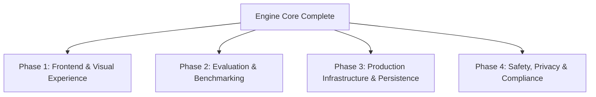

# ASKTHEPEOPLE: Next Tasks & Product Roadmap

Following the successful implementation of the **Core AI Simulation Engine Upgrade** (Memory Stream & Reflection Engine, Dynamic Topologies & Homophily Rewiring, Multi-Model Complexity Tiering, and Counterfactual Scenario Branching), this document outlines the next logical priorities to achieve full production readiness and a best-in-class user experience.

---

## 🗺️ Task Categories at a Glance

---

## 🎨 Phase 1: Frontend UI & Interactive Visualization

Now that the backend supports scenario branching, dynamic topologies, and reflection streams, the frontend needs rich visual controls to surface these features to users.

### 1. Counterfactual Scenario Branching UI
- [ ] **Simulation Timeline & Tree View**: Build an interactive tree diagram (e.g. using `React Flow` or `D3.js`) representing simulation branches.
- [ ] **Fork Action Button**: Add a "Fork Simulation from Turn X" modal in the simulation execution view.
- [ ] **Branch Comparison View**: Side-by-side metric comparison card allowing users to compare outcomes between Branch A (e.g. control) and Branch B (e.g. injected event).

### 2. Network Topology & Emergent Bubble Visualizer
- [ ] **Live Agent Graph Canvas**: Render an interactive network graph of agents and edges using `Cytoscape.js` or `Force-Directed D3`.
- [ ] **Real-Time Edge Rewiring Animation**: Animate unfollow actions when homophily rewiring drops an edge between disagreeable peers.
- [ ] **Community & Cluster Highlights**: Color-code agent nodes by their political/social stance to visually highlight emerging filter bubbles.

### 3. Agent Inspector Drawer & Reflection Stream
- [ ] **Agent Profile Inspector**: Clicking an agent node opens a drawer displaying their `user_char`, current stance, and relationship edges.
- [ ] **Reflection Memory Timeline**: Display the agent's periodic reflection stream with importance scores and memory synthesis history.

---

## 📊 Phase 2: Evaluation & Benchmark Suite

To validate the synthetic simulation against real-world opinion distributions while abiding by the Product Truth Contract.

### 1. Persona Consistency & Drift Metric
- [ ] **Automated Persona Drift Evaluator**: Implement an evaluation module that scores agent persona retention over 20+ simulation turns.
- [ ] **Baseline Benchmarks**: Run regression tests against standardized survey benchmarks (e.g. ANES, Pew Research open datasets) to measure aggregate fidelity.

### 2. Multi-Model Comparison Testing
- [ ] **Provider Benchmarking Harness**: Automated test suite comparing simulation outcomes when using OpenAI, Anthropic, or local open-weights models (via Ollama/vLLM) for the `complex` and `routine` tiers.

---

## ⚙️ Phase 3: Production Infrastructure & Persistence

Transitioning from local SQLite observation stores to production-grade scalable infrastructure.

### 1. Database Migrations (PostgreSQL + Alembic)
- [ ] **Alembic Setup**: Initialize Alembic migration scripts for the SQLAlchemy models defined in `backend/app/db/schema.py`.
- [ ] **Multi-Tenant Isolation**: Add `tenant_id` and `organization_id` foreign key constraints across `Simulation`, `Attempt`, and `Observation` tables.

### 2. Worker Scaling & Queue Monitoring
- [ ] **Celery Flower Dashboard**: Add Flower container and configuration to `docker-compose.yml` for monitoring Celery background workers.
- [ ] **Redis Cluster & Storage Isolation**: Configure persistent volume mounts for Redis and task queue isolation.

---

## 🛡️ Phase 4: Governance, Safety & Telemetry

### 1. Synthetic Disclosure & Product Truth Verification
- [ ] **Automated Copy Linter**: Ensure all newly generated UI views and export reports include non-causal disclosures ("synthetic exploration", "non-representative sample").
- [ ] **CoT Scrubbing Verification**: Add integration tests verifying that raw Chain-of-Thought reasoning tags are scrubbed from all API responses and export bundles.

---

## 🎯 Recommended Next Immediate Task

> [!TIP]
> **Recommended First Step**: Start with **Phase 1.1 & 1.2 (Frontend UI for Branching and Network Graph Visualizer)**. Surfacing the newly built backend capabilities in the Civic Wayfinding UI will immediately provide visual proof of the dynamic filter bubbles and counterfactual branching!
