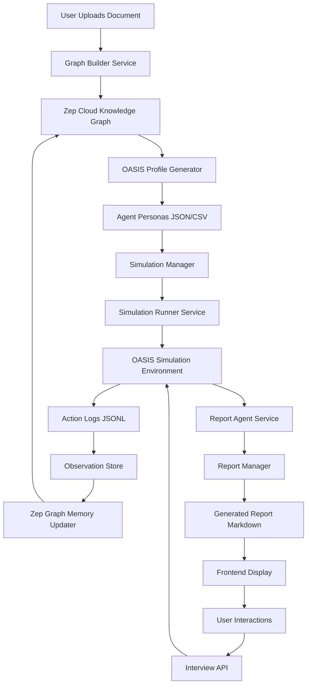

<div align="center">

# ASKTHEPEOPLE

**Crowd Intelligence Engine — Predict Anything**

[](https://choosealicense.com/licenses/agpl-3.0)
[](https://www.python.org/downloads/)
[](https://nodejs.org/)
[](https://www.docker.com/)
[](https://github.com/psf/black)

</div>

---

## Table of Contents

- [Deep-Dive Introduction](#deep-dive-introduction)
- [Meticulous Feature Breakdown](#meticulous-feature-breakdown)
- [Exhaustive File & Architecture Breakdown](#exhaustive-file--architecture-breakdown)
- [Prerequisites & Installation](#prerequisites--installation)
- [Usage Guide](#usage-guide)
- [Possibilities & Roadmap](#possibilities--roadmap-future-scope)
- [Contributing Guidelines](#contributing-guidelines)
- [License & Acknowledgments](#license--acknowledgments)

---

## Deep-Dive Introduction

### What is ASKTHEPEOPLE?

**ASKTHEPEOPLE** is a next-generation AI-powered crowd intelligence simulation engine that enables users to predict future outcomes by constructing and running high-fidelity parallel digital worlds. By leveraging multi-agent technology, the system simulates complex social dynamics across multiple platforms, providing unprecedented insights into how events, policies, and decisions might unfold in real-world scenarios.

### Why Was It Built?

Traditional prediction methods—surveys, expert panels, statistical models—often fail to capture the emergent, unpredictable nature of human social behavior. Individual decisions, when aggregated across thousands of agents with independent personalities, memories, and behavioral logic, produce phenomena that no single expert could anticipate. ASKTHEPEOPLE was built to bridge this gap by:

- **Modeling Collective Intelligence**: Simulating thousands of autonomous agents interacting in real-time to observe emergent behaviors
- **Testing "What-If" Scenarios**: Enabling decision-makers to inject variables from a "god's-eye view" and observe potential futures
- **Providing Evidence-Based Predictions**: Generating detailed reports backed by actual simulation data, not speculation

### What Specific Problem Does It Solve?

ASKTHEPEOPLE addresses several critical challenges in prediction and scenario planning:

| Challenge | Traditional Approach | ASKTHEPEOPLE Solution |
|-----------|---------------------|------------------------|
| **Unpredictable Emergence** | Static models assume linear cause-effect relationships | Multi-agent interactions generate non-linear, emergent outcomes |
| **Limited Perspective Diversity** | Small expert panels lack demographic breadth | Thousands of agents with varied backgrounds and personalities |
| **High Cost of Real-World Testing** | Pilot programs, surveys, focus groups are expensive and slow | Digital simulations run in hours, not months |
| **Lack of Actionable Detail** | High-level predictions without implementation guidance | Granular simulation data showing who says what, when, and why |
| **Single-Platform Blindness** | Studies often focus on one medium (e.g., surveys only) | Dual-platform simulation (Twitter + Reddit) captures cross-platform dynamics |

### Core Value Proposition

> **Input**: Upload any document (news article, policy draft, financial report, novel) + describe your prediction goal in natural language  
> **Output**: A detailed prediction report + a deeply interactive, high-fidelity digital world with thousands of simulated agents

This transformation—from static document to living simulation—enables:

- **Policy Makers**: To test communication strategies and public reception before implementation
- **Researchers**: To study information propagation and opinion formation in controlled environments
- **Business Strategists**: To anticipate market reactions to product launches or announcements
- **Creative Writers**: To explore alternative endings or scenario branches for narratives

---

## Meticulous Feature Breakdown

### 1. Intelligent Graph Construction

**What It Does**: Automatically extracts "reality seeds" from uploaded documents to construct a knowledge graph using GraphRAG (Graph Retrieval-Augmented Generation) methodology.

**Why It Matters**: Raw documents contain unstructured information—names, relationships, events, opinions—that must be systematically organized before simulation can begin. The graph construction process transforms free text into a structured representation that:

- Preserves entity relationships (who knows whom, who influences whom)
- Captures temporal information (when events occurred)
- Maintains source attribution (where each fact originated)
- Enables efficient retrieval during simulation and report generation

**How It Benefits Users**:

- **Zero Manual Curation**: Upload a PDF, DOCX, or text file—the system handles entity extraction, relationship mapping, and graph building automatically
- **Rich Context Injection**: Users can inject additional memories or knowledge directly into specific entities, enriching the simulation baseline
- **Graph Visualization**: Interactive D3.js-based graph panel allows users to explore entity relationships visually before simulation begins
- **Flexible Ontology**: Automatic ontology generation adapts to document content, creating entity types and relationship categories that fit the domain

**Technical Implementation**: Uses LLM-powered entity extraction with Zep Cloud's graph storage, supporting hybrid search (semantic + keyword) for rapid fact retrieval.

---

### 2. Advanced Agent Persona Generation

**What It Does**: Converts graph entities into detailed, realistic AI agent profiles with personalities, backgrounds, memories, and behavioral patterns.

**Why It Matters**: The quality of simulation predictions depends entirely on the realism of agent behavior. Generic or stereotyped personas produce predictable, unconvincing outcomes. ASKTHEPEOPLE generates rich, multi-dimensional personas by:

- Analyzing entity context from the graph (relationships, attributes, historical facts)
- Using LLM to craft detailed biographies, personality traits, and social media habits
- Distinguishing between individual personas (students, experts, officials) and institutional accounts (universities, media outlets)
- Assigning psychological attributes (MBTI types, emotional expression patterns, stance indicators)

**How It Benefits Users**:

- **Realistic Behavior**: Agents with detailed backgrounds and motivations produce authentic-looking posts, comments, and reactions
- **Diverse Perspectives**: Automatic generation ensures demographic and ideological diversity matching the source document
- **Platform-Specific Adaptation**: Personas are formatted differently for Twitter (short, hashtag-heavy) vs. Reddit (longer, community-focused)
- **Memory Integration**: Agents retain knowledge of events and relationships from the graph, enabling context-aware responses

**Technical Implementation**: The [`OasisProfileGenerator`](backend/app/services/oasis_profile_generator.py:116) service supports parallel persona generation with checkpointing, enabling large-scale simulations (100+ agents) to be created efficiently.

---

### 3. Dual-Platform Parallel Simulation

**What It Does**: Runs simultaneous social media simulations on Twitter-like and Reddit-like platforms, with thousands of agents posting, commenting, liking, and sharing in real-time.

**Why It Matters**: Different social platforms have distinct cultures, algorithms, and user behaviors. A simulation limited to one platform cannot capture cross-platform dynamics—how information spreads from Twitter to Reddit, how discussions evolve differently, or how platform-specific features (like Reddit's upvote system) influence outcomes.

**How It Benefits Users**:

- **Cross-Platform Insights**: Compare how the same event plays out on Twitter (fast, viral) vs. Reddit (deliberative, community-driven)
- **Platform-Specific Strategies**: Test platform-tailored messaging (e.g., thread format for Reddit vs. thread format for Twitter)
- **Emergent Phenomena Discovery**: Observe platform-unique behaviors like Reddit's "early upvote bias" or Twitter's "retweet cascades"
- **Real-Time Monitoring**: Watch simulations unfold with live action feeds, round summaries, and agent statistics

**Technical Implementation**: The [`SimulationRunner`](backend/app/services/simulation_runner.py:198) service manages background processes, logs all agent actions to JSONL files, and provides real-time status APIs. Supports:

- **Flexible Platform Selection**: Run Twitter-only, Reddit-only, or parallel simulations
- **Configurable Duration**: Set total simulation hours (default: 72 hours) and rounds per hour
- **Round Truncation**: Limit rounds for quick testing without full simulation
- **Process Cleanup**: Automatic termination of simulation processes on server shutdown

---

### 4. Intelligent Report Generation with ReACT

**What It Does**: Generates comprehensive prediction reports using a ReportAgent that employs the ReACT (Reasoning + Acting) pattern, autonomously calling retrieval tools to gather evidence before writing each section.

**Why It Matters**: Traditional report generation often produces generic summaries lacking evidence or specificity. The ReACT pattern ensures that:

- Every claim in the report is backed by retrieved simulation data
- The agent can "think" about what information it needs before writing
- Multiple tool calls per section enable cross-referencing and verification
- Citations are included for all quoted agent behaviors or statements

**How It Benefits Users**:

- **Evidence-Based Conclusions**: Reports cite specific agent actions, posts, and interactions from the simulation
- **Structured Analysis**: Automatic outline planning creates logical report structures (typically 3-5 sections)
- **Real-Time Progress**: Watch reports generate section-by-section with detailed logs showing tool calls and reasoning
- **Interactive Chat**: Ask the ReportAgent follow-up questions, and it will autonomously retrieve additional data to answer

**Technical Implementation**: The [`ReportAgent`](backend/app/services/report_agent.py:869) service provides:

- **Four Retrieval Tools**:
  - **InsightForge**: Deep analysis with automatic sub-query decomposition
  - **PanoramaSearch**: Wide-angle view including historical/expired facts
  - **QuickSearch**: Fast fact verification
  - **InterviewAgents**: Real-time interviews with running simulation agents
- **Required Analysis Types**: Reports must cover "Seed vs Emergence," "Platform Divergence," and "Uncertainty/Weak Evidence"
- **Chapter-by-Chapter Output**: Sections are saved immediately upon completion, no need to wait for full report

---

### 5. Deep Interaction & Interviewing

**What It Does**: Enables users to chat with any agent in the simulated world or with the ReportAgent, asking questions and receiving context-aware responses.

**Why It Matters**: Static reports, however detailed, cannot answer every question a user might have. Interactive interviewing allows:

- **Exploratory Analysis**: Probe specific aspects of the simulation that weren't covered in the report
- **Agent-Specific Perspectives**: Ask individual agents about their motivations, reactions, or future plans
- **Hypothesis Testing**: Pose "what if" questions to agents and observe their reasoning
- **Report Clarification**: Ask the ReportAgent to elaborate on specific points or provide additional evidence

**How It Benefits Users**:

- **Unlimited Exploration**: No fixed question set—ask anything about the simulation
- **Real Agent Responses**: Interviewing running agents returns their actual simulation-generated responses, not LLM approximations
- **Dual-Platform Interviews**: When available, interview agents simultaneously on both Twitter and Reddit for comparative insights
- **Persistent Memory**: Agents remember interview questions and can reference them in future interactions

**Technical Implementation**: The simulation maintains an IPC (Inter-Process Communication) server that accepts interview commands, executes them in the simulation context, and returns responses. The frontend provides a dedicated interaction view for seamless chatting.

---

### 6. Graph Memory Updates

**What It Does**: Dynamically updates the Zep knowledge graph with agent actions and observations as the simulation progresses, creating an evolving memory of the simulated world.

**Why It Matters**: Static graphs represent the initial state of the world, but simulations generate new facts, relationships, and entity states that should be preserved for:

- **Post-Simulation Analysis**: Query the graph for emergent patterns not visible in real-time
- **Historical Comparisons**: Run multiple simulations with different variables and compare graph states
- **Report Evidence**: Provide the ReportAgent with a complete picture of what happened, not just initial conditions

**How It Benefits Users**:

- **Evolving Knowledge Base**: The graph becomes richer with each simulation, capturing emergent phenomena
- **Temporal Queries**: Distinguish between "current" facts (latest simulation state) and "expired" facts (earlier rounds)
- **Enhanced Retrieval**: Future simulations can leverage historical data from previous runs
- **Evidence Traceability**: Every fact in reports can be traced back to specific simulation actions

**Technical Implementation**: The [`ZepGraphMemoryUpdater`](backend/app/services/zep_graph_memory_updater.py) service runs in a background thread, processing action logs and updating graph nodes and edges with new observations.

---

### 7. Robust Process Management

**What It Does**: Provides comprehensive lifecycle management for simulations and reports, including creation, monitoring, pausing, stopping, and cleanup.

**Why It Matters**: Long-running simulations (hours to days) require reliable process management to:

- **Prevent Resource Leaks**: Ensure background processes terminate cleanly
- **Enable Recovery**: Resume interrupted simulations from checkpoints
- **Provide Visibility**: Real-time status updates for users and monitoring systems
- **Handle Errors Gracefully**: Capture and report failures without crashing the entire system

**How It Benefits Users**:

- **Reliable Execution**: Simulations run unattended without manual intervention
- **Status Monitoring**: Check simulation progress, round counts, and action statistics via API
- **Flexible Control**: Stop, pause, or restart simulations as needed
- **Debugging Support**: Access detailed logs (simulation.log, agent_log.jsonl, console_log.txt) for troubleshooting

**Technical Implementation**: The system uses:

- **Background Processes**: Subprocess management with proper signal handling (SIGTERM, SIGINT)
- **State Persistence**: JSON files store run state, progress, and configuration
- **Cleanup Hooks**: Automatic process termination on server shutdown via `atexit` and signal handlers
- **Cross-Platform Support**: Windows (taskkill) and Unix (process group termination) compatibility

---

## Exhaustive File & Architecture Breakdown

### Project Structure Overview

```
ASKTHEPEOPLE/
├── backend/                      # Python Flask backend
│   ├── app/                     # Application code
│   │   ├── api/                # REST API endpoints
│   │   ├── models/              # Data models
│   │   ├── services/            # Core business logic
│   │   └── utils/               # Utility functions
│   ├── scripts/                  # Standalone simulation scripts
│   ├── tests/                    # Test suite
│   ├── requirements.txt            # Python dependencies
│   ├── pyproject.toml             # Project metadata (uv)
│   ├── run.py                    # Application entry point
│   └── uv.lock                  # Dependency lock file
├── frontend/                     # Vue.js frontend
│   ├── src/                      # Source code
│   │   ├── api/                # API client functions
│   │   ├── assets/             # Static assets (logos, images)
│   │   ├── components/          # Vue components
│   │   ├── router/              # Vue Router configuration
│   │   ├── store/               # State management
│   │   └── views/               # Page components
│   ├── public/                   # Public static files
│   ├── package.json              # Node.js dependencies
│   ├── vite.config.js            # Vite build configuration
│   └── index.html               # HTML entry point
├── static/                       # Static assets
│   └── image/                   # Screenshots and logos
├── .env.example                  # Environment variables template
├── .gitignore                    # Git ignore rules
├── docker-compose.yml             # Docker orchestration
├── Dockerfile                    # Container image definition
├── LICENSE                       # AGPL-3.0 license
├── package.json                  # Root package scripts
└── README.md                     # This file
```

### Backend Architecture

#### [`backend/app/`](backend/app/) - Application Core

**Purpose**: Contains the Flask application factory, configuration, and all business logic.

| File/Directory | Description |
|----------------|-------------|
| [`__init__.py`](backend/app/__init__.py:1) | Flask application factory, CORS setup, request logging, health check endpoint |
| [`config.py`](backend/app/config.py:1) | Configuration management, environment variable loading, secret key handling |
| [`api/`](backend/app/api/) | REST API blueprints organized by domain |
| [`models/`](backend/app/models/) | Data models for projects, tasks, and simulation state |
| [`services/`](backend/app/services/) | Core business logic services (simulation, reporting, graph management) |
| [`utils/`](backend/app/utils/) | Shared utilities (logging, LLM client, retry logic, file parsing) |

#### [`backend/app/api/`](backend/app/api/) - API Endpoints

| File | Endpoints | Description |
|------|------------|-------------|
| [`graph.py`](backend/app/api/graph.py:1) | `/api/graph/*` | Graph construction, entity management, relationship queries |
| [`simulation.py`](backend/app/api/simulation.py:1) | `/api/simulation/*` | Simulation lifecycle (start, stop, status, interview) |
| [`report.py`](backend/app/api/report.py:1) | `/api/report/*` | Report generation, progress tracking, chat interface |

#### [`backend/app/services/`](backend/app/services/) - Business Logic

| File | Responsibility | Key Classes/Functions |
|------|----------------|------------------------|
| [`graph_builder.py`](backend/app/services/graph_builder.py:1) | Constructs knowledge graphs from uploaded documents | `GraphBuilder`, entity extraction, GraphRAG implementation |
| [`simulation_runner.py`](backend/app/services/simulation_runner.py:1) | Manages simulation processes and state | `SimulationRunner`, `SimulationRunState`, action logging |
| [`simulation_manager.py`](backend/app/services/simulation_manager.py:1) | High-level simulation orchestration | `SimulationManager`, config generation, environment setup |
| [`report_agent.py`](backend/app/services/report_agent.py:1) | Generates prediction reports using ReACT | `ReportAgent`, `ReportManager`, tool execution |
| [`oasis_profile_generator.py`](backend/app/services/oasis_profile_generator.py:1) | Creates agent personas from entities | `OasisProfileGenerator`, `OasisAgentProfile`, LLM persona generation |
| [`zep_tools.py`](backend/app/services/zep_tools.py:1) | Zep Cloud integration for graph operations | `ZepToolsService`, search, retrieval, interview tools |
| [`simulation_config_generator.py`](backend/app/services/simulation_config_generator.py:1) | Generates OASIS simulation configuration | Config templates, platform-specific settings |
| [`ontology_generator.py`](backend/app/services/ontology_generator.py:1) | Creates entity types and relationship schemas | Ontology extraction from document content |
| [`zep_graph_memory_updater.py`](backend/app/services/zep_graph_memory_updater.py:1) | Updates graph with simulation actions | `ZepGraphMemoryManager`, action-to-graph mapping |
| [`simulation_observation_store.py`](backend/app/services/simulation_observation_store.py:1) | Stores and retrieves simulation observations | Observation indexing, time-series queries |
| [`simulation_ipc.py`](backend/app/services/simulation_ipc.py:1) | Inter-process communication for interviews | `SimulationIPCClient`, command/response protocol |
| [`simulation_runtime_contract.py`](backend/app/services/simulation_runtime_contract.py:1) | Defines simulation runtime interface | Action schemas, event types, state contracts |
| [`simulation_preflight.py`](backend/app/services/simulation_preflight.py:1) | Validates simulation readiness | Preflight checks, dependency verification |
| [`role_normalizer.py`](backend/app/services/role_normalizer.py:1) | Normalizes entity roles and types | Role mapping, type categorization |
| [`report_evidence.py`](backend/app/services/report_evidence.py:1) | Builds evidence packages for reports | Evidence aggregation, citation formatting |
| [`zep_entity_reader.py`](backend/app/services/zep_entity_reader.py:1) | Reads entities from Zep graphs | `ZepEntityReader`, `EntityNode`, relationship parsing |

#### [`backend/app/utils/`](backend/app/utils/) - Utilities

| File | Purpose |
|------|---------|
| [`logger.py`](backend/app/utils/logger.py:1) | Structured logging configuration with file and console output |
| [`llm_client.py`](backend/app/utils/llm_client.py:1) | OpenAI-compatible LLM API client wrapper |
| [`retry.py`](backend/app/utils/retry.py:1) | Exponential backoff retry logic for API calls |
| [`file_parser.py`](backend/app/utils/file_parser.py:1) | Document parsing (PDF, DOCX, TXT) |
| [`zep_paging.py`](backend/app/utils/zep_paging.py:1) | Pagination helpers for Zep API responses |

#### [`backend/scripts/`](backend/scripts/) - Standalone Scripts

| Script | Purpose |
|---------|---------|
| [`run_parallel_simulation.py`](backend/scripts/run_parallel_simulation.py:1) | Runs dual-platform (Twitter + Reddit) simulations |
| [`run_twitter_simulation.py`](backend/scripts/run_twitter_simulation.py:1) | Runs Twitter-only simulations |
| [`run_reddit_simulation.py`](backend/scripts/run_reddit_simulation.py:1) | Runs Reddit-only simulations |
| [`action_logger.py`](backend/scripts/action_logger.py:1) | Logs and parses agent actions from simulation output |
| [`test_profile_format.py`](backend/scripts/test_profile_format.py:1) | Validates agent profile format compatibility |

#### [`backend/tests/`](backend/tests/) - Test Suite

| File | Coverage |
|------|------------|
| [`test_simulation_preflight.py`](backend/tests/test_simulation_preflight.py:1) | Preflight validation logic |
| [`test_simulation_artifacts.py`](backend/tests/test_simulation_artifacts.py:1) | Simulation artifact generation and storage |
| [`test_observation_and_evidence.py`](backend/tests/test_observation_and_evidence.py:1) | Observation store and evidence building |
| [`test_simulation_runtime_contract.py`](backend/tests/test_simulation_runtime_contract.py:1) | Runtime contract compliance |
| [`conftest.py`](backend/tests/conftest.py:1) | Pytest configuration and fixtures |

### Frontend Architecture

#### [`frontend/src/`](frontend/src/) - Vue.js Application

| Directory/File | Description |
|---------------|-------------|
| [`main.js`](frontend/src/main.js:1) | Application entry point, Vue app initialization |
| [`App.vue`](frontend/src/App.vue:1) | Root component with router and global layout |
| [`api/`](frontend/src/api/) | API client modules using Axios |
| [`assets/`](frontend/src/assets/) | Static assets (logos, brand images) |
| [`components/`](frontend/src/components/) | Reusable Vue components |
| [`router/`](frontend/src/router/) | Vue Router configuration and route definitions |
| [`store/`](frontend/src/store/) | State management (Pinia or Vuex) |
| [`views/`](frontend/src/views/) | Page-level components |

#### [`frontend/src/components/`](frontend/src/components/) - Vue Components

| Component | Purpose |
|------------|---------|
| [`Step1GraphBuild.vue`](frontend/src/components/Step1GraphBuild.vue:1) | Document upload and graph construction UI |
| [`Step2EnvSetup.vue`](frontend/src/components/Step2EnvSetup.vue:1) | Environment configuration and persona review |
| [`Step3Simulation.vue`](frontend/src/components/Step3Simulation.vue:1) | Simulation control and real-time monitoring |
| [`Step4Report.vue`](frontend/src/components/Step4Report.vue:1) | Report generation progress and display |
| [`Step5Interaction.vue`](frontend/src/components/Step5Interaction.vue:1) | Agent interviewing and chat interface |
| [`GraphPanel.vue`](frontend/src/components/GraphPanel.vue:1) | D3.js-based graph visualization |
| [`HistoryDatabase.vue`](frontend/src/components/HistoryDatabase.vue:1) | Simulation and report history browser |

#### [`frontend/src/views/`](frontend/src/views/) - Page Components

| View | Route | Description |
|------|--------|-------------|
| [`Home.vue`](frontend/src/views/Home.vue:1) | `/` | Landing page with project overview and quick start |
| [`MainView.vue`](frontend/src/views/MainView.vue:1) | `/main` | Main workflow interface (5-step process) |
| [`SimulationView.vue`](frontend/src/views/SimulationView.vue:1) | `/simulation` | Simulation list and management |
| [`SimulationRunView.vue`](frontend/src/views/SimulationRunView.vue:1) | `/simulation/:id` | Single simulation detail and control |
| [`ReportView.vue`](frontend/src/views/ReportView.vue:1) | `/report` | Report list and viewer |
| [`InteractionView.vue`](frontend/src/views/InteractionView.vue:1) | `/interaction` | Agent interview and chat interface |
| [`Process.vue`](frontend/src/views/Process.vue:1) | `/process` | Background process status and logs |

#### [`frontend/src/api/`](frontend/src/api/) - API Clients

| Module | Endpoints |
|---------|------------|
| [`index.js`](frontend/src/api/index.js:1) | Base API client configuration |
| [`graph.js`](frontend/src/api/graph.js:1) | Graph construction and query APIs |
| [`simulation.js`](frontend/src/api/simulation.js:1) | Simulation lifecycle and interview APIs |
| [`report.js`](frontend/src/api/report.js:1) | Report generation and chat APIs |

### Data Flow Architecture



### Technology Stack

| Layer | Technology | Purpose |
|--------|-------------|---------|
| **Backend Runtime** | Python 3.11-3.12 | Core application logic |
| **Web Framework** | Flask | REST API server |
| **Simulation Engine** | OASIS (CAMEL-AI) | Multi-agent social simulation |
| **Memory/Graph** | Zep Cloud | Knowledge graph storage and retrieval |
| **LLM Integration** | OpenAI SDK | Compatible with any OpenAI-style API |
| **Frontend Runtime** | Node.js 18+ | Build tooling and runtime |
| **Frontend Framework** | Vue.js 3 | Reactive UI components |
| **Build Tool** | Vite 7 | Fast development and optimized builds |
| **HTTP Client** | Axios | API communication |
| **Visualization** | D3.js 7.9 | Graph rendering |
| **Process Management** | Python subprocess | Background simulation execution |
| **Containerization** | Docker | Deployment and isolation |
| **Package Manager** | uv (Python), npm (Node.js) | Dependency management |

---

## Prerequisites & Installation

### System Requirements

| Requirement | Minimum | Recommended |
|-------------|-----------|--------------|
| **Operating System** | Windows 10+, macOS 10.15+, Linux (Ubuntu 20.04+) | Any modern OS |
| **RAM** | 8 GB | 16 GB or higher |
| **CPU** | 4 cores | 8+ cores for parallel persona generation |
| **Disk Space** | 5 GB free | 10 GB+ for multiple simulations |
| **Network** | Stable internet connection | High-speed for LLM API calls |

### Software Dependencies

#### Required Tools

| Tool | Version | Installation Check |
|------|---------|-------------------|
| **Node.js** | ≥18.0 | `node -v` |
| **Python** | ≥3.11, ≤3.12 | `python --version` |
| **uv** | Latest | `uv --version` |
| **Git** | Any recent version | `git --version` |
| **Docker** (optional) | ≥20.10 | `docker --version` |
| **Docker Compose** (optional) | ≥2.0 | `docker-compose --version` |

#### Installation Instructions

##### 1. Clone Repository

```bash
# Clone the repository
git clone https://github.com/yourusername/ASKTHEPEOPLE.git
cd ASKTHEPEOPLE

# Verify repository structure
ls -la
```

##### 2. Configure Environment Variables

```bash
# Copy the environment template
cp .env.example .env

# Edit .env with your preferred editor
# Required: LLM_API_KEY, ZEP_API_KEY
# Optional: BRAVE_SEARCH_API_KEY
```

**Environment Variables Reference**:

```env
# ===== LLM API Configuration =====
# Supports any OpenAI SDK-compatible API
# Recommended providers:
#   - OpenRouter (free models available): https://openrouter.ai/
#   - Alibaba Qwen: https://bailian.console.aliyun.com/
#   - OpenAI: https://platform.openai.com/
LLM_API_KEY=your_api_key_here
LLM_BASE_URL=https://api.openai.com/v1
LLM_MODEL_NAME=gpt-4o-mini

# ===== ZEP Memory Graph Configuration =====
# Free tier sufficient for basic use: https://app.getzep.com/
ZEP_API_KEY=your_zep_api_key_here

# ===== Optional: Brave Search =====
# Used for web search capabilities (if implemented)
BRAVE_SEARCH_API_KEY=your_brave_search_api_key_here
```

##### 3. Install Python Dependencies

```bash
# Using uv (recommended - faster than pip)
npm run setup:backend

# Or manually:
cd backend
uv sync

# Verify installation
python -c "import flask; print('Flask installed')"
```

##### 4. Install Node.js Dependencies

```bash
# Install root and frontend dependencies
npm run setup

# Or manually:
npm install
cd frontend && npm install

# Verify installation
node -v
npm -v
```

##### 5. Verify Installation

```bash
# Check Python dependencies
cd backend
uv pip list | grep -E "(flask|openai|zep)"

# Check Node.js dependencies
cd ../frontend
npm list --depth=0

# Test backend startup
cd ../backend
uv run python run.py

# Test frontend startup (in another terminal)
cd ../frontend
npm run dev
```

### Docker Installation (Alternative)

#### Using Docker Compose

```bash
# Build and start all services
docker compose up -d

# View logs
docker compose logs -f

# Stop services
docker compose down

# Rebuild after changes
docker compose up -d --build
```

#### Service Ports

| Service | Internal Port | External Port | Description |
|----------|---------------|----------------|-------------|
| Frontend | 3000 | 3000 | Vue.js development server |
| Backend | 5001 | 5001 | Flask API server |

Access the application at: `http://localhost:3000`

### Troubleshooting Installation

| Issue | Possible Cause | Solution |
|--------|----------------|----------|
| **ImportError: No module named 'flask'** | Python dependencies not installed | Run `npm run setup:backend` |
| **uv command not found** | uv not installed | Install via `pip install uv` or `curl -LsSf <https://astral.sh/uv/install.sh> | sh` |
| **Node.js version too old** | Node.js < 18.0 | Upgrade via nvm: `nvm install 18` |
| **Port already in use** | Previous instance running | Kill process: `lsof -ti:3000 -x kill` |
| **LLM API timeout** | Network or API key issues | Verify API key, check network, increase timeout in config |
| **Zep connection failed** | Invalid ZEP_API_KEY | Verify key at <https://app.getzep.com/> |

---

## Usage Guide

### Quick Start Workflow

#### Step 1: Upload Document and Build Graph

1. Navigate to the application: `http://localhost:3000`
2. Click **"Upload Document"** on the home page
3. Select a file (PDF, DOCX, or TXT)
4. Wait for automatic graph construction
5. Review the generated graph in the visualization panel
6. Inject additional memories or relationships if desired

**Expected Output**: A knowledge graph with entities, relationships, and extracted facts stored in Zep Cloud.

#### Step 2: Configure Simulation Environment

1. After graph construction, proceed to **Environment Setup**
2. Review automatically generated agent personas
3. Customize simulation parameters:
   - **Duration**: Total simulation hours (default: 72)
   - **Rounds per Hour**: Simulation granularity (default: 2)
   - **Platform Selection**: Twitter, Reddit, or Parallel
4. Add custom memories or modify agent profiles if needed
5. Click **"Prepare Simulation"**

**Expected Output**: A simulation configuration file with agent profiles, platform settings, and time parameters.

#### Step 3: Run Simulation

1. Navigate to **Simulation** tab
2. Click **"Start Simulation"**
3. Monitor real-time progress:
   - **Round Counter**: Current simulation round / total rounds
   - **Action Feed**: Live stream of agent posts, comments, likes
   - **Platform Status**: Twitter and Reddit completion status
   - **Agent Statistics**: Most active agents, action counts by type
4. Optionally pause or stop the simulation early
5. Wait for completion or reach desired round count

**Expected Output**: Action logs (JSONL format), observation store, and updated graph memory.

#### Step 4: Generate Report

1. After simulation completes, go to **Report** tab
2. Enter your prediction question or requirement
   - Example: "What are the key factors that influenced public opinion?"
   - Example: "How did different demographic groups react to the policy?"
3. Click **"Generate Report"**
4. Monitor generation progress:
   - **Planning Phase**: Report outline creation
   - **Generation Phase**: Section-by-section writing with tool calls
   - **Completion**: Full report assembly
5. Review the generated report with citations to simulation data

**Expected Output**: A structured Markdown report with sections, evidence, and agent quotes.

#### Step 5: Interactive Exploration

1. Navigate to **Interaction** tab
2. Select an agent from the simulation or choose **ReportAgent**
3. Ask questions in natural language:
   - "Why did Agent A take that position?"
   - "What were the most discussed topics?"
   - "How did opinions change over time?"
4. Review responses with cited evidence
5. Continue exploring different agents and topics

**Expected Output**: Context-aware responses with references to simulation actions and graph data.

### Advanced Usage Examples

#### Example 1: Policy Impact Simulation

**Scenario**: A university is considering a new tuition policy and wants to predict student and parent reactions.

```bash
# 1. Upload policy document
# File: tuition_policy_proposal.pdf

# 2. Build graph
# Entities extracted: University, Student Union, Parents Association, Media, Government

# 3. Generate personas
# 50 student agents (various years, majors, financial situations)
# 10 parent agents (different income levels, education backgrounds)
# 5 university admin agents (official accounts)
# 3 media outlet agents (student newspapers, local news)

# 4. Run simulation
# Duration: 48 hours (simulating 2 weeks)
# Platforms: Parallel (Twitter + Reddit)
# Injected variable: "University announces 15% tuition increase"

# 5. Monitor key metrics
# Sentiment trend: Positive → Negative over time
# Hashtag usage: #TuitionHike, #StudentProtest
# Platform divergence: More organized discussion on Reddit, more viral on Twitter

# 6. Generate report
# Question: "What are the likely outcomes and risks of this policy announcement?"
# Report sections:
#   - Initial Reactions and Sentiment Shift
#   - Platform-Specific Narrative Formation
#   - Emergent Organizing Behaviors
#   - Risk Assessment: Protests, Media Coverage, Enrollment Impact

# 7. Interview specific agents
# Ask Student Union agent: "What would make you support this policy?"
# Ask Parent agent: "Under what conditions would you accept the increase?"
```

#### Example 2: Crisis Communication Testing

**Scenario**: A company needs to test crisis communication strategies for a product recall.

```bash
# 1. Upload crisis scenario document
# File: product_recall_scenario.docx

# 2. Build graph
# Entities: Company, Customers, Regulators, Media, Competitors, Investors

# 3. Generate personas
# 100 customer agents (different demographics, product usage patterns)
# 5 company spokesperson agents (different communication styles)
# 10 media agents (tech blogs, mainstream news, social media influencers)
# 3 regulator agents (official accounts)
# 5 competitor agents (observing and commenting)

# 4. Run multiple simulations
# Simulation A: "Immediate, transparent announcement with apology"
# Simulation B: "Delayed, technical explanation announcement"
# Simulation C: "No announcement (control)"

# 5. Compare outcomes
# Metric: Negative sentiment percentage
# Metric: Share of voice (company vs. customers)
# Metric: Viral spread of negative content
# Metric: Regulator response speed

# 6. Generate comparative report
# Question: "Which communication strategy minimized reputational damage?"
# Report includes:
#   - Sentiment trajectory comparison
#   - Platform-specific effectiveness
#   - Emergent phenomena (e.g., competitor exploitation)
#   - Recommendations based on simulation data
```

#### Example 3: Narrative Exploration

**Scenario**: A writer wants to explore alternative endings for a novel's plot point.

```bash
# 1. Upload novel excerpt
# File: novel_chapter_15.txt

# 2. Build graph
# Entities: Protagonist, Antagonist, Supporting Characters, Locations, Organizations

# 3. Generate personas
# 20 character agents (with personalities matching novel descriptions)
# 5 narrator agents (different storytelling perspectives)

# 4. Inject plot twist variable
# Variable: "Protagonist discovers Antagonist is their long-lost sibling"

# 5. Run simulation
# Duration: 24 hours (simulating intense emotional period)
# Platform: Reddit (long-form discussion focused)

# 6. Monitor character reactions
# Track: Which characters support vs. oppose the protagonist?
# Track: New alliances formed?
# Track: Emotional tone shifts?

# 7. Interview characters
# Ask Protagonist: "How does this discovery change your motivations?"
# Ask Antagonist: "What was your true goal all along?"
# Ask Supporting Character: "How will this affect your loyalty?"

# 8. Generate narrative report
# Question: "What are the plausible narrative developments from this twist?"
# Report provides:
#   - Character arc predictions
#   - New conflict opportunities
#   - Thematic implications
```

### API Usage Examples

#### Building a Graph Programmatically

```bash
curl -X POST http://localhost:5001/api/graph/build \
  -H "Content-Type: application/json" \
  -d '{
    "document_path": "/path/to/document.pdf",
    "inject_memories": [
      {"entity_name": "University", "memory": "Recently faced budget cuts"}
    ]
  }'
```

#### Starting a Simulation

```bash
curl -X POST http://localhost:5001/api/simulation/start \
  -H "Content-Type: application/json" \
  -d '{
    "simulation_id": "sim_001",
    "platform": "parallel",
    "max_rounds": 100,
    "enable_graph_memory_update": true
  }'
```

#### Checking Simulation Status

```bash
curl http://localhost:5001/api/simulation/status/sim_001

# Response:
{
  "simulation_id": "sim_001",
  "runner_status": "running",
  "current_round": 45,
  "total_rounds": 144,
  "twitter_actions_count": 1234,
  "reddit_actions_count": 987,
  "progress_percent": 31.3
}
```

#### Interviewing an Agent

```bash
curl -X POST http://localhost:5001/api/simulation/interview \
  -H "Content-Type: application/json" \
  -d '{
    "simulation_id": "sim_001",
    "agent_id": 5,
    "prompt": "What is your opinion on the recent announcement?",
    "platform": null
  }'

# Response:
{
  "success": true,
  "agent_id": 5,
  "prompt": "What is your opinion on the recent announcement?",
  "result": "As a student representative, I believe...",
  "timestamp": "2024-03-23T15:30:00Z"
}
```

#### Generating a Report

```bash
curl -X POST http://localhost:5001/api/report/generate \
  -H "Content-Type: application/json" \
  -d '{
    "simulation_id": "sim_001",
    "graph_id": "graph_abc123",
    "simulation_requirement": "Analyze the factors that influenced public opinion"
  }'

# Monitor progress:
curl http://localhost:5001/api/report/progress/report_xyz789
```

---

## Possibilities & Roadmap (Future Scope)

### Current Capabilities

ASKTHEPEOPLE already provides a powerful foundation for social simulation and prediction. The system supports:

- ✅ Multi-platform simulation (Twitter + Reddit)
- ✅ Thousands of autonomous agents with detailed personas
- ✅ Real-time monitoring and interaction
- ✅ Evidence-based report generation
- ✅ Graph memory with temporal updates
- ✅ Flexible LLM provider integration

### Future Possibilities

Based on the current architecture, here are exciting directions for expansion:

#### 1. Multi-Modal Document Ingestion

**Description**: Extend document parsing to support images, audio, and video content, not just text.

**Why It Matters**: Many important documents contain visual information (infographics, charts, photos) or audio/video content (speeches, interviews). Current text-only parsing misses this rich context.

**Implementation Approach**:

- Integrate OCR (Optical Character Recognition) for image text extraction
- Add speech-to-text for audio/video processing
- Use multimodal LLMs (e.g., GPT-4V) to understand visual content
- Store extracted multimodal data in the knowledge graph

**Use Cases**:

- Analyzing social media posts with images (memes, infographics)
- Processing video transcripts from press conferences
- Extracting data from charts and graphs in reports

#### 2. Real-Time Data Integration

**Description**: Connect simulations to live data sources (social media APIs, news feeds, stock tickers) for dynamic environment updates.

**Why It Matters**: Static simulations assume a fixed world state. Real-time integration would enable simulations that react to actual external events, creating hybrid real-virtual scenarios.

**Implementation Approach**:

- Build adapters for Twitter API, Reddit API, news APIs
- Create an event ingestion pipeline that injects external events into the simulation
- Implement conflict resolution when simulation agents interact with real-world data
- Add safeguards to prevent feedback loops (simulation actions affecting real platforms)

**Use Cases**:

- Testing crisis response during an actual unfolding crisis
- Simulating market reactions to real earnings announcements
- Modeling information spread during live events (elections, sports)

#### 3. Advanced Agent Architectures

**Description**: Implement more sophisticated agent models beyond current persona-based approach, including memory hierarchies, emotional systems, and learning capabilities.

**Why It Matters**: Current agents have static personas. Advanced architectures would enable agents to evolve, learn from interactions, and display more nuanced emotional responses.

**Implementation Approach**:

- **Hierarchical Memory**: Implement short-term, episodic, and semantic memory layers
- **Emotional Modeling**: Add affective computing with mood states and emotional contagion
- **Reinforcement Learning**: Enable agents to learn effective communication strategies
- **Social Network Dynamics**: Model influence, trust, and reputation evolution

**Use Cases**:

- Studying how opinions shift through social networks over time
- Modeling the formation and dissolution of online communities
- Simulating the impact of influencers and thought leaders

#### 4. Causal Inference and Counterfactual Analysis

**Description**: Add capabilities to identify causal relationships in simulation outcomes and test "what if" scenarios by modifying past conditions.

**Why It Matters**: Current simulations show what happened, but not why. Causal inference would enable users to understand the mechanisms behind emergent phenomena and test interventions.

**Implementation Approach**:

- Implement causal discovery algorithms (e.g., Do-Calculus, structural causal models)
- Add counterfactual simulation: "What if Agent A hadn't posted that tweet?"
- Create intervention testing: Inject changes mid-simulation and observe divergence
- Generate causal reports with confidence intervals

**Use Cases**:

- Identifying key influencers in opinion formation
- Testing the impact of removing specific misinformation
- Understanding the causal chain of viral events
- Optimizing intervention strategies (e.g., "What if we responded 2 hours earlier?")

#### 5. Collaborative Simulation Environments

**Description**: Enable multiple users to run interconnected simulations, where agents from different simulations can interact or share information.

**Why It Matters**: Current simulations are isolated. Collaborative environments would model complex systems with multiple organizations, regions, or demographic groups interacting.

**Implementation Approach**:

- Build a simulation registry for discovering and connecting simulations
- Implement cross-simulation communication protocols
- Create shared knowledge graphs that merge across simulations
- Add conflict resolution for competing simulations

**Use Cases**:

- Modeling multi-stakeholder negotiations (company vs. union vs. regulator)
- Simulating regional interactions in political campaigns
- Testing supply chain dynamics across multiple companies
- Modeling international relations with multiple country simulations

---

## Contributing Guidelines

We welcome contributions from the community! ASKTHEPEOPLE is a complex project, and there are many ways to help.

### Ways to Contribute

| Type | Description | Examples |
|-------|-------------|-----------|
| **Bug Reports** | Report issues with reproduction steps | Simulation crashes, UI bugs, API errors |
| **Feature Requests** | Propose new functionality | Additional platforms, new agent types, UI improvements |
| **Code Contributions** | Submit pull requests with improvements | Performance optimizations, bug fixes, new features |
| **Documentation** | Improve guides and explanations | API docs, tutorials, examples |
| **Testing** | Write tests for uncovered areas | Unit tests, integration tests, end-to-end tests |
| **Translations** | Add language support | UI translations, documentation localization |

### Development Workflow

1. **Fork the Repository**

   ```bash
   # Fork on GitHub, then clone your fork
   git clone https://github.com/yourusername/ASKTHEPEOPLE.git
   cd ASKTHEPEOPLE
   ```

2. **Create a Feature Branch**

   ```bash
   git checkout -b feature/your-feature-name
   ```

3. **Make Changes**
   - Follow existing code style (Black formatting for Python)
   - Add tests for new functionality
   - Update documentation as needed
   - Ensure all tests pass: `pytest backend/tests/`

4. **Commit Changes**

   ```bash
   git add .
   git commit -m "feat: add your feature description"
   ```

   Commit message format:
   - `feat:` New feature
   - `fix:` Bug fix
   - `docs:` Documentation changes
   - `refactor:` Code refactoring
   - `test:` Test additions
   - `chore:` Maintenance tasks

5. **Push and Create Pull Request**

   ```bash
   git push origin feature/your-feature-name
   ```

   Then create a pull request on GitHub with:
   - Clear description of changes
   - Related issues (if any)
   - Screenshots for UI changes
   - Test results

### Code Style Guidelines

#### Python (Backend)

- Use **Black** for formatting: `uv run black backend/`
- Follow **PEP 8** style guidelines
- Use type hints where appropriate
- Write docstrings for all functions and classes (Google style)
- Maximum line length: 100 characters
- Import order: standard library, third-party, local modules

#### JavaScript/Vue (Frontend)

- Use **ESLint** for linting: `npm run lint`
- Follow Vue.js style guide
- Use composition API for new components
- Prefer `<script setup>` syntax
- Use meaningful component and variable names

### Testing Guidelines

- Write tests for all new features
- Aim for >80% code coverage
- Use descriptive test names: `test_should_return_error_when_invalid_input`
- Mock external dependencies (LLM API, Zep Cloud)
- Test both success and failure paths
- Add integration tests for API endpoints

### Reporting Issues

When reporting issues, please include:

1. **Environment Information**
   - OS and version
   - Python and Node.js versions
   - Browser (for UI issues)

2. **Reproduction Steps**
   - Clear, numbered steps to reproduce
   - Expected vs. actual behavior

3. **Logs and Error Messages**
   - Backend logs from `backend/logs/`
   - Browser console errors
   - Simulation logs if applicable

4. **Minimal Reproduction Case**
   - Simplified example that demonstrates the issue
   - Remove sensitive data (API keys, personal info)

### License and Contributor Agreement

By contributing, you agree that your contributions will be licensed under the **AGPL-3.0** license, the same license as the project. This ensures the project remains free and open-source.

---

## License & Acknowledgments

### License

This project is licensed under the **GNU Affero General Public License v3.0 (AGPL-3.0)**.

```
ASKTHEPEOPLE - Crowd Intelligence Simulation Engine
Copyright (C) 2024

This program is free software: you can redistribute it and/or modify
it under the terms of the GNU Affero General Public License as published
by the Free Software Foundation, either version 3 of the License, or
(at your option) any later version.

This program is distributed in the hope that it will be useful,
but WITHOUT ANY WARRANTY; without even the implied warranty of
MERCHANTABILITY or FITNESS FOR A PARTICULAR PURPOSE. See the
GNU Affero General Public License for more details.

You should have received a copy of the GNU Affero General Public License
along with this program. If not, see <https://www.gnu.org/licenses/>.
```

**What This Means**:

- ✅ You can use, modify, and distribute the software
- ✅ You can use it in commercial applications
- ✅ If you modify it, you must share your changes under the same license
- ⚠️ If you run it as a network service, you must provide source code to users

### Acknowledgments

ASKTHEPEOPLE stands on the shoulders of giants. We sincerely thank the following projects and communities:

#### Core Dependencies

- **[OASIS](https://github.com/camel-ai/oasis)** by CAMEL-AI
  - The multi-agent social simulation framework that powers our simulation engine
  - Provides agent orchestration, platform implementations, and action logging

- **[Zep Cloud](https://www.getzep.com/)**
  - Long-term memory and knowledge graph storage
  - Enables semantic search, graph operations, and temporal fact management

- **[Flask](https://flask.palletsprojects.com/)**
  - Python web framework for our REST API
  - Lightweight, flexible, and well-documented

- **[Vue.js](https://vuejs.org/)**
  - Progressive JavaScript framework for our frontend
  - Reactive components, virtual DOM, excellent developer experience

- **[Vite](https://vitejs.dev/)**
  - Next-generation frontend build tool
  - Fast HMR, optimized production builds

#### AI & ML Libraries

- **[OpenAI Python SDK](https://github.com/openai/openai-python)**
  - LLM API client with broad provider compatibility
  - Enables integration with OpenAI, Azure, OpenRouter, and more

- **[LangChain](https://github.com/langchain-ai/langchain)** (indirectly via OASIS)
  - Framework for building LLM-powered applications
  - Provides agent orchestration and tool execution patterns

#### Development Tools

- **[uv](https://github.com/astral-sh/uv)**
  - Fast Python package manager written in Rust
  - Dramatically speeds up dependency installation

- **[pytest](https://docs.pytest.org/)**
  - Python testing framework
  - Simple, extensible, and powerful

- **[Black](https://github.com/psf/black)**
  - Python code formatter
  - Ensures consistent code style across the project

#### Inspiration & Research

This project draws inspiration from research in:

- **Multi-Agent Systems**: Complex adaptive systems and emergent behavior
- **Social Simulation**: Computational models of social dynamics
- **GraphRAG**: Retrieval-augmented generation with knowledge graphs
- **ReACT Pattern**: Reasoning and acting in LLM agents

### Community

Special thanks to:

- All contributors who have submitted pull requests, reported bugs, and suggested features
- The open-source community for feedback, testing, and advocacy
- Early adopters who have provided valuable usage insights

### Contact & Support

- **GitHub Issues**: Report bugs and request features
- **Discussions**: Ask questions, share ideas, and connect with other users
- **Documentation**: This README and inline code documentation

## License & Acknowledgments

### License

**ASKTHEPEOPLE** is released under the [GNU Affero General Public License v3.0 (AGPL-3.0)](LICENSE). For more information, please see the full license text in the `LICENSE` file.

### Acknowledgments

Grateful to the open-source community for the tools and frameworks that made this project possible.

---

<div align="center">

**Built with ❤️ for the future of predictive intelligence**

[⬆ Back to Top](#askthepeople)

</div>
