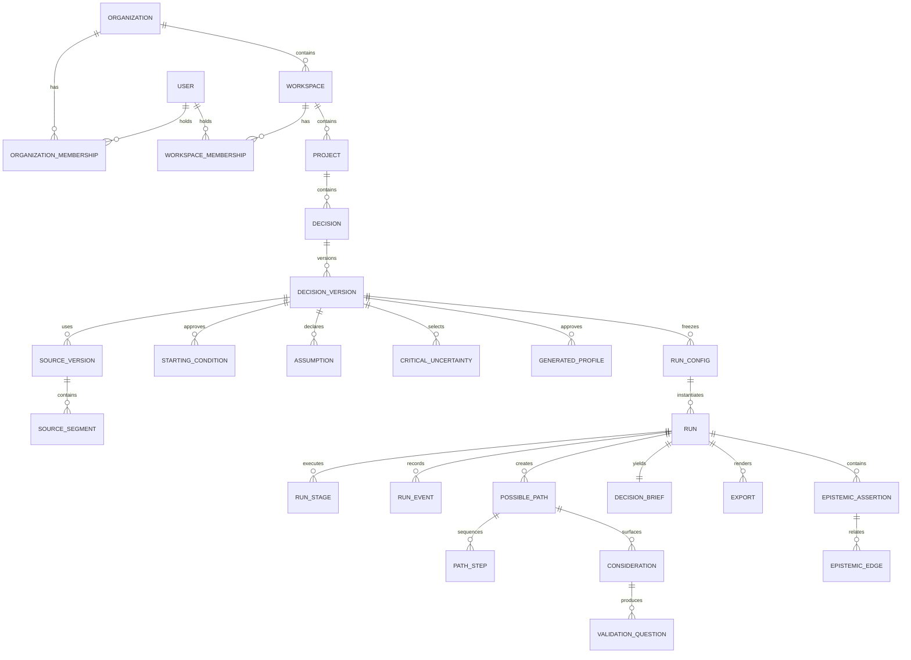

# Data model

> **Document authority.** The capitalized terms **MUST**, **MUST NOT**, **SHOULD**,
> **SHOULD NOT**, and **MAY** are normative. A feature is not complete merely
> because the interface resembles the design; it must satisfy the domain,
> methodological, security, accessibility, and evidence requirements in this
> documentation system. Where this document conflicts with generated output,
> legacy copy, or an implementation convenience, this document controls until
> superseded through an approved architecture or product decision record.

## Design rules

1. PostgreSQL is the target system of record.
2. Every workspace-owned row carries immutable physical `organization_id` and
   `workspace_id`; a composite foreign key proves that the workspace belongs
   to that organization.
3. Every mutable aggregate uses optimistic concurrency (`version`).
4. Historical run inputs and outputs are append-only after a run starts.
5. Completed runs are immutable.
6. Source provenance and synthetic provenance are separate.
7. The Epistemic Ledger is normalized and validated.
8. Hidden chain-of-thought is never stored.
9. Soft deletion is a workflow state, not a substitute for hard deletion.
10. Every table declares privacy class, retention class, and audit behavior.

## Identifier convention

Every addressable canonical physical ID is an application- or operator-issued
RFC 9562 UUIDv7 stored as PostgreSQL `uuid`. Join tables MAY use composite
primary keys when they are not externally addressable. Human-readable codes
such as `P-03` are scoped display identifiers, not primary keys.

Every externally addressable aggregate also has a separate immutable,
server-issued public alias. The alias is used at API, URL, event, queue, log,
and telemetry boundaries; physical UUIDs never cross those boundaries. New
foundation aliases use the lower-case UUID hexadecimal form:

```text
org_<32 lowercase hex>
user_<32 lowercase hex>
workspace_<32 lowercase hex>
proj_<32 lowercase hex>
```

Accepted legacy `workspace_<32 lowercase hex>` and project aliases are
preserved during an operator-owned adoption. Their historical random version
does not change the UUIDv7 requirement for the independent physical row ID.
Aliases, physical IDs, `organization_id`, and `workspace_id` are immutable;
database triggers reject mutation.

Common columns for a mutable workspace-owned aggregate (global identity and
join tables use their documented scope/composite shape):

```sql
id uuid primary key,
organization_id uuid not null,
workspace_id uuid not null,
public_id varchar(128) not null,
created_at timestamptz not null default now(),
created_by uuid,
updated_at timestamptz not null default now(),
updated_by uuid,
version bigint not null default 1,
retention_class varchar(64) not null,
retention_policy_version varchar(128) not null,
retention_started_at timestamptz not null,
expires_at timestamptz
```

Every canonical table, including global identities, memberships, audit, and
operator evidence, stores those four retention fields even when its documented
scope/composite shape differs. Checkpoint 3A-2 accepts exactly
`retention-policy/v1`; unknown versions fail closed and require a reviewed
migration. Customer-lifecycle deletion targets also store
nullable `deletion_state varchar(32)` and
`deletion_state_changed_at timestamptz`, plus nullable
`deletion_failed_from_state varchar(32)`; null means no accepted deletion
request. The closed non-null values are `REQUESTED`, `ELIGIBILITY_CHECK`, `LEGAL_HOLD`,
`PURGING_PRIMARY`, `PURGING_PROVIDERS`, `PURGING_BACKUPS`, `COMPLETE`, and
`FAILED`, with only the transitions in the deletion state machine. The exact
class and trigger for each `core` table are defined in
[`docs/privacy/RETENTION.md`](../privacy/RETENTION.md); schema defaults cannot
select a longer period than the server-derived policy.

The exact deletion edges are `NULL -> REQUESTED`, `REQUESTED ->
ELIGIBILITY_CHECK`, `ELIGIBILITY_CHECK -> LEGAL_HOLD|PURGING_PRIMARY`,
`LEGAL_HOLD -> ELIGIBILITY_CHECK`, `PURGING_PRIMARY ->
PURGING_PROVIDERS|FAILED`, `PURGING_PROVIDERS -> PURGING_BACKUPS|FAILED`, and
`PURGING_BACKUPS -> COMPLETE|FAILED`. `FAILED` returns only to its recorded
originating purge state; `COMPLETE` is terminal. Nullable
`deletion_failed_from_state` stores that origin and is closed to the three purge
states. Zero-work stages still require durable advancement evidence and no
skip edge is authorized.

## Core relationship model



## Identity and tenancy

### `organizations`

Purpose: tenant boundary and policy configuration.

Key fields:

```text
id
public_id
name
status
default_region
data_residency_policy
retention_policy_version
use_policy_overlay_version
created_at
suspended_at
```

### `users`

Global identity record. Store the minimum identity fields required by the
chosen identity provider. Authentication secrets SHOULD remain with the
identity provider.

`identity_subjects` maps exact `(issuer, subject)` pairs to users. Ordinary
application roles cannot select it directly; a bounded `SECURITY DEFINER`
bootstrap resolver is the only authentication read boundary. Tokens, complete
OIDC claims, provider secrets, and passwords are never stored.

The identity-link lifecycle is exact:

```text
status: ACTIVE | REVOKED | ANONYMIZED
issuer                 # required only while raw link is retained
subject                # required only while raw link is retained
user_id
revoked_at
revoked_by
revocation_reason_code
subject_tombstone_hmac # required only after anonymization
tombstone_key_version  # required only after anonymization
retention_class        # fixed to ACCOUNT_IDENTITY
retention_policy_version
retention_started_at
expires_at
deletion_state
deletion_state_changed_at
```

Only `ACTIVE` can authenticate. `REVOKED` is immediately unusable. After an
approved recovery or hold window, `ANONYMIZED` requires null raw issuer/subject
values and a keyed HMAC-SHA-256 tombstone over the canonical length-prefixed
pair. The key is external and versioned. Provisioning checks the tombstone only
to prevent silent recreation; it is never a public identifier, credential,
log/metric value, or analytics key. Restore replays revocation and
anonymization before authentication is enabled. Re-linking is a separate,
audited identity-proofing action and never a state rollback.
The tombstone remains covered by `ACCOUNT_IDENTITY`, has its own bounded
`expires_at`, and is purged no later than the authorized deletion-evidence
period unless a reviewed hold applies.
Retained raw pairs have a partial unique constraint on `(issuer, subject)`;
anonymized rows have a partial unique constraint on
`(tombstone_key_version, subject_tombstone_hmac)`. `id`, `user_id`, and a set
tombstone/key are immutable.

### `workspaces`

A workspace belongs to exactly one organization and is the collaboration,
authorization, retention-policy, and operational-isolation boundary. It may
contain multiple projects. The TRANSITION Decision Workspace manifest remains
the one-project product projection and may supply only a preserved public
alias during operator adoption; it is not authentication, membership, or
organization evidence.

### `organization_memberships` and `workspace_memberships`

```text
organization_id
workspace_id  # workspace membership only
user_id
role: OWNER | ADMIN | EDITOR | REVIEWER | VIEWER | SECURITY
status
joined_at
```

Organization membership permits `OWNER`, `ADMIN`, or `SECURITY`. Workspace
membership permits all six roles. An active workspace membership also requires
an active organization membership for the same user and organization. A user
may belong to an organization without access to every workspace.

Authorization is capability-based. Roles map to one versioned, closed policy
rather than being hardcoded throughout controllers. An immutable
`ActorContext` is resolved for exactly one organization/workspace and optional
project; issuer claims never directly grant scope, role, or capability.

Bootstrap uses only bounded functions equivalent to
`core.resolve_oidc_subject(issuer, subject)` and
`core.resolve_actor_project_scope(user_id, project_public_id)`. After
bootstrap, each repository transaction sets server-derived transaction-local
actor, organization, workspace, and request settings. Missing or malformed
settings yield no rows. Application authorization remains primary; forced RLS
is defense in depth.

### Canonical `core` foundation

The TARGET canonical foundation lives in an explicitly qualified PostgreSQL
`core` schema and contains only:

```text
organizations
users
identity_subjects
workspaces
organization_memberships
workspace_memberships
projects
schema_adoptions
backfill_batches
legacy_project_bindings
persistence_cutovers
audit_events
```

Every addressable row uses UUIDv7. Workspace-owned tables carry both scope
keys and composite foreign keys. Mutable aggregates use positive `row_version`
optimistic concurrency. Identity, scope, public alias, audit events, and
adoption evidence are immutable. Core schema change is Alembic-only;
production startup never calls `create_all`, stamps, migrates, provisions a
tenant, or upgrades this schema.

The foundation migration implements the exact table-to-retention-class mapping
in [`docs/privacy/RETENTION.md`](../privacy/RETENTION.md) and the closed field
map in [`docs/privacy/DATA_MAP.md`](../privacy/DATA_MAP.md). The mapping covers
all twelve tables above; a row with a missing or unknown class/policy version,
an expiry before its retention start, or a deletion state inconsistent with
its lifecycle is rejected by database checks.

`core.audit_events` is append-only to application, worker, support, backfill,
and read-only roles. That immutability does not authorize indefinite
retention. Audit rows carry policy-derived expiry and are time-partitioned (or
use an independently reviewed equivalent). A dedicated retention operator may
detach and purge only an entirely expired, unheld partition, after preserving
the minimized content-free deletion evidence and aggregate evidence hash
required by the retention policy. It cannot update individual live events.
Legal hold pauses expiry for the exact scope; hold release restores the prior
class without restarting the retention clock.

Audit scope is closed to `TENANT|SYSTEM`: TENANT requires organization scope;
SYSTEM requires organization/workspace/project null. The closed v1 event set is
`SCHEMA_ADOPTION_RECORDED`, `ROLE_TOPOLOGY_VERIFIED`,
`AUDIT_EXPIRY_APPROVED`, and `AUDIT_PARTITION_EXPIRED`. The first two accept
only `evidence_sha256`; approval accepts class, UTC bucket bounds, evidence and
zero-hold hashes, and approver public alias; completion adds nonnegative row
count and aggregate event hash. No extra JSON key or alternate type is valid.

PostgreSQL requires every partition key in a partitioned-table unique or
primary key. `core.audit_events` is therefore the explicit exception to the
sole-column UUID primary-key shorthand: its physical primary key is
`(retention_class, expires_at, id)`. `id` remains the server-issued UUIDv7
logical event identifier and has a non-unique lookup index. Class and expiry
are immutable. The initial schema creates yearly expiry partitions for both
allowed classes covering `2026-01-01T00:00:00Z` through
`2035-01-01T00:00:00Z`, with no default partition. Inserts outside that window
fail closed; future coverage requires a separately reviewed operator action.

The twelve-table count means twelve logical domain tables; PostgreSQL child
partition relations are physical storage relations. Top-level children are
`audit_events_audit_long` and `audit_events_deletion_evidence_long`; yearly
leaves use `audit_events_<class>_y<year>` for 2026 through 2034.

The existing `384c98f88d53` migration is immutable history. Adoption first
fingerprints the exact managed legacy schema. Only an empty database, an exact
stamped baseline, or an explicitly approved exact unversioned fingerprint may
advance. Any missing, extra, renamed, type-changed, constraint-changed, or
index-changed managed object fails closed. Operator-owned dry-run/apply
backfill preserves accepted workspace/project public aliases, records hashes
and reconciliation evidence, and never infers organization ownership from a
project, filesystem, token claim, or alias.

Persistence modes are closed:

| Mode | Read authority | Write authority |
|---|---|---|
| `LEGACY` | Legacy | Legacy only |
| `SHADOW` | Legacy response; read-only core comparison | Legacy only |
| `CANONICAL` | Core only | Core only |

There is no dual-write mode. In `CANONICAL`, missing rows, RLS denial,
timeout, or PostgreSQL unavailability fail closed; no canonical read or write
falls back to SQLite, filesystem JSON, Redis state, or another legacy store.
Before the first canonical application write, an approved rollback may return
to a verified read-only legacy snapshot. After that write, rollback is a
schema-compatible application rollback or forward fix; it never routes writes
back to legacy.

## Product aggregates

### `projects`

Container for related decisions. Every project belongs to exactly one
workspace and therefore one organization. Projects never move between
organizations; a future workspace move requires a separately reviewed
migration workflow. A project is not a cross-project retrieval corpus by
default.

### `decisions` and `decision_versions`

`decisions` holds stable identity and lifecycle. `decision_versions` is
append-only once referenced by a run.

Required version fields:

```text
question
decision_owner
intended_use
deadline
time_horizon
context
stakes
reversibility
affected_context
known_constraints
out_of_scope
human_validation_intent
policy_classification
policy_reason_codes
content_hash
```

### `sources`, `source_versions`, and `source_segments`

`sources` is a user-facing logical asset. Each upload or replacement creates a
`source_version`.

Required `source_versions` fields:

```text
storage_key_quarantine
storage_key_processed
original_filename
safe_display_filename
declared_mime
detected_mime
byte_size
sha256
scan_status
parser_name
parser_version
page_count
language
rights_attestation
processing_status
retention_class
deleted_at
```

`source_segments` preserve exact location:

```text
source_version_id
ordinal
page_start
page_end
section_path
character_start
character_end
normalized_text
text_hash
instruction_risk_flags
```

Segments are never directly linked to path outcomes.

### `extraction_candidates`

Model-created proposals pending review:

```text
source_segment_ids[]
candidate_text
condition_type
ambiguity
conflict_group_id
model_invocation_id
review_status
reviewed_by
reviewed_at
```

### `starting_conditions`

Only approved conditions enter a run. Origin is `USER_STATED` or
`SOURCE_EXTRACTED`. Source-extracted conditions require at least one approved
source segment.

### `assumptions`

```text
statement
category
rationale
falsifier
validation_method
scope
sensitive_domain_flag
origin
review_status
```

Generated assumptions remain proposals until user approval.

### `critical_uncertainties` and `uncertainty_states`

Uncertainties require two to four materially distinct states. No state has a
probability field.

### `generated_profiles`

Public name: generated profile or decision lens.

```text
code
decision_relevant_constraints jsonb
information_conditions jsonb
incentives jsonb
access_conditions jsonb
switching_costs jsonb
decision_criteria jsonb
assumption_links uuid[]
sensitive_attribute_justifications jsonb
review_status
```

Prohibited fields: realistic name, avatar, first-person biography, sample
weight, representativeness score, human quotation.

## Run aggregates

### `run_configs`

Immutable once a run enters `QUEUED`.

```text
decision_version_id
source_version_ids[]
starting_condition_ids[]
assumption_ids[]
critical_uncertainty_ids[]
generated_profile_ids[]
scenario_rules jsonb
prompt_release_set_id
model_release_set_id
validator_bundle_version
simulation_adapter_version
seed_manifest jsonb
configuration_hash
```

### `runs`

```text
status
parent_run_id
workflow_ref
human_respondent_count check (= 0)
output_origin check (= 'synthetic')
is_forecast check (= false)
is_public_opinion_measure check (= false)
is_causal_evidence check (= false)
source_role check (= 'starting_conditions_only')
human_validation_scope check (= 'external_to_synthetic_run')
started_at
completed_at
failure_code
manifest_hash
```

### `run_stages`

One row per stage attempt:

```text
stage_code
attempt
status
input_hash
output_hash
prompt_release_id
model_release_id
schema_version
started_at
completed_at
failure_code
retryable
```

A unique constraint on `(run_id, stage_code, attempt)` and idempotency key
prevents duplicate materialization.

### `run_events`

Append-only event stream:

```text
sequence bigint
event_type
actor_type
actor_id
payload jsonb
occurred_at
trace_id
```

Payloads contain IDs and safe metadata, not hidden reasoning or unrestricted
source text.

### `path_sets`, `run_path_heads`, and `possible_paths`

`path_sets` are immutable whole-artifact revisions owned by a canonical run and
stage attempt. They store UUIDv7 physical identity, stable public identity,
revision/supersession, status, path count, accepted raw-artifact reference,
canonical SHA-256, schema/coverage/distinctness validator versions and
results, creation metadata, and the immutable truth fields. A complete
reviewable set contains four to eight materially distinct paths; fewer is
explicitly `INCOMPLETE`, more is invalid, and the system never pads a set.

`run_path_heads` is the only mutable pointer. Optimistic compare-and-swap moves
it to a new immutable revision in the same transaction as review invalidation,
audit, command receipt, and outbox events.

Every path, consideration, conflict, missing-information item, disconfirming
condition, and validation question has three distinct identities: repository-
internal UUIDv7 physical ID, stable server-issued public ID, and non-null
server-owned semantic lineage ID. Providers and clients can assign none of
them. Exact unambiguous predecessor lineage may preserve semantic identity;
ambiguity creates a new identity rather than guessing.

```text
public_id
semantic_id
display_code
title
scenario_frame jsonb
branch_basis_ids[]
profile_ids[]
coverage_cell_ids[]
distinctness_hash
status
```

No probability, confidence, prevalence, support, or rank field exists.

### `path_steps`

Ordered synthetic actions with allowed input IDs and rationale. The rationale is
a concise user-visible explanation, not chain-of-thought. Canonical sequences
are contiguous and represented by `POSSIBLE_PATH SEQUENCES PATH_STEP`.

### `considerations`, `path_conflicts`, `missing_information`,
`disconfirming_conditions`, `validation_questions`, and `decision_briefs`

Each object stores origin, approved source/run input links, revision history,
semantic identity, content hash, and truth-language validation result. Every
path has at least one consideration, missing-information item, disconfirming
condition, and non-leading validation question. Absence of a detected conflict
is recorded by the cross-path validator rather than inferred from a missing
row.

`path_set_reviews` and their per-path dispositions are immutable and bind the
exact path-set ID and SHA-256. Reviewer actor and membership role come from
authorization context. A new artifact revision never mutates a review; it
makes the former review stale.

A decision brief may be generated only from an immutable brief gate containing
the exact current path-set ID/hash, review ID/hash, validator-bundle IDs, run
ID, and truth bundle while the run is `VALIDATING_OUTPUT`. `BRIEF_STATEMENT`
lineage uses only the exact `SUMMARIZES` triples. Final brief and run manifest
store these references; changed content or lineage relocks the gate.

## Epistemic Ledger

### `epistemic_assertions`

```text
id
organization_id
run_id nullable
object_type
object_id
origin enum
role enum
content_hash
display_label
created_at
```

Origin enum:

```text
USER_STATED
SOURCE_EXTRACTED
ASSUMPTION_DECLARED
SYNTHETIC_GENERATED
EXTERNAL_HUMAN_EVIDENCE
SYSTEM_METADATA
```

The closed role vocabulary and all edge semantics are controlled by
`epistemic-ledger/v2` in
[`PRODUCT_TRUTH_CONTRACT.md`](../product/PRODUCT_TRUTH_CONTRACT.md). Canonical
assertions store one of those exact roles; display labels are not roles.

### `epistemic_edges`

```text
from_assertion_id
relation enum
to_assertion_id
created_by
contract_version check (= 'epistemic-ledger/v2')
validator_version
```

Allowed relations:

```text
CONTAINS
EXTRACTED_FROM
ACCEPTED_AS
REVISED_AS
DEFINES
INFORMS
CONSTRAINS
BRANCHES_ON
APPLIES_LENS
SEQUENCES
SURFACES
DISCONFIRMED_BY
PRODUCES_QUESTION
SUMMARIZES
```

A database trigger and domain constraint reject every relation triple not in
the exact v2 matrix. Roles and origins are resolved from the referenced
assertions at write time. Neither endpoint role nor origin is accepted from a
client, provider, worker payload, or import.

Required path lineage includes:

```text
POSSIBLE_PATH SEQUENCES PATH_STEP
POSSIBLE_PATH SURFACES CONSIDERATION
POSSIBLE_PATH SURFACES CONFLICT
POSSIBLE_PATH SURFACES MISSING_INFORMATION
POSSIBLE_PATH DISCONFIRMED_BY DISCONFIRMING_CONDITION
CONSIDERATION PRODUCES_QUESTION VALIDATION_QUESTION
BRIEF_STATEMENT SUMMARIZES POSSIBLE_PATH
BRIEF_STATEMENT SUMMARIZES CONSIDERATION
```

Required source-review lineage includes:

```text
SOURCE_ASSET CONTAINS SOURCE_SEGMENT
EXTRACTION_CANDIDATE EXTRACTED_FROM SOURCE_SEGMENT
EXTRACTION_CANDIDATE ACCEPTED_AS STARTING_CONDITION
EXTRACTION_CANDIDATE REVISED_AS STARTING_CONDITION
SOURCE_SEGMENT INFORMS STARTING_CONDITION  # unchanged acceptance only
```

A revised condition is `USER_STATED`; `REVISED_AS` preserves traceability but
does not authorize an `INFORMS` edge. Direct or transitive source-to-path and
source-to-consideration support is forbidden. The retired relations
`SUPPORTS`, `DECLARES`, `BRANCHES_TO`, `VALIDATED_BY`, and `SUMMARIZED_BY` are
not aliases and are invalid for new canonical writes. External-evidence and
decision-owner-conclusion relations remain deferred to a later contract
version.

## Governance and AI tables

### Prompt and model governance

- `prompt_definitions`
- `prompt_releases`
- `prompt_release_sets`
- `model_releases`
- `model_release_sets`
- `validator_bundles`
- `model_invocations`

A run references immutable releases, never mutable aliases.

### Evaluation

- `eval_suites`
- `eval_cases`
- `eval_runs`
- `eval_case_results`
- `human_review_assignments`
- `human_review_results`

Evaluation data is separated from production tenant data unless a workspace
explicitly contributes a redacted, authorized case.

### Audit and approvals

- `audit_events`
- `approvals`
- `policy_decisions`
- `claim_records`
- `incidents`
- `incident_events`
- `deletion_jobs`
- `legal_holds`
- `subprocessor_versions`

Audit events are append-only. Corrections create a new event.

## Export and provenance

### `exports`

```text
type
status
storage_key
content_hash
render_template_version
disclosure_validator_version
provenance_manifest_id
requested_by
ready_at
revoked_at
```

### `provenance_manifests`

Required fields:

```json
{
  "artifact_id": "uuid",
  "output_origin": "synthetic",
  "human_respondent_count": 0,
  "is_forecast": false,
  "decision_version_id": "uuid",
  "run_id": "uuid",
  "source_version_hashes": [],
  "prompt_release_ids": [],
  "model_release_ids": [],
  "validator_bundle_version": "string",
  "generated_at": "RFC3339",
  "human_edits": [],
  "manifest_hash": "sha256",
  "signature": "optional-signed-envelope"
}
```

A valid manifest proves integrity and declared origin, not factual truth.

## Deletion model

Deletion traverses an explicit dependency graph. A source cannot be marked
deleted while provider copies or scheduled backup aging remain unaccounted for.
The deletion job records status by store/provider and exposes a truthful
completion statement.

## Indexing

Recommended indexes:

```sql
create index on projects (organization_id, workspace_id, updated_at desc);
create index on decisions (organization_id, workspace_id, project_id, updated_at desc);
create index on runs (organization_id, workspace_id, decision_id, created_at desc);
create unique index on run_events (run_id, sequence);
create index on source_segments using gin (to_tsvector('simple', normalized_text));
create index on epistemic_assertions (run_id, role, origin);
create index on epistemic_edges (from_assertion_id, relation);
create index on audit_events (organization_id, occurred_at desc);
```

Vector retrieval, if used, requires tenant and project filters before similarity
search. Vector IDs do not become provenance.

## Database acceptance

- the physical relationship is exactly
  `organization -> workspace -> project`, with active organization and
  workspace memberships resolved server-side;
- every addressable physical ID is UUIDv7 and every caller-visible ID is a
  separate immutable server-issued alias;
- the checked-in baseline fingerprint matches before adoption, the original
  baseline migration is byte-identical, and the Alembic graph has one reviewed
  head;
- clean, exact-stamped, and explicit-exact-unversioned adoption paths are
  rehearsed; every other schema starting state is rejected;
- application, migration, backfill, and read-only roles are separate; the
  application role is neither owner, superuser, nor `BYPASSRLS`;
- RLS is enabled and forced, `USING` and `WITH CHECK` compare both scope keys,
  and pooled connections cannot retain transaction-local actor scope;
- shadow comparison performs no writes and canonical failure never triggers a
  legacy fallback;
- migration up/down or forward-fix strategy is tested;
- RLS tests cover owner, editor, reviewer, viewer, worker, and admin roles;
- every `core` table has the exact retention class/policy/start/expiry fields,
  class mapping, checks, and deletion metadata required by its lifecycle;
- the complete Cartesian complement of the closed deletion-state transitions
  and retention-class mapping is rejected by domain and database tests;
- identity-subject tests prove `ACTIVE` authenticates, `REVOKED` and
  `ANONYMIZED` fail closed, raw issuer/subject values age out, tombstones are
  non-reversible/non-disclosable, and an unauthorized re-link is rejected;
- ordinary roles cannot mutate audit history; the retention operator can purge
  only expired, unheld partitions, cannot purge a held/nonexpired partition,
  and preserves only minimized deletion evidence;
- restore tests replay identity and membership revocations, anonymizations,
  expired audit partitions, deletion obligations, and legal-hold releases
  before service resumes;
- every `epistemic-ledger/v2` triple passes and the complete Cartesian
  complement is rejected at domain and database boundaries;
- completed runs reject mutation;
- run config rejects mutation after queueing;
- source-to-outcome direct relation cannot be inserted;
- deletion jobs enumerate all storage locations;
- backups can be restored without violating tenant keys;
- no table stores hidden chain-of-thought;
- schema documentation matches migrations.

## References

- [PostgreSQL - Row security policies](https://www.postgresql.org/docs/current/ddl-rowsecurity.html) - Database-enforced tenant-isolation reference, including owner/superuser bypass considerations.
- [RFC 9562 - UUIDs](https://www.rfc-editor.org/rfc/rfc9562.html) - UUIDv7 specification used for time-ordered identifiers.
- [C2PA Technical Specifications](https://spec.c2pa.org/specifications/) - Cryptographically verifiable provenance structure; provenance does not prove that content is true.

---

## Project-specific data-model status (baseline `8b616dc7`)

This section maps every aggregate in this doc to the actual code under
[`backend/app/`](../../backend/app/) and to the persisted state on disk
under `backend/uploads/`. Items are marked
**CURRENT** (implemented and verified), **PARTIAL** (implemented but
materially deficient against this doc), or **TARGET** (the doc is
normative; the implementation has not reached it). See
[`docs/architecture/index.md`](index.md) for the legend.

### Storage today (CURRENT)

The current implementation uses five storage substrates, none of which
satisfies the "PostgreSQL is the target system of record" rule in
"Design rules" above:

| Substrate | Path / service | Holds | Status |
|---|---|---|---|
| Filesystem JSON | `backend/uploads/projects/{project_id}/project.json` | `Project` aggregate, source files, extracted text | CURRENT, non-atomic |
| Filesystem JSON | `backend/uploads/simulations/{simulation_id}/state.json` | `Simulation` lifecycle (audit-flagged) | CURRENT, non-atomic, repair-on-read |
| Filesystem JSON | `backend/uploads/reports/{report_id}/...` | Generated report | CURRENT |
| SQLite (per platform) | `backend/uploads/simulations/{simulation_id}/reddit_simulation.db` and `twitter_simulation.db` | Per-action records | CURRENT, opened by an audit-flagged path-escape route |
| Redis | `task:{task_id}` keys with 24h TTL, plus `tasks:all` set | `Task` aggregate | CURRENT, best-effort |
| ZEP Cloud | external graph memory service | Entity / relationship graph, optional | CURRENT |
| NetworkX | in-process | Intermediate graph computation | CURRENT |

See [`docs/architecture/index.md`](index.md) §"State and persistence" for
the per-substrate defect list.

### Aggregates in the code (vs. this doc)

| Aggregate | Doc target | Code today | Status |
|---|---|---|---|
| `organizations` | Required | Not modeled; only `project_id` exists | TARGET |
| `users` | Required | Not modeled; auth is bearer-token only via `APP_TOKEN` | TARGET |
| `memberships` | Required with OWNER/ADMIN/EDITOR/REVIEWER/VIEWER/SECURITY | Not modeled | TARGET |
| `projects` | Container for related decisions | [`models/project.py:28-99`](../../backend/app/models/project.py:28) (5-state dataclass) | PARTIAL (no `organization_id`, no version, no append-only) |
| `decisions` / `decision_versions` | Append-only once referenced by a run | `simulation_requirement` is a free-text field on `Project` | TARGET |
| `sources` / `source_versions` / `source_segments` | Quarantined, scanned, parsed, user-approved | `Project.files` is a list of `{filename, path, size}` | PARTIAL (no quarantine, no scan, no per-version) |
| `starting_conditions` / `assumptions` / `critical_uncertainties` | First-class aggregates | Implicit in extracted text and prompts | TARGET |
| `generated_profiles` | First-class aggregate with version and approval | Files written by [`services/oasis_profile_generator.py`](../../backend/app/services/oasis_profile_generator.py) | PARTIAL (no version, no approval workflow) |
| `run_configs` | Frozen, content-hashed | [`services/simulation_config_generator.py`](../../backend/app/services/simulation_config_generator.py) (52 KB) generates config files | PARTIAL (no freeze, no hash, no per-version row) |
| `runs` / `run_stages` / `run_events` | Independent aggregates with optimistic concurrency | `state.json` per simulation; no rows | TARGET |
| `possible_paths` / `path_steps` / `considerations` / `validation_questions` | First-class in the report | Produced in [`services/report_agent.py`](../../backend/app/services/report_agent.py) (114 KB) | PARTIAL (no per-path rows, no DB) |
| `decision_briefs` | Separate, human-authored conclusion store | The "report" today mixes synthetic content with an editorial voice | TARGET |
| `exports` | Server-derived from canonical records | [`services/export_service.py`](../../backend/app/services/export_service.py) (15 KB) accepts client-supplied rows | **PARTIAL — audit P1** |
| `epistemic_assertions` / `epistemic_edges` | Normalized and validated ledger | Not implemented | TARGET |
| `audit_events` | Append-only | Per-task status in Redis is best-effort | PARTIAL |

### Source material as data, not instruction (PARTIAL — audit P0)

`ProjectManager.save_file_to_project`
([`models/project.py:247-278`](../../backend/app/models/project.py:247))
writes uploaded files with a randomized safe filename and never exposes
the original filename downstream. The extracted text is written to
`extracted_text.txt`
([`models/project.py:280-296`](../../backend/app/models/project.py:280)).

**Gap:** the source material is consumed by LLM calls in
[`services/ontology_generator.py`](../../backend/app/services/ontology_generator.py),
[`services/oasis_profile_generator.py`](../../backend/app/services/oasis_profile_generator.py),
and
[`services/simulation_config_generator.py`](../../backend/app/services/simulation_config_generator.py).
The current code does not isolate source text as a separate prompt role
and does not run a deterministic prompt-injection scanner. The P0 fix is
in [`adr/ADR-0005-zero-trust-source-ingestion.md`](adr/ADR-0005-zero-trust-source-ingestion.md)
and the audit's P0 finding. Gate 0, owned by
`askthepeople-security-reviewer`.

### Identifiers today vs. UUIDv7

This doc specifies UUIDv7 identifiers. The current code uses
`uuid.uuid4().hex[:12]` truncated to 12 hex chars
([`models/project.py:146`](../../backend/app/models/project.py:146)) and
`uuid.uuid4()` for task IDs
([`models/task.py:184`](../../backend/app/models/task.py:184)). The
12-hex truncation reduces the identifier space from 128 bits to 48 bits
and is not time-ordered. The migration to UUIDv7 is **TARGET** and
requires the canonical persistence layer.

### Optimistic concurrency — TARGET

No aggregate today carries a `version` column. `ProjectManager.save_project`
([`models/project.py:168-175`](../../backend/app/models/project.py:168))
writes JSON non-atomically. The audit's P1 finding "Non-atomic file
persistence" applies to every JSON write. Reaching optimistic
concurrency requires the canonical persistence layer in gate 3.

### Tenant isolation — TARGET

No `organization_id` exists anywhere in the data model. A valid bearer
token is allowed to read and write every project, every simulation, and
every report. Multi-tenant isolation is **TARGET** and is the subject of
[`adr/ADR-0009-multi-tenant-isolation.md`](adr/ADR-0009-multi-tenant-isolation.md).
Gate 3, owned by `askthepeople-persistence-engineer`.

### Append-only after a run starts — PARTIAL (force restart hazard)

The current code's force-restart path can stop an existing run, delete
logs, reset state, and rerun under the same simulation ID. This violates
"Historical run inputs and outputs are append-only after a run starts"
and "Completed runs are immutable". The audit's P1 finding "Force restart
destores provenance" applies. Reaching the contract requires
separation of identifiers (project_id, decision_version_id,
source_bundle_version_id, scenario_version_id, simulation_id,
preparation_attempt_id, run_attempt_id, report_version_id, export_id)
and immutability of completed attempts. Gate 3.

### Export provenance — PARTIAL (audit P1)

The export route accepts arbitrary `results` rows from the caller and
returns a file under the ASKTHEPEOPLE wordmark. The server cannot prove
those rows originated from the referenced simulation. The fix is
documented in the audit:

> The client should send canonical record IDs. The server MUST
> authorize the caller, retrieve canonical records, confirm they belong
> to the same attempt, generate the export, add the truth contract, add
> a provenance manifest, hash the output, record the export event, return
> an immutable export ID.

The replacement flow is **TARGET** and is part of gate 5 / exec plan
[`docs/exec-plans/05-brief-handoff-exports-and-provenance.md`](../exec-plans/05-brief-handoff-exports-and-provenance.md).

### Epistemic Ledger — TARGET

The Epistemic Ledger (origin types, epistemic roles, allowed and
prohibited relationships) is not yet implemented. ADR
[`adr/ADR-0002-epistemic-ledger.md`](adr/ADR-0002-epistemic-ledger.md)
defines it; the data model and the validation layer are part of gate 1
and gate 3.

### Chain-of-thought retention — CURRENT (NOT stored)

The current code never persists the model's chain-of-thought. The
`Task` aggregate stores a `result: Optional[Dict]` and a `message: str`
([`models/task.py:38-40`](../../backend/app/models/task.py:38)) but
neither is the model's reasoning trace. The `claim_boundary` and
`validation_engine` services only consume the structured output of the
model. The audit's P1 finding and
[`adr/ADR-0010-no-chain-of-thought-retention.md`](adr/ADR-0010-no-chain-of-thought-retention.md)
require explicit non-retention; the current behavior satisfies the rule
by accident of implementation rather than by design. A future change
that adds any reasoning-trace field to `Task` MUST be blocked.

### Hidden chain-of-thought in any future table — TARGET (negative rule)

Any table that the canonical persistence layer introduces MUST declare
explicitly that no chain-of-thought field is permitted. The database
acceptance criterion "no table stores hidden chain-of-thought" is
enforced by a schema-review CI check that is **TARGET** and is part of
gate 5.

### Retention and deletion — PARTIAL

`ProjectManager.delete_project`
([`models/project.py:227-244`](../../backend/app/models/project.py:227))
calls `shutil.rmtree` synchronously. There is no retention policy, no
LEGAL_HOLD state, no provider-deletion step, and no backup aging
record. Reaching the deletion state machine in `state-machines.md`
requires the canonical persistence layer.
