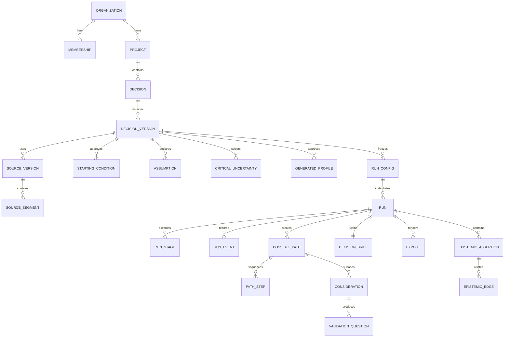

# Data model

> **Document authority.** The capitalized terms **MUST**, **MUST NOT**, **SHOULD**,
> **SHOULD NOT**, and **MAY** are normative. A feature is not complete merely
> because the interface resembles the design; it must satisfy the domain,
> methodological, security, accessibility, and evidence requirements in this
> documentation system. Where this document conflicts with generated output,
> legacy copy, or an implementation convenience, this document controls until
> superseded through an approved architecture or product decision record.

## Design rules

1. PostgreSQL is the target system of record.
2. Every tenant-owned row carries `organization_id`.
3. Every mutable aggregate uses optimistic concurrency (`version`).
4. Historical run inputs and outputs are append-only after a run starts.
5. Completed runs are immutable.
6. Source provenance and synthetic provenance are separate.
7. The Epistemic Ledger is normalized and validated.
8. Hidden chain-of-thought is never stored.
9. Soft deletion is a workflow state, not a substitute for hard deletion.
10. Every table declares privacy class, retention class, and audit behavior.

## Identifier convention

Domain IDs are UUIDv7. Join tables MAY use composite primary keys when they are
not externally addressable. Human-readable codes such as `P-03` are scoped
display identifiers, not primary keys.

Common columns:

```sql
id uuid primary key,
organization_id uuid not null,
created_at timestamptz not null default now(),
created_by uuid,
updated_at timestamptz not null default now(),
updated_by uuid,
version bigint not null default 1
```

## Core relationship model



## Identity and tenancy

### `organizations`

Purpose: tenant boundary and policy configuration.

Key fields:

```text
id
name
slug
status
default_region
data_residency_policy
retention_policy_version
use_policy_overlay_version
created_at
suspended_at
```

### `users`

Global identity record. Store the minimum identity fields required by the
chosen identity provider. Authentication secrets SHOULD remain with the
identity provider.

### `memberships`

```text
organization_id
user_id
role: OWNER | ADMIN | EDITOR | REVIEWER | VIEWER | SECURITY
status
joined_at
```

Authorization is capability-based. Roles map to capabilities in policy rather
than being hardcoded throughout controllers.

## Product aggregates

### `projects`

Container for related decisions. It is not a cross-project retrieval corpus by
default.

### `decisions` and `decision_versions`

`decisions` holds stable identity and lifecycle. `decision_versions` is
append-only once referenced by a run.

Required version fields:

```text
question
decision_owner
intended_use
deadline
time_horizon
context
stakes
reversibility
affected_context
known_constraints
out_of_scope
human_validation_intent
policy_classification
policy_reason_codes
content_hash
```

### `sources`, `source_versions`, and `source_segments`

`sources` is a user-facing logical asset. Each upload or replacement creates a
`source_version`.

Required `source_versions` fields:

```text
storage_key_quarantine
storage_key_processed
original_filename
safe_display_filename
declared_mime
detected_mime
byte_size
sha256
scan_status
parser_name
parser_version
page_count
language
rights_attestation
processing_status
retention_class
deleted_at
```

`source_segments` preserve exact location:

```text
source_version_id
ordinal
page_start
page_end
section_path
character_start
character_end
normalized_text
text_hash
instruction_risk_flags
```

Segments are never directly linked to path outcomes.

### `extraction_candidates`

Model-created proposals pending review:

```text
source_segment_ids[]
candidate_text
condition_type
ambiguity
conflict_group_id
model_invocation_id
review_status
reviewed_by
reviewed_at
```

### `starting_conditions`

Only approved conditions enter a run. Origin is `USER_STATED` or
`SOURCE_EXTRACTED`. Source-extracted conditions require at least one approved
source segment.

### `assumptions`

```text
statement
category
rationale
falsifier
validation_method
scope
sensitive_domain_flag
origin
review_status
```

Generated assumptions remain proposals until user approval.

### `critical_uncertainties` and `uncertainty_states`

Uncertainties require two to four materially distinct states. No state has a
probability field.

### `generated_profiles`

Public name: generated profile or decision lens.

```text
code
decision_relevant_constraints jsonb
information_conditions jsonb
incentives jsonb
access_conditions jsonb
switching_costs jsonb
decision_criteria jsonb
assumption_links uuid[]
sensitive_attribute_justifications jsonb
review_status
```

Prohibited fields: realistic name, avatar, first-person biography, sample
weight, representativeness score, human quotation.

## Run aggregates

### `run_configs`

Immutable once a run enters `QUEUED`.

```text
decision_version_id
source_version_ids[]
starting_condition_ids[]
assumption_ids[]
critical_uncertainty_ids[]
generated_profile_ids[]
scenario_rules jsonb
prompt_release_set_id
model_release_set_id
validator_bundle_version
simulation_adapter_version
seed_manifest jsonb
configuration_hash
```

### `runs`

```text
status
parent_run_id
workflow_ref
human_respondent_count check (= 0)
output_origin check (= 'synthetic')
is_forecast check (= false)
human_validation_scope check (= 'external_to_synthetic_run')
started_at
completed_at
failure_code
manifest_hash
```

### `run_stages`

One row per stage attempt:

```text
stage_code
attempt
status
input_hash
output_hash
prompt_release_id
model_release_id
schema_version
started_at
completed_at
failure_code
retryable
```

A unique constraint on `(run_id, stage_code, attempt)` and idempotency key
prevents duplicate materialization.

### `run_events`

Append-only event stream:

```text
sequence bigint
event_type
actor_type
actor_id
payload jsonb
occurred_at
trace_id
```

Payloads contain IDs and safe metadata, not hidden reasoning or unrestricted
source text.

### `possible_paths`

```text
display_code
title
scenario_frame jsonb
branch_basis_ids[]
profile_ids[]
coverage_cell_ids[]
distinctness_hash
status
```

No probability, confidence, prevalence, support, or rank field exists.

### `path_steps`

Ordered synthetic actions with allowed input IDs and rationale. The rationale is
a concise user-visible explanation, not chain-of-thought.

### `considerations`, `validation_questions`, `decision_briefs`

Each object stores origin, approved source/run input links, revision history,
and truth-language validation result.

## Epistemic Ledger

### `epistemic_assertions`

```text
id
organization_id
run_id nullable
object_type
object_id
origin enum
role enum
content_hash
display_label
created_at
```

Origin enum:

```text
USER_STATED
SOURCE_EXTRACTED
ASSUMPTION_DECLARED
SYNTHETIC_GENERATED
EXTERNAL_HUMAN_EVIDENCE
SYSTEM_METADATA
```

### `epistemic_edges`

```text
from_assertion_id
relation enum
to_assertion_id
created_by
validator_version
```

Allowed relations:

```text
DEFINES
INFORMS
CONSTRAINS
BRANCHES_ON
APPLIES_LENS
SEQUENCES
SURFACES
PRODUCES_QUESTION
SUPPORTS_HUMAN_QUESTION
CONTRADICTS_HUMAN_QUESTION
LEAVES_UNRESOLVED
RELATED_BY_KEYWORD
```

A database trigger or domain constraint rejects disallowed origin/role/relation
combinations. `RELATED_BY_KEYWORD` can only target a diagnostic record and
cannot be traversed as support.

## Governance and AI tables

### Prompt and model governance

- `prompt_definitions`
- `prompt_releases`
- `prompt_release_sets`
- `model_releases`
- `model_release_sets`
- `validator_bundles`
- `model_invocations`

A run references immutable releases, never mutable aliases.

### Evaluation

- `eval_suites`
- `eval_cases`
- `eval_runs`
- `eval_case_results`
- `human_review_assignments`
- `human_review_results`

Evaluation data is separated from production tenant data unless a workspace
explicitly contributes a redacted, authorized case.

### Audit and approvals

- `audit_events`
- `approvals`
- `policy_decisions`
- `claim_records`
- `incidents`
- `incident_events`
- `deletion_jobs`
- `legal_holds`
- `subprocessor_versions`

Audit events are append-only. Corrections create a new event.

## Export and provenance

### `exports`

```text
type
status
storage_key
content_hash
render_template_version
disclosure_validator_version
provenance_manifest_id
requested_by
ready_at
revoked_at
```

### `provenance_manifests`

Required fields:

```json
{
  "artifact_id": "uuid",
  "output_origin": "synthetic",
  "human_respondent_count": 0,
  "is_forecast": false,
  "decision_version_id": "uuid",
  "run_id": "uuid",
  "source_version_hashes": [],
  "prompt_release_ids": [],
  "model_release_ids": [],
  "validator_bundle_version": "string",
  "generated_at": "RFC3339",
  "human_edits": [],
  "manifest_hash": "sha256",
  "signature": "optional-signed-envelope"
}
```

A valid manifest proves integrity and declared origin, not factual truth.

## Deletion model

Deletion traverses an explicit dependency graph. A source cannot be marked
deleted while provider copies or scheduled backup aging remain unaccounted for.
The deletion job records status by store/provider and exposes a truthful
completion statement.

## Indexing

Recommended indexes:

```sql
create index on projects (organization_id, updated_at desc);
create index on decisions (organization_id, project_id, updated_at desc);
create index on runs (organization_id, decision_id, created_at desc);
create unique index on run_events (run_id, sequence);
create index on source_segments using gin (to_tsvector('simple', normalized_text));
create index on epistemic_assertions (run_id, role, origin);
create index on epistemic_edges (from_assertion_id, relation);
create index on audit_events (organization_id, occurred_at desc);
```

Vector retrieval, if used, requires tenant and project filters before similarity
search. Vector IDs do not become provenance.

## Database acceptance

- migration up/down or forward-fix strategy is tested;
- RLS tests cover owner, editor, reviewer, viewer, worker, and admin roles;
- property tests reject every prohibited epistemic edge;
- completed runs reject mutation;
- run config rejects mutation after queueing;
- source-to-outcome direct relation cannot be inserted;
- deletion jobs enumerate all storage locations;
- backups can be restored without violating tenant keys;
- no table stores hidden chain-of-thought;
- schema documentation matches migrations.

## References

- [PostgreSQL — Row security policies](https://www.postgresql.org/docs/current/ddl-rowsecurity.html) — Database-enforced tenant-isolation reference, including owner/superuser bypass considerations.
- [RFC 9562 — UUIDs](https://www.rfc-editor.org/rfc/rfc9562.html) — UUIDv7 specification used for time-ordered identifiers.
- [C2PA Technical Specifications](https://spec.c2pa.org/specifications/) — Cryptographically verifiable provenance structure; provenance does not prove that content is true.
