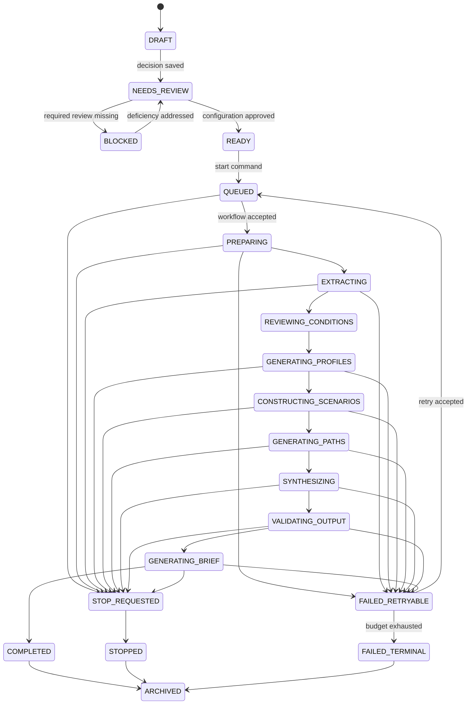
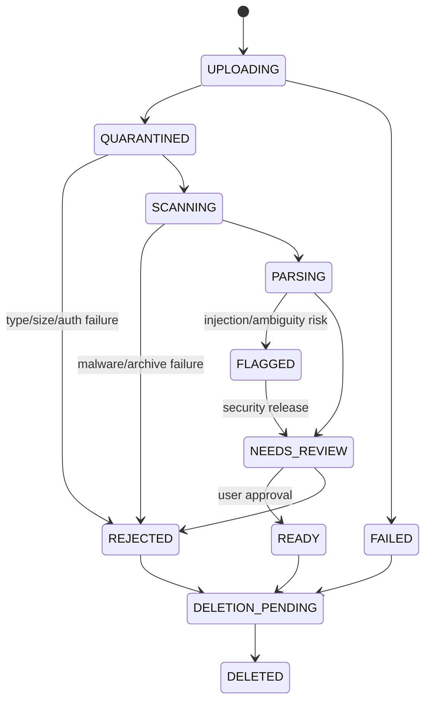
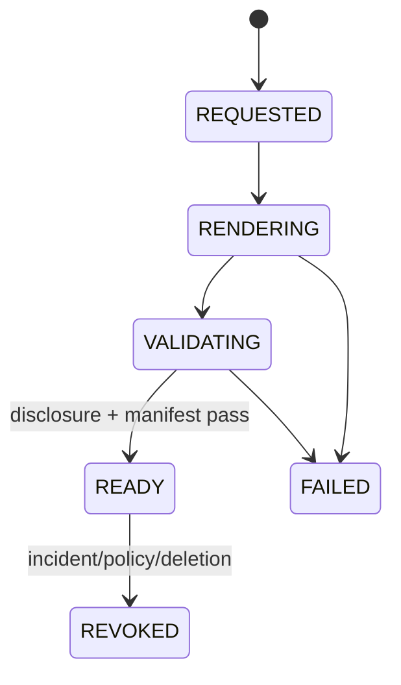

# State machines

> **Document authority.** The capitalized terms **MUST**, **MUST NOT**, **SHOULD**,
> **SHOULD NOT**, and **MAY** are normative. A feature is not complete merely
> because the interface resembles the design; it must satisfy the domain,
> methodological, security, accessibility, and evidence requirements in this
> documentation system. Where this document conflicts with generated output,
> legacy copy, or an implementation convenience, this document controls until
> superseded through an approved architecture or product decision record.

## Rules common to all state machines

- Transitions occur through a domain command, never direct UI/database mutation.
- Every command is authenticated, authorized, policy-checked, and audited.
- State changes use optimistic concurrency.
- Repeated commands are idempotent.
- Invalid transitions return a stable error code.
- Timestamps and responsible actor are recorded.
- Background activities may retry; state transitions do not duplicate artifacts.
- Terminal success does not erase prior failures or attempts.
- Administrative overrides require a reason, approver, expiry, and audit event.

## Run state machine



### Run transition guards

| From | To | Guard |
|---|---|---|
| `NEEDS_REVIEW` | `READY` | decision valid; policy allowed; sources resolved; assumptions/profiles approved; Truth Contract fields present |
| `READY` | `QUEUED` | immutable config created; configuration hash verified; idempotency key accepted |
| any active | `STOP_REQUESTED` | requester has stop capability; not already terminal |
| `VALIDATING_OUTPUT` | `GENERATING_BRIEF` | all critical truth, schema, provenance, coverage, and safety validators pass |
| `GENERATING_BRIEF` | `COMPLETED` | brief and manifest stored; export eligibility calculated |
| `FAILED_RETRYABLE` | `QUEUED` | retryable code; budget remains; same or approved replacement release |
| terminal | `ARCHIVED` | retention and legal-hold rules allow |

`COMPLETED` cannot transition back to active. A rerun creates a new run with
`parent_run_id`.

### Stop semantics

- Stop is cooperative and durable.
- The workflow stops scheduling new activities.
- In-flight provider calls may finish; their output is quarantined unless the
  workflow explicitly accepts it before final stop.
- Completed stage artifacts remain inspectable and labeled incomplete.
- No decision brief is marked final.
- Billing and audit records reflect completed work.
- Restarting is a new run or explicit retry, not a hidden continuation.

## Run-stage state machine

```text
PENDING
→ READY
→ RUNNING
→ VALIDATING
→ SUCCEEDED

RUNNING/VALIDATING
→ RETRY_WAIT
→ READY

RUNNING/VALIDATING
→ FAILED_TERMINAL
RUNNING
→ CANCEL_REQUESTED
→ CANCELLED
```

A stage attempt is immutable. Retry creates the next attempt number.

## Source-ingestion state machine



### Source guards

- `QUARANTINED` objects cannot be fetched through user-facing download routes.
- `PARSING` requires successful signature/MIME/malware/decompression checks.
- `FLAGGED` requires named security or authorized reviewer action.
- `READY` requires extracted candidates to be reviewed; source readiness does
  not mean outcome evidence.
- Replacement creates a new source version.
- Deletion does not become `DELETED` until primary copies are purged and backup
  aging is scheduled/accounted for.

## Decision-review state machine

```text
DRAFT
→ POLICY_REVIEW
→ SOURCE_REVIEW
→ ASSUMPTION_REVIEW
→ PROFILE_REVIEW
→ CONFIGURATION_CHECK
→ APPROVED
```

Any material edit after approval creates a new decision version and returns the
affected downstream stage to review.

## Export state machine



The export service MUST fail closed. `READY` requires:

- visible truth header/footer;
- machine-readable origin metadata;
- content hash;
- provenance manifest;
- authorization check;
- no prohibited terminology;
- no cross-tenant references.

## Deletion state machine

```text
REQUESTED
→ ELIGIBILITY_CHECK
→ LEGAL_HOLD | PURGING_PRIMARY
PURGING_PRIMARY
→ PURGING_PROVIDERS
→ PURGING_BACKUPS
→ COMPLETE

any purge state
→ FAILED
→ retry same state
```

`COMPLETE` means primary and provider deletions are confirmed and backup
expiration is complete or truthfully documented as aged out according to
policy. The UI must not claim instant erasure when backups remain.

## Incident state machine

```text
REPORTED
→ TRIAGED
→ ACTIVE
→ CONTAINED
→ ERADICATED
→ RECOVERING
→ MONITORING
→ CLOSED
```

A closed incident requires a timeline, affected scope, evidence preservation,
notification decisions, corrective actions, and post-incident review.

## Model/prompt release state machine

```text
DRAFT
→ EVALUATING
→ REJECTED | APPROVED
APPROVED
→ CANARY
→ ACTIVE | ROLLED_BACK
ACTIVE
→ DEPRECATED
→ RETIRED
```

Mutable provider aliases never become `ACTIVE` without being resolved to an
exact model identifier in the run manifest.

## State-machine acceptance

- exhaustive transition tests cover allowed and forbidden pairs;
- concurrent transition tests prove optimistic locking;
- worker restarts do not lose acknowledged jobs;
- duplicate messages do not duplicate artifacts;
- stop works at every active stage;
- terminal states are immutable;
- export and deletion states do not overstate completion;
- every state exposes plain-language user copy and an explicit next action;
- all transition events appear in the audit timeline.

## References

- [Temporal documentation](https://docs.temporal.io/) — Reference implementation for durable, resumable workflow orchestration; the architecture requires an interface rather than vendor lock-in.
- [NIST SP 800-61 Rev. 3](https://csrc.nist.gov/pubs/sp/800/61/r3/final) — Final incident-response recommendations aligned with CSF 2.0.
