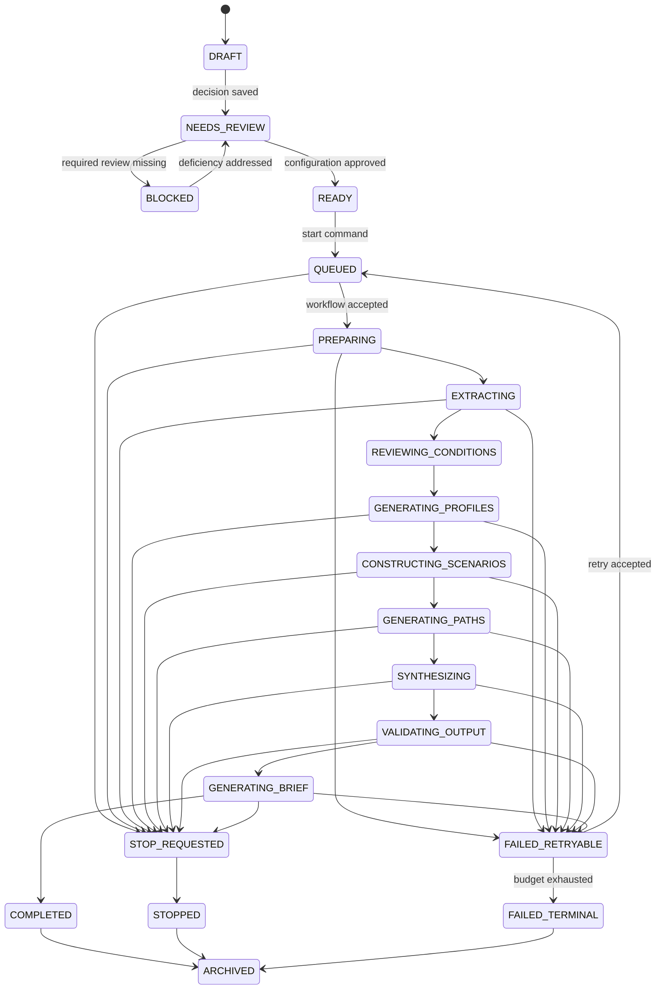
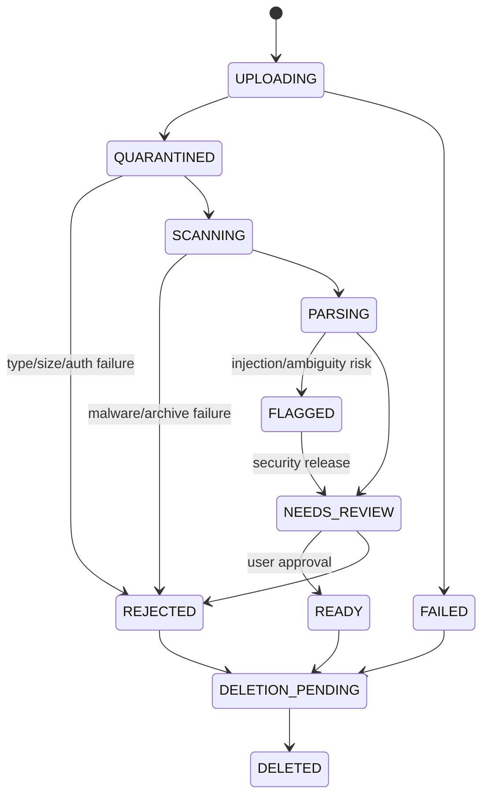
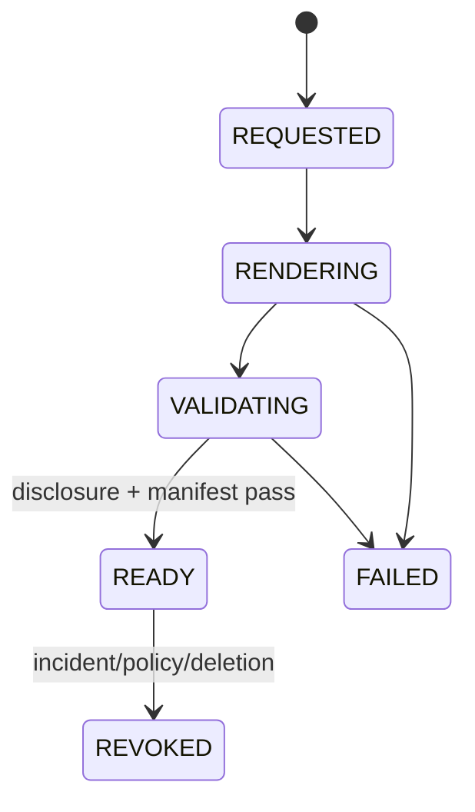

# State machines

> **Document authority.** The capitalized terms **MUST**, **MUST NOT**, **SHOULD**,
> **SHOULD NOT**, and **MAY** are normative. A feature is not complete merely
> because the interface resembles the design; it must satisfy the domain,
> methodological, security, accessibility, and evidence requirements in this
> documentation system. Where this document conflicts with generated output,
> legacy copy, or an implementation convenience, this document controls until
> superseded through an approved architecture or product decision record.

## Rules common to all state machines

- Transitions occur through a domain command, never direct UI/database mutation.
- Every command is authenticated, authorized, policy-checked, and audited.
- State changes use optimistic concurrency.
- Repeated commands are idempotent.
- Invalid transitions return a stable error code.
- Timestamps and responsible actor are recorded.
- Background activities may retry; state transitions do not duplicate artifacts.
- Terminal success does not erase prior failures or attempts.
- Administrative overrides require a reason, approver, expiry, and audit event.

## Run state machine



### Run transition guards

| From | To | Guard |
|---|---|---|
| `NEEDS_REVIEW` | `READY` | decision valid; policy allowed; sources resolved; assumptions/profiles approved; Truth Contract fields present |
| `READY` | `QUEUED` | immutable config created; configuration hash verified; idempotency key accepted |
| any active | `STOP_REQUESTED` | requester has stop capability; not already terminal |
| `VALIDATING_OUTPUT` | `GENERATING_BRIEF` | all critical truth, schema, provenance, coverage, and safety validators pass |
| `GENERATING_BRIEF` | `COMPLETED` | brief and manifest stored; export eligibility calculated |
| `FAILED_RETRYABLE` | `QUEUED` | retryable code; budget remains; same or approved replacement release |
| terminal | `ARCHIVED` | retention and legal-hold rules allow |

`COMPLETED` cannot transition back to active. A rerun creates a new run with
`parent_run_id`.

### Stop semantics

- Stop is cooperative and durable.
- The workflow stops scheduling new activities.
- In-flight provider calls may finish; their output is quarantined unless the
  workflow explicitly accepts it before final stop.
- Completed stage artifacts remain inspectable and labeled incomplete.
- No decision brief is marked final.
- Billing and audit records reflect completed work.
- Restarting is a new run or explicit retry, not a hidden continuation.

## Run-stage state machine

```text
PENDING
→ READY
→ RUNNING
→ VALIDATING
→ SUCCEEDED

RUNNING/VALIDATING
→ RETRY_WAIT
→ READY

RUNNING/VALIDATING
→ FAILED_TERMINAL
RUNNING
→ CANCEL_REQUESTED
→ CANCELLED
```

A stage attempt is immutable. Retry creates the next attempt number.

## Source-ingestion state machine



### Source guards

- `QUARANTINED` objects cannot be fetched through user-facing download routes.
- `PARSING` requires successful signature/MIME/malware/decompression checks.
- `FLAGGED` requires named security or authorized reviewer action.
- `READY` requires extracted candidates to be reviewed; source readiness does
  not mean outcome evidence.
- Replacement creates a new source version.
- Deletion does not become `DELETED` until primary copies are purged and backup
  aging is scheduled/accounted for.

## Decision-review state machine

```text
DRAFT
→ POLICY_REVIEW
→ SOURCE_REVIEW
→ ASSUMPTION_REVIEW
→ PROFILE_REVIEW
→ CONFIGURATION_CHECK
→ APPROVED
```

Any material edit after approval creates a new decision version and returns the
affected downstream stage to review.

## Export state machine



The export service MUST fail closed. `READY` requires:

- visible truth header/footer;
- machine-readable origin metadata;
- content hash;
- provenance manifest;
- authorization check;
- no prohibited terminology;
- no cross-tenant references.

## Deletion state machine

```text
REQUESTED
→ ELIGIBILITY_CHECK
→ LEGAL_HOLD | PURGING_PRIMARY
PURGING_PRIMARY
→ PURGING_PROVIDERS
→ PURGING_BACKUPS
→ COMPLETE

any purge state
→ FAILED
→ retry same state
```

`COMPLETE` means primary and provider deletions are confirmed and backup
expiration is complete or truthfully documented as aged out according to
policy. The UI must not claim instant erasure when backups remain.

## Incident state machine

```text
REPORTED
→ TRIAGED
→ ACTIVE
→ CONTAINED
→ ERADICATED
→ RECOVERING
→ MONITORING
→ CLOSED
```

A closed incident requires a timeline, affected scope, evidence preservation,
notification decisions, corrective actions, and post-incident review.

## Model/prompt release state machine

```text
DRAFT
→ EVALUATING
→ REJECTED | APPROVED
APPROVED
→ CANARY
→ ACTIVE | ROLLED_BACK
ACTIVE
→ DEPRECATED
→ RETIRED
```

Mutable provider aliases never become `ACTIVE` without being resolved to an
exact model identifier in the run manifest.

## State-machine acceptance

- exhaustive transition tests cover allowed and forbidden pairs;
- concurrent transition tests prove optimistic locking;
- worker restarts do not lose acknowledged jobs;
- duplicate messages do not duplicate artifacts;
- stop works at every active stage;
- terminal states are immutable;
- export and deletion states do not overstate completion;
- every state exposes plain-language user copy and an explicit next action;
- all transition events appear in the audit timeline.

## References

- [Temporal documentation](https://docs.temporal.io/) — Reference implementation for durable, resumable workflow orchestration; the architecture requires an interface rather than vendor lock-in.
- [NIST SP 800-61 Rev. 3](https://csrc.nist.gov/pubs/sp/800/61/r3/final) — Final incident-response recommendations aligned with CSF 2.0.

---

## Project-specific state-machine status (baseline `8b616dc7`)

This section maps every state machine above to the actual code under
[`backend/app/`](../../backend/app/) and flags where the implementation
matches, diverges, or is missing. Items are marked **CURRENT** (implemented
and verified), **PARTIAL** (implemented but materially deficient against
this doc), or **TARGET** (the doc is normative; the implementation has not
reached it). See [`docs/architecture/index.md`](index.md) for the legend.

### Current state machines in the code

Three state machines are explicitly defined in the codebase today:

```text
Project lifecycle — CURRENT
  CREATED
  → ONTOLOGY_GENERATED
  → GRAPH_BUILDING
  → GRAPH_COMPLETED
  (any) → FAILED
```

Source: [`backend/app/models/project.py:18-25`](../../backend/app/models/project.py:18).
`ProjectManager` ([`models/project.py:102-310`](../../backend/app/models/project.py:102))
reads and writes `project.json` per project directory directly — no
constraints, no transactions. The lifecycle is a coarse 5-state enum; it
does **not** model the run, the report, the environment, or the
preparation as independent aggregates.

```text
Task lifecycle — PARTIAL
  PENDING
  → PROCESSING
  → COMPLETED
  (any) → FAILED
```

Source: [`backend/app/models/task.py:21-26`](../../backend/app/models/task.py:21).
The `TaskManager` is a process-local singleton with a thread-safe in-memory
dict plus a best-effort Redis snapshot. The in-memory dict will not
survive multi-worker or a restart. See [`docs/architecture/index.md`](index.md)
§"State and persistence" for the defect list.

```text
Simulation lifecycle — PARTIAL (audit P1 finding)
  Conflated with preparation, environment, task, and report states
```

Source: [`backend/app/services/simulation_runtime_contract.py`](../../backend/app/services/simulation_runtime_contract.py)
and the routes in [`backend/app/api/routes/`](../../backend/app/api/routes/).
The integration audit's P1 finding "Contradictory lifecycle semantics"
identified four contradictions. **Three are now fixed:**

- **stop returns `STOPPED` but the manager state became `PAUSED`** — FIXED:
  `/stop` maps the runner's terminal status to the persisted status (STOPPED).
- **the close route marked the simulation `COMPLETED` even when the close
  result was failure** — FIXED: `/close-env` sets COMPLETED only on success.
- **the preparation-check helper treated `failed` (and other terminal states)
  as proof that preparation was ready** — FIXED: `failed` is no longer in
  `prepared_statuses`; only genuinely-prepared or post-run-success statuses
  qualify.
- **a status read rewrote `state.json` from `preparing` to `ready`** — FIXED:
  `_check_simulation_prepared` no longer mutates canonical state; flipping to
  READY is the prepare task's responsibility.

The deeper P1 finding — the single conflated `SimulationStatus` enum
conflating preparation/execution/environment/report/task state — remains
TARGET; resolving it needs the four independent state machines (gate 2). The
full audit text is in
[`ASKTHEPEOPLE_GODMODE_BUILDPLAN.md` §5 P1](../../ASKTHEPEOPLE_GODMODE_BUILDPLAN.md#5-release-blocking-findings).

### Status of the target state machines

| Target machine | This doc | Current code | Gap |
|---|---|---|---|
| Run (DRAFT → ARCHIVED, with PREPARING, EXTRACTING, etc.) | run state machine | `SimulationManager` mutates state.json directly | All transitions need a domain command and a centralized guard |
| Run-stage (PENDING → SUCCEEDED, with RETRY_WAIT) | run-stage state machine | Implicit in `time.sleep(0.5)` polling loop in the Celery task | No attempt table, no per-stage retry classification |
| Source-ingestion (UPLOADING → DELETED) | source-ingestion state machine | `ProjectManager.save_file_to_project` writes a UUID file; `extracted_text.txt` is the only post-processing artifact | No QUARANTINED, no SCANNING, no FLAGGED; gate 0 P0 fix |
| Decision-review (DRAFT → APPROVED) | decision-review state machine | `simulation_requirement` is free-text in `models/project.py:48-49` | No review aggregates, no version bump on material edit |
| Export (REQUESTED → REVOKED) | export state machine | `services/export_service.py` writes a file directly | No READY with disclosure + manifest pass; no REVOKED |
| Deletion (REQUESTED → COMPLETE) | deletion state machine | `ProjectManager.delete_project` calls `shutil.rmtree` immediately | No LEGAL_HOLD, no provider deletion, no backup aging |
| Incident (REPORTED → CLOSED) | incident state machine | [`docs/security/INCIDENT_RESPONSE.md`](../security/INCIDENT_RESPONSE.md) defines the procedure; no code implementation | No incident table, no state transitions in code |
| Model/prompt release (DRAFT → RETIRED) | model/prompt release state machine | No prompt registry; prompt templates are inlined in service code | No EVALUATING, no CANARY, no ROLLED_BACK |

### Domain command surface — TARGET

The doc's "Rules common to all state machines" require that **transitions
occur through a domain command, never direct UI/database mutation**. The
current code does not have a domain command surface. The audit's
decomposition target
([`ASKTHEPEOPLE_GODMODE_BUILDPLAN.md` §7](../../ASKTHEPEOPLE_GODMODE_BUILDPLAN.md#7-correct-target-architecture))
names the application-command layer at
`backend/app/application/commands/{create_simulation,prepare_simulation,start_run,stop_run,close_environment}.py`.
None of these exists today. Tracked in
[`docs/exec-plans/04-durable-orchestration-and-path-engine.md`](../exec-plans/04-durable-orchestration-and-path-engine.md).

### Optimistic concurrency — TARGET

`Project` and `Task` dataclasses do not carry a `version` field. The
filesystem JSON write in
[`models/project.py:168-175`](../../backend/app/models/project.py:168)
is a non-atomic `open(..., 'w').write(...)`. The audit's P1 finding
"Non-atomic file persistence" applies. Optimistic concurrency is
**TARGET** and is part of gate 3 (canonical persistence), owned by
`askthepeople-persistence-engineer`.

### Idempotency — PARTIAL

The Celery task
[`app/tasks/simulation_tasks.py:16`](../../backend/app/tasks/simulation_tasks.py:16)
takes an optional `task_id` and uses it as the canonical Celery task ID,
which is the seed of idempotency. The route layer does not yet pass an
`Idempotency-Key` header. Tracked in
[`docs/exec-plans/04-durable-orchestration-and-path-engine.md`](../exec-plans/04-durable-orchestration-and-path-engine.md).

### Stop semantics — CURRENT (audit P1 fix)

The two P1 contradictions in the stop/close lifecycle are fixed
([`api/routes/execution_routes.py`](../../backend/app/api/routes/execution_routes.py)):

- `/stop` now maps the runner's terminal `RunnerStatus` to the persisted
  `SimulationStatus`, so an explicit stop records `STOPPED`, not `PAUSED`.
- `/close-env` now sets `COMPLETED` only when the close actually succeeded;
  a failed close leaves the prior status visible instead of silently
  upgrading a failure to `COMPLETED`.

Regression tests pin both (route-level: stop-persists-stopped,
close-env-no-complete-on-failure, close-env-complete-on-success).

The deeper P1 finding — the single conflated `SimulationStatus` enum
conflating preparation/execution/environment/report/task state — remains
TARGET; resolving it needs the four independent state machines (gate 2).

### Run-stage attempt — TARGET

There is no `attempts` table and no per-stage attempt record today. The
"rework creates the next attempt number" rule from the Run-stage state
machine is **TARGET** and requires the canonical persistence layer.

### Terminal immutability — PARTIAL

A completed `Project` is mutable in the current code: `ProjectManager`
does not block edits after `GRAPH_COMPLETED`. The audit's P1 finding on
"Force restart destroys provenance" is the same defect from a different
angle. Terminal immutability is **TARGET** and is enforced by the
canonical persistence layer in gate 3.

### Audit timeline — PARTIAL

A cross-aggregate append-only audit log now exists
([`services/audit_log.py`](../../backend/app/services/audit_log.py)): JSONL
today (portable to a PostgreSQL `audit_events` table when gate 3 lands),
recording `actor`/`reason`/`timestamp`/`before`/`after` per the P1
requirement, with an incident-response read side (`find_events` /
`find_affected_runs`). It is wired into project create/delete/status-change
and task create/complete/fail transitions. Still TARGET: recording *every*
state-machine transition (only the highest-value transitions are wired
today), joining the event to the same transaction as the write (requires the
PostgreSQL outbox), and using it for the admin-override expiry record.
