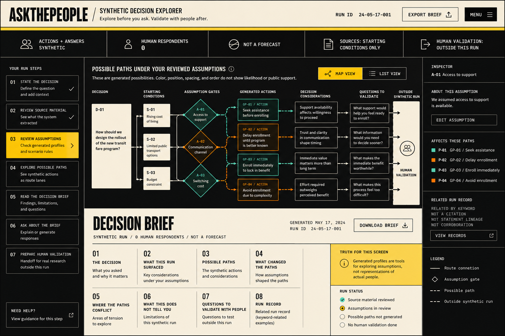

# Direction C — Civic Wayfinding

> **Document authority.** The capitalized terms **MUST**, **MUST NOT**, **SHOULD**,
> **SHOULD NOT**, and **MAY** are normative. A feature is not complete merely
> because the interface resembles the design; it must satisfy the domain,
> methodological, security, accessibility, and evidence requirements in this
> documentation system. Where this document conflicts with generated output,
> legacy copy, or an implementation convenience, this document controls until
> superseded through an approved architecture or product decision record.
> **Research status.** This document distinguishes binding product policy from
> external standards and research. External sources inform the requirements but
> do not automatically make the product compliant, valid, accurate, or fit for a
> particular legal jurisdiction. Legal and human-subject review remain separate
> launch responsibilities.

## Design objective

The interface must feel like a consequential public-interest decision brief:
direct, legible, editorial, and useful to a person who does not speak in model,
graph, or simulation terminology. The route-map metaphor communicates sequence
and branching. It MUST NOT communicate probability, popularity, sample size,
corroboration, or prediction.

The visual system is successful only when the user forms the correct product
model. Charcoal, cream, editorial red, compressed display type, and route
lines are not sufficient on their own. Yellow is an attention accent, not the
primary brand or action color.

## Design principles

1. **Truth before theater.** The synthetic and non-forecast status is always more
   prominent than visual AI spectacle.
2. **One decision, one next action, one limitation layer.** Primary screens do not
   compete with diagnostics.
3. **Surfaces have semantic meaning.** Paper is for human-authored decisions and
   review; charcoal is for synthetic exploration; white marks transfer outside
   the synthetic system.
4. **Route geometry is language.** Every node and line has a controlled semantic
   definition.
5. **Editorial reading beats dashboards.** The brief is a document, not a KPI wall.
6. **Progressive disclosure beats telemetry.** Advanced run records remain
   inspectable without dominating the journey.
7. **Accessibility is structural.** The route map has an equivalent semantic list,
   all controls work with keyboard and touch, and no meaning depends on color or
   motion.
8. **No fake institutionality.** Civic clarity does not justify a government seal,
   flag treatment, official-sounding certification, or imitation of a specific
   public authority.

## Brand lockup

```text
ASKTHEPEOPLE / GENERATED DECISION EXPLORER
Explore assumptions before you ask. Validate with people after.
```

The descriptor is inseparable from the wordmark. Marketing and logged-out
surfaces MUST establish the synthetic boundary before describing features.

## Top-level information architecture

```text
WORKSPACES
  └── PROJECTS
       └── DECISIONS
            ├── SOURCES
            ├── ASSUMPTIONS
            ├── GENERATED PROFILES
            ├── RUN CONFIGURATIONS
            ├── RUNS
            │    ├── POSSIBLE PATHS
            │    ├── DECISION BRIEF
            │    ├── FOLLOW-UP
            │    └── RUN RECORD
            ├── RESEARCH HANDOFFS
            ├── EXTERNAL HUMAN EVIDENCE [PHASE 2]
            └── DECISION-OWNER CONCLUSIONS
```

## Primary navigation

Primary navigation should remain small:

- Decisions
- Runs
- Handoffs
- Workspace settings

Inside a decision, use the seven-step workflow. Do not add separate top-level pages for every diagnostic object.

## Canonical seven-step journey

### Step 1 — State the decision

**Page title:** `State the decision`  
**Primary action:** `Review source material`  
**Secondary action:** `Continue without source material`

Required UI:

- decision question;
- intended use;
- owner;
- time horizon;
- stakes;
- reversibility;
- scope and exclusions;
- source upload;
- contextual truth statement.

Block progress when the question contains multiple decisions, prohibited use, or no intended use.

### Step 2 — Review source material

Default to a **source-to-starting-condition ledger**, not a graph.

Columns:

- Source location
- Candidate starting condition
- System interpretation
- Flags
- Accept / Edit / Ignore

`View source map` is optional and user-invoked. The map uses neutral lines and may connect source segments only to starting conditions.

Primary action: `Review assumptions`

### Step 3 — Review assumptions

Sections:

- accepted starting conditions;
- assumptions;
- critical uncertainties;
- generated profiles;
- scenario rules;
- coverage tasks.

Show a task status list:

```text
READY         Decision question
READY         Source material
NEEDS REVIEW  2 assumptions
NEEDS REVIEW  1 generated profile
READY         Scenario rules
```

Primary action: `Check this run`

### Step 4 — Check this run

Use a check-answers pattern before expensive generation.

Show:

- decision;
- sources and hashes;
- starting conditions;
- assumptions;
- uncertainties and states;
- profiles;
- scenario rules;
- exclusions;
- model/method configuration at a human-readable level;
- estimated run cost range;
- permanent truth block.

Primary action: `Generate possible paths`

The user must confirm:

```text
I understand that this run generates synthetic possibilities and does not ask, measure, or predict people.
```

### Step 5 — Explore possible paths

**Page title:** `Possible paths under your reviewed assumptions`

Fixed explanation:

```text
These are generated possibilities. Color, position, spacing, order,
and line length do not show likelihood, public support, or quality.
```

Required modes:

- Map view
- List view
- Compare runs

List view is canonical and must contain all information and actions available in the visual map.

Primary action: `Create decision brief`

### Step 6 — Read and question the brief

The brief comes first. Follow-up tools sit after the document, not as a dominant chat surface.

Sections follow the brief method in Section 28.

Primary action: `Prepare human validation`

Secondary action: `Ask about this brief`

### Step 7 — Prepare human validation

The charcoal route ends before this step. The screen uses a separate light-cream transfer field.

Primary action: `Create research handoff`

Secondary outputs:

- Export discussion guide
- Export questionnaire draft
- Copy assumptions to test
- Export path-validation matrix

Completion state:

```text
RESEARCH HANDOFF PREPARED
No human validation has occurred in this application.
```

## Route-map grammar

The map is a controlled semantic system.

| Object | Identifier | Geometry | Meaning |
|---|---|---|---|
| Decision | `D-01` | Solid warm-paper rectangle | Single origin of the run |
| Source material | `S-01` | Outlined document block | Uploaded input asset |
| Starting condition | `SC-01` | Short neutral rectangular block | Reviewed input condition |
| Assumption | `A-01` | Diamond or square junction | Only object allowed to create a branch |
| Critical uncertainty | `U-01` | Split gate with labeled states | Variable deliberately varied across paths |
| Generated profile | `GP-01` | Rectangular labeled lens | Decision-relevant constraint set, not a person |
| Possible path | `P-01` | Directly labeled lane | Qualitative synthetic path |
| Synthetic action | `SA-01` | Equal-weight route segment/block | Generated action in sequence |
| Decision consideration | `DC-01` | Bordered block | Issue surfaced within the run |
| Validation question | `VQ-01` | Warm-paper question block | Question for actual research |
| Related run record | `RR-01` | Inspector row | Keyword/semantic relation, not citation |
| Human handoff | — | White external field with broken boundary | Outside synthetic run |

### Route rules

1. All possible-path lines have equal visible weight.
2. Each lane is directly labeled with `P-##`; color is redundant.
3. No edge width, opacity, animation speed, length, vertical position, or order may encode probability or importance.
4. Teal and orange distinguish route families only. Neither means positive, negative, safe, risky, majority, or minority.
5. Source material never connects directly to a path, action, consideration, or brief statement.
6. Branches occur only at reviewed assumptions or critical uncertainties.
7. The route terminates before the human-validation field with a visible 8–16 px break.
8. No Sankey diagram, force-directed graph, chord diagram, confidence band, funnel, poll bar, heat map, or weighted network.
9. The legend must state: `Spacing shows sequence only. It does not show time or likelihood.`
10. Map interactions have an equivalent named control in the semantic list.

## Truth Rail

### Desktop

Five rectangular cells separated by hard rules; 48–52 px high.

```text
ACTIONS + ANSWERS: GENERATED | HUMAN RESPONDENTS: 0 | NOT A FORECAST |
SOURCES: STARTING CONDITIONS ONLY | HUMAN VALIDATION: OUTSIDE THIS RUN
```

### Mobile

Two wrapped lines, never a horizontal carousel:

```text
GENERATED · 0 HUMAN RESPONDENTS · NOT A FORECAST
SOURCES SET INPUTS ONLY · VALIDATE WITH PEOPLE OUTSIDE
```

The rail may be sticky only if `scroll-padding-top` and focus tests prove it never obscures content. WCAG 2.2 adds an AA requirement that focused items not be entirely obscured.([WCAG 2.2 Focus Not Obscured](https://www.w3.org/WAI/WCAG22/Understanding/focus-not-obscured-minimum))

## Surface semantics

- **Warm paper:** user decisions, forms, review, editorial brief.
- **Charcoal:** synthetic route field, run process, diagnostics.
- **Light-cream transfer field:** external research handoff and the boundary where the synthetic system ends.

This creates a stable visual narrative:

```text
CREAM — DEFINE AND REVIEW
CHARCOAL — EXPLORE GENERATED POSSIBILITIES
LIGHT CREAM — LEAVE THE GENERATED SYSTEM AND VALIDATE
```

Do not use these surfaces merely as decorative alternation.

## Visual design tokens

### Color

| Token | Value | Use |
|---|---:|---|
| `--ink` | `#111313` | Main dark field and primary text |
| `--paper` | `#F2EBDD` | Forms and reading surfaces |
| `--paper-transfer` | `#F7F0E2` | Human-validation boundary |
| `--signal` | `#F04B3D` | Current step, active route, thin wayfinding edge, single primary action |
| `--signal-strong` | `#FF5D4F` | Hover or pressed action field |
| `--signal-deep` | `#982D24` | Accessible red text on cream and hard-offset action shadow |
| `--attention` | `#FFD51D` | Focus, warning, and small attention marks only |
| `--text-dark-secondary` | `#C7C0B3` | Secondary text on charcoal |
| `--text-paper-secondary` | `#646761` | Secondary text on paper |
| `--error-paper` | `#B42318` | Error on paper |
| `--error-dark` | `#E75B52` | Error on charcoal |
| `--rule-dark` | `#2A2E2E` | Dark-field rules |
| `--rule-paper` | `#B8B0A2` | Paper-field rules |

Validate actual contrast in code and CI. Do not rely on this table alone.

### Typography

Default open-source pairing:

- **Archivo Narrow:** display headings, route labels, folios.
- **Source Sans 3:** body, forms, instructions, buttons, brief.

Optional licensed pairing:

- Söhne Schmal + Söhne.

Rules:

- compressed display type is for short labels and headings only;
- body line length: 45–68 characters;
- sentence case for instructions;
- uppercase only for compact route/status labels;
- tabular numerals for IDs, dates, and zero-human disclosure;
- no monospace as a theme;
- never rely on browser-default control typography.

### Type scale

| Role | Desktop | Mobile |
|---|---:|---:|
| Display | 64–72 / 0.92 | 44–52 / 0.96 |
| H1 | 44–52 / 1.0 | 36–40 / 1.0 |
| H2 | 30–34 / 1.08 | 26–30 / 1.10 |
| H3 | 21–24 / 1.20 | 20–22 / 1.20 |
| Large body | 18 / 28 | 18 / 27 |
| Body | 16–17 / 25 | 16 / 24 |
| Route label | 12–13 / 16 | 12 / 16 |

### Geometry

- Base corner radius: `0`.
- Small functional radius allowed only for native focus clarity: maximum `2px`.
- Borders: 1px and 2px hard rules.
- Active step: 4px editorial-red edge or full red field.
- No glass, blur, gradients, glows, rounded floating cards, pill-heavy controls, or soft elevation system.
- A single 4px hard-offset document shadow may be used on paper surfaces.
- Use asymmetry through grid, folios, extended rules, and inspector placement—not random card offsets.

### Spacing

Use a 4px base with primary steps:

```text
4, 8, 12, 16, 24, 32, 48, 64, 96
```

Dense diagnostic rows may use 8–12px vertical spacing. Reading surfaces require 24–48px section rhythm.

## Desktop layout

Recommended shell:

| Region | Size |
|---|---:|
| Masthead | 72 px (4.5 rem) |
| Truth Rail | 32 px (2 rem) |
| Step spine | 216–240 px |
| Primary paper surface | 680–760 px |
| Route stage | Flexible remainder |
| Optional inspector | 320–360 px |
| Outer margin | 32–48 px |
| Gutter | 24 px |

The paper surface is anchored to the grid. Do not center every page as a floating card.

## Mobile layout

- Minimum supported width: 320 CSS px.
- 16px outer margins.
- One mode at a time.
- Current step shown as `Step 3 of 7 — Review assumptions`.
- List view is the default for paths.
- Path comparison stacks vertically.
- Inspector becomes a full-screen dialog or inline disclosure.
- No mandatory horizontal panning.
- No miniaturized desktop map.
- Sticky actions must not cover focus or content.

## Content design and terminology enforcement

### Preferred terms

- Source material
- Starting condition
- Assumption
- Critical uncertainty
- Generated profile
- Decision lens
- Scenario rule
- Possible path
- Synthetic action
- Decision consideration
- Pattern within this run
- Related run record
- Validate with people
- Research handoff
- External human evidence

### Prohibited synthetic-outcome terms

- Respondent
- Participant
- Sample
- Panel
- Survey result
- Poll
- Public opinion
- Confidence
- Probability
- Predicted behavior
- Representative
- Majority
- Minority
- Evidence from the graph
- Verified lineage
- Corroborated claim
- Digital twin
- Realistic human
- Human parity
- Citation to a generated conclusion

The words `respondent`, `participant`, `survey`, and `poll` may appear only when describing **future or completed real human research**, never synthetic output.

### Language linter

Implement a shared server/client linter that scans:

- AI outputs;
- UI copy;
- exports;
- email templates;
- share previews;
- seed data;
- marketing pages;
- documentation examples.

Each violation should include:

- term;
- location;
- allowed-context check;
- suggested replacement;
- severity.

Critical violations block artifact finalization and release.

## Related run records

The inspector title is `RUN RECORD`, not `Sources`, `Evidence`, or `Citations`.

Every related record displays:

```text
RELATED BY KEYWORD OR SEMANTIC SIMILARITY
NOT A CITATION
NOT STATEMENT LINEAGE
NOT CORROBORATION
```

Do not use superscript numbers, academic citation styling, quotation marks, or lines from a record to a consideration.

## Loading and operational states

Every state uses plain language and an explicit action.

### Upload processing

```text
Reading source material
We are extracting text and locations. No possible paths are being generated yet.
```

### Run queued

```text
Run queued
Your reviewed configuration is locked. You can leave this page and return.
```

### Run in progress

Show stages, not simulated “thinking”:

```text
1/5 Checking configuration          COMPLETE
2/5 Building scenario candidates    IN PROGRESS
3/5 Generating possible paths       NOT STARTED
4/5 Checking coverage and language  NOT STARTED
5/5 Preparing review                NOT STARTED
```

### Stopped

```text
Run stopped
No final brief was created. Review partial artifacts or start a new run.
```

### Reconnecting

```text
Connection lost
The run continues on the server. Reconnecting to status…
```

### Failure

```text
This run did not complete
No decision brief was finalized. Review the error record, retry from the failed stage, or duplicate the run with changes.
```

### Unauthorized

```text
You do not have access to this decision
Ask a workspace owner for access or return to Decisions.
```

Never use vague “Something went wrong” as the only message.

## Accessibility acceptance

Target **WCAG 2.2 AA** as the minimum and adopt selected AAA practices where practical. W3C recommends WCAG 2.2 as the current conformance target.([WCAG 2.2](https://www.w3.org/TR/WCAG22/))

Required:

- semantic headings and landmarks;
- list view equivalent for every route fact;
- full keyboard operation;
- visible yellow-and-ink focus treatment across dark and cream fields;
- no focused element obscured by sticky UI;
- 44×44 CSS px product standard for primary pointer targets, even though WCAG AA permits a smaller minimum in defined cases; 44×44 is the enhanced target.([WCAG 2.2 Target Size](https://www.w3.org/WAI/WCAG22/Understanding/target-size-minimum.html))
- no color-only meaning;
- minimum 3:1 non-text contrast for meaningful graphical objects and UI states;
- screen-reader labels for route IDs and relationships;
- focus trap, `Escape`, inert background, and focus restoration in modal dialogs;
- no hover-only or tooltip-only essential content;
- `prefers-reduced-motion` support;
- zoom/reflow at 200% and 400% where applicable;
- no two-dimensional scrolling for primary workflow content at 320px;
- accessible authentication without memory or puzzle barriers;
- error summary linked to fields;
- status messages announced without moving focus unnecessarily.

### Required manual test matrix

- Keyboard only, desktop
- NVDA + Firefox or Chrome on Windows
- VoiceOver + Safari on macOS/iOS
- 200% zoom on desktop
- 320px viewport
- Reduced motion
- High contrast / forced colors
- Touch target review
- PDF/print reading order

Automated accessibility tests are necessary but not sufficient.

## Motion

Use one signature motion cue:

- selected route draws from origin to endpoint in 160–220ms;
- branch nodes appear without bounce;
- state changes use short opacity/position transitions;
- no continuous pulses, moving particles, animated network “thinking,” or avatar typing;
- reduced-motion mode renders final state immediately.

Motion communicates sequence only. It must never imply probability, urgency, intelligence, or certainty.

## Elements that automatically fail design review

- Card soup or bento dashboard treatment
- Pill navigation everywhere
- Glassmorphism
- Generic SaaS gradients
- AI sparkles, robot heads, brains, magic wands
- Human avatars or portrait grids
- Fake subway tickets or faux government seals
- Poll bars, pie charts, confidence gauges, KPI cards
- Green “validated” or “verified” states
- Decorative coordinates or pseudo-technical metadata
- Animated agent swarms
- Fake citations attached to synthetic conclusions
- Source maps visible by default
- A chat interface dominating the product
- Any screen that looks like people have responded


---
## Component design contract

Every component family MUST define:

- semantic purpose;
- allowed content;
- forbidden content;
- states;
- keyboard and pointer behavior;
- screen-reader name and status behavior;
- responsive transformation;
- reduced-motion behavior;
- visual regression reference;
- truth-layer implications.

A one-off component is not acceptable when an existing family can represent the
same meaning.

## Design QA evidence

A release requires:

- concept and implementation screenshots at the agreed native viewport;
- side-by-side fidelity ledger;
- desktop, mobile, 200% zoom, high-contrast, keyboard, and reduced-motion review;
- route-map/list parity evidence;
- copy diff against approved strings;
- comprehension evidence for truth, route semantics, and human-validation
  boundary;
- no unapproved gradients, pills, rounded SaaS cards, avatars, or probability
  cues;
- no clipped or obscured Truth Rail or focus indicator.

## Reference asset

The approved visual direction reference is stored at:

[](assets/ASKTHEPEOPLE_Civic_Wayfinding_Reference.png)

The image is a direction reference, not production UI. Its rasterized copy,
icons, routes, and controls are non-normative. Code-native text and controls
MUST replace them, and the implementation MUST still pass the semantic,
responsive, accessibility, truth-layer, and comprehension requirements in this
documentation system.

## References

- [GOV.UK Design System - Notification banner](https://design-system.service.gov.uk/components/notification-banner/) - Warns against repeated banner overuse and supports putting task-critical information in the main journey.
- [GOV.UK Design System - Check answers](https://design-system.service.gov.uk/patterns/check-answers/) - Review-before-submit pattern used as the basis for the immutable run-configuration checkpoint.
- [ONS Service Manual - Using colours in charts](https://service-manual.ons.gov.uk/data-visualisation/colours/using-colours-in-charts) - Color restraint, contrast, and non-color redundancy for data and route visualization.
- [W3C Web Content Accessibility Guidelines 2.2](https://www.w3.org/TR/WCAG22/) - Current accessibility conformance target for the product.

---

## Design convergence ledger — combined direction

Two design directions were merged into one canonical surface: the
**web-OS desktop shell** (structural) and the **ink/paper restyle**
(visual). Each divergence below was resolved explicitly; the resolution is
normative and supersedes any earlier per-view or per-component treatment.

Status legend: **CURRENT** = implemented and verified in the tree.

### D1 — Truth Rail placement: shell-level, once

- Divergence: the original design rendered a Truth Rail inside individual
  views (Home, InteractionView, SimulationRunView each mounted
  `<TruthRail />`); the shell direction hoisted it into the desktop chrome.
- Resolution: the rail renders **once, in the shell**, never per-view.
  `frontend/src/components/DesktopShell.vue:3` mounts `<TruthRail />`;
  the views carry zero TruthRail references
  (`frontend/src/views/Home.vue`, `frontend/src/views/InteractionView.vue`,
  `frontend/src/views/SimulationRunView.vue`). Every window is therefore
  covered by the same disclosure with no duplication or drift.
- Emphasis: the rail's fact labels use the attention accent —
  `.truth-rail-text strong { color: var(--attention) }`
  (`frontend/src/components/TruthRail.vue:64-65`).

### D2 — Masthead: a two-level system

- Divergence: the original Home masthead was a single tall stack
  (`min-height: 16rem`); the shell added global chrome; the restyle made
  the in-window masthead a compact grid.
- Resolution:
  - **Shell chrome masthead** — `DesktopMasthead.vue` (`desktop-masthead`):
    brand + descriptor, workspace label, commands, and the standing
    `GENERATED · NOT A FORECAST` marker. This is the only masthead above
    the desktop chrome.
  - **In-window masthead** (State the decision) — the compact three-column
    grid: `grid-template-areas: "brand copy disclosure" / "brand nav nav"`,
    `min-height: 10.5rem` (`frontend/src/views/Home.vue:944-952`), with a
    3.2rem nav rail and 2.6rem nav tabs
    (`frontend/src/views/Home.vue:1070,1076,1093`).
  - The 16rem stacked masthead is discontinued.

### D3 — Badges: neutral field, semantic tint, red only on active

- Divergence: the original badges were solid signal-red fields; the restyle
  made badges status marks, not CTAs.
- Resolution (`frontend/src/components/Step1GraphBuild.vue:523-544`):
  - `success` → attention tint;
  - `processing` → signal tint (the **only** red badge state);
  - `accent` → violet tint;
  - `pending` → neutral `ink-raised` field.
  Red is reserved for the active/processing state.

### D4 — Signal red demoted to a thin wayfinding edge

- Divergence: the original used full red fields for brand surfaces, hover
  fills, and status overlays; the restyle demoted red to a wayfinding
  accent and made the brand field ink.
- Resolution — red is a **wayfinding edge / active-state accent**, never a
  full brand field:
  - Brand fields are ink: `.app-process-root > .app-header > .header-left`
    uses `background: var(--ink-deep)` with a 4px red left edge
    (`frontend/src/assets/design-tokens.css:474-480`); `.wb-label` is paper
    (`frontend/src/assets/design-tokens.css:656`); `run-brand` is ink-deep
    with a 4px red edge (`frontend/src/views/SimulationRunView.vue:407-416`);
    `brand-monogram` is ink-deep with a red outline
    (`frontend/src/views/InteractionView.vue:405-406`); `settings-index` is
    ink-deep with a 4px red right edge
    (`frontend/src/components/SettingsModal.vue:640`).
  - Hover fills are neutral: `button:hover` uses `--line-strong` /
    `--bg-hover` with paper text, not red
    (`frontend/src/assets/design-tokens.css:271-276`); template hover uses
    `--signal-faint` (`frontend/src/views/Home.vue`).
  - Status overlays are paper with a red outline and a hard offset shadow:
    `.status-overlay-hint` / `.completion-hint`
    (`frontend/src/components/GraphPanel.vue:678,693`).
  - Surfaces keep ink borders and a black hard-offset shadow:
    `.modal-container` / `.modal-content` / `.crash-banner` /
    `.access-gate-card` (`frontend/src/assets/design-tokens.css:863-870`).
  - Attention boundaries keep red as a top edge on ink or the
    paper-transfer field: `.meaning-boundary`
    (`frontend/src/components/Step3RunWayfinder.vue:999`);
    `.question-composer` (`frontend/src/components/Step5Interaction.vue:2423-2426`);
    NotFound aside (`frontend/src/views/NotFoundView.vue:49-58`).

### D5 — The desktop shell is the canonical workspace surface

The persistent desktop shell (`frontend/src/components/DesktopShell.vue`)
hosts the masthead, the journey step-spine launcher, draggable/tileable
step windows, the taskbar, and a session that restores open windows and
preserves deep links on refresh. Step views render **inside** windows; the
shell chrome (masthead, dock, taskbar) is the only chrome above them. See
the "Project-specific design status" section below for the full
CURRENT / PARTIAL / TARGET state.

---

## Project-specific design status (baseline `8b616dc7`)

The Civic Wayfinding visual system is implemented in
`frontend/src/` as CSS and SVG. The semantic route list required
by
[`adr/ADR-0006-route-map-list-parity.md`](../architecture/adr/ADR-0006-route-map-list-parity.md)
is **TARGET**. Owned by `askthepeople-frontend-steward`.

### Current state — PARTIAL

- Frontend is Vue 3 + Vite + vue-router. Built into
  `frontend/dist/` and served by
  [`backend/app/__init__.py:317-325`](../../backend/app/__init__.py:317).
- The workspace renders as a persistent desktop shell
  (`frontend/src/components/DesktopShell.vue`): a masthead, a
  journey step-spine launcher, draggable/tileable windows for each
  step, a taskbar, and a session that restores open windows and
  preserves deep links on refresh. The shell is the sole host of
  the five-fact Truth Rail, so every primary route is covered.
- Route visualization in the home view uses CSS-driven animations;
  D3 is used in `GraphPanel.vue` for graph rendering. The route
  grammar is documented in [`docs/design/ROUTE_GRAMMAR.md`](ROUTE_GRAMMAR.md).
- The Truth Rail is rendered once in the desktop shell. The
  per-screen contextual statements and the full disclosure block
  remain **not yet rendered** in the frontend. The text
  disclosures live in
  [`README.md:9-12`](../../README.md) and
  [`docs/product/PRODUCT_TRUTH_CONTRACT.md`](../product/PRODUCT_TRUTH_CONTRACT.md).
- The route-list / map parity test required by ADR-0006 is
  missing. There is no automated check that every node, edge,
  and action in the visual map has a corresponding list entry.
- The qualitative-only constraint ("line width, color, position,
  spacing, order, count and placement never communicate
  probability, support, prevalence, confidence, or rank") has
  no automated check on rendered SVG.
- The disclosure block required by the contract is not
  automatically attached to social cards, share previews, or
  exported report files.

### Required correction (per this doc and ADR-0006)

- Canonical semantic route list at the API or JSON-LD level
  that the visual map and the list view both consume.
- Parity test in CI asserting every map fact has a list entry,
  and vice versa.
- Keyboard-only and screen-reader-only navigation of every
  map fact and action.
- Mobile default to the list view.
- WCAG 2.2 conformance verified per
  [`docs/design/ACCESSIBILITY.md`](ACCESSIBILITY.md).
- Comprehension-test program confirming users understand that
  route geometry carries no quantitative meaning.

### Lockup and disclosure

The product lockup is locked in the contract:

```text
ASKTHEPEOPLE
GENERATED DECISION EXPLORER

Explore assumptions before you ask.
Validate with people after.
```

The full lockup MUST be visually adjacent to every generated
route, every report, every social card, and every share preview.
The naked wordmark is prohibited. The CI linter in
[`.github/workflows/docs.yml`](../../.github/workflows/docs.yml)
enforces the wordmark rule in the doc tree.
