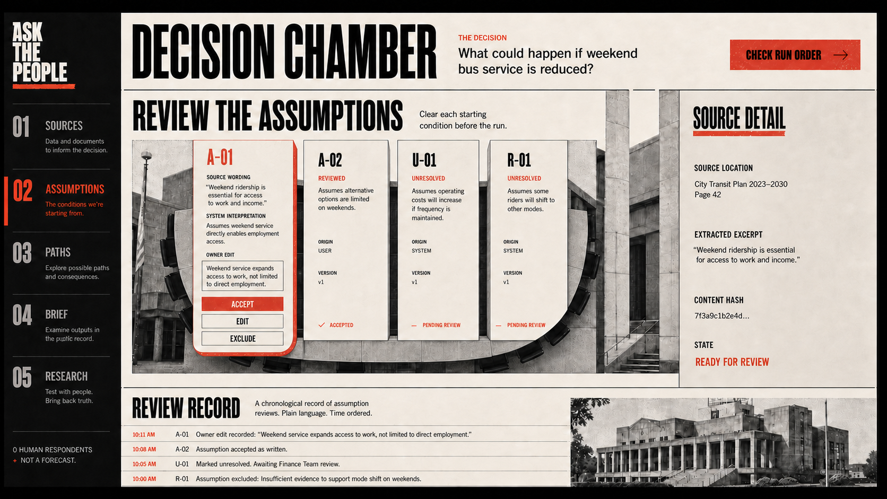
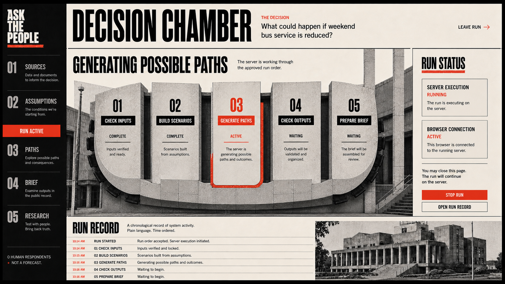
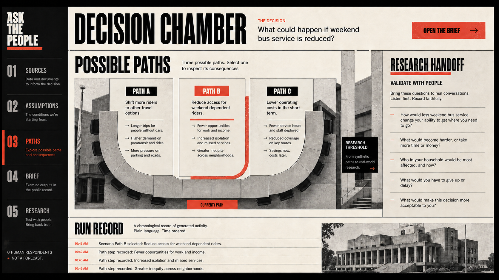
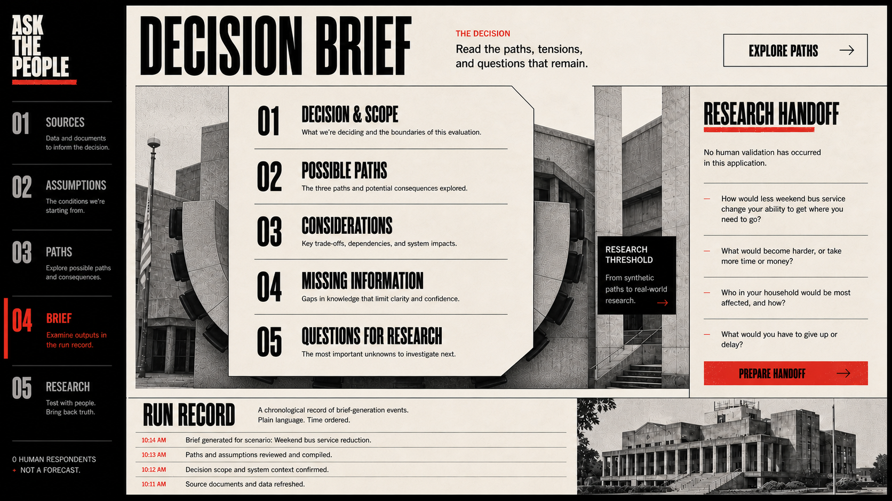
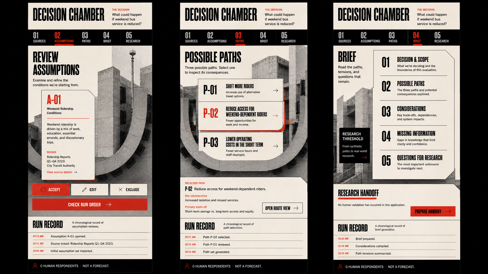
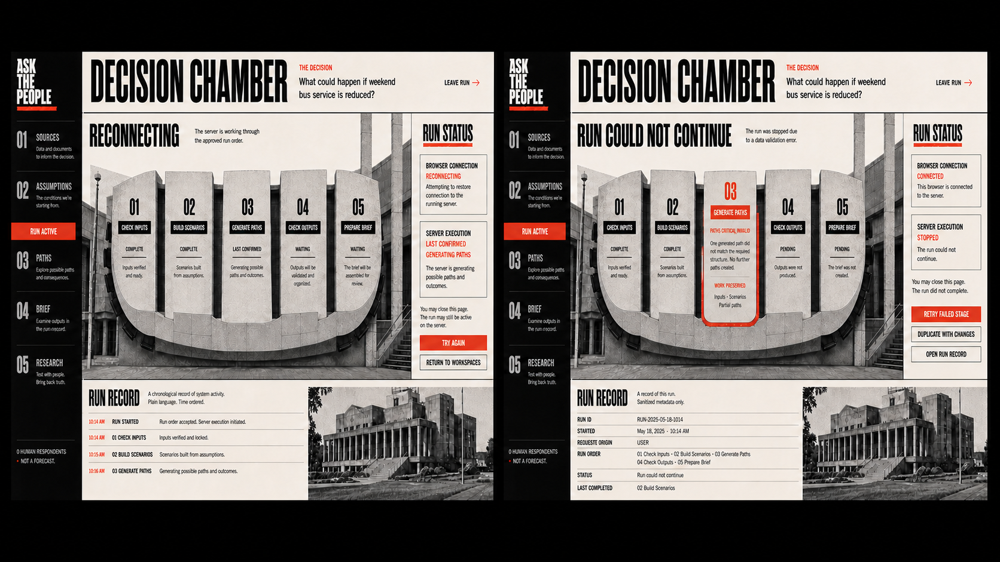

# Decision Workspace candidate state pack v2

This pack explores how one visual chamber changes state without becoming a
collection of unrelated dashboards. The product metaphor lives in the spatial
composition. User-facing actions remain direct and concrete.

## Review

The central chamber holds redline sheets. Source detail occupies the right
column. The bottom record contains review events only.

## Run

The curved chamber becomes a five-stage server process. Browser connection and
server execution remain separate in the right column. No percentage or
duration is shown.

## Possible Paths

Three paths receive equal visible weight. The selected path receives one red
incision. Research questions remain beyond the synthetic-path threshold.

## Brief and research handoff

The arena becomes one monumental editorial brief. The handoff remains visibly
separate and states that no human validation occurred in the application.

## Mobile

Mobile preserves the masthead, phase strip, architectural crop, sculptural
sheet geometry, and record. It uses a complete list-first path experience and
does not miniaturize the desktop route plate.

## Failure and reconnection

Recovery states keep the chamber visible. Reconnection does not imply that the
server stopped. Failure exposes a stable error code, preserved work, and safe
next actions without raw logs.

## Generation brief

The pack was generated through the built-in image-generation workflow using
the approved Possible Paths reference as the visual source. Each prompt bound
the output to the carbon, warm-cream, signal-red, and restrained-yellow
palette; monumental condensed typography; hard rules; paper grain; numbered
spine; sculptural architectural crop; asymmetric context column; and bottom
chronological record. Prompts prohibited probability, popularity, confidence
scores, public-authority cues, raw logs, avatar audiences, generic rounded SaaS
cards, gradients, glass, glow, and cyberpunk styling.

These images are composition references. The production interface must be
implemented from semantic HTML, canonical API contracts, responsive CSS, and
accessible interactions rather than raster assets.
