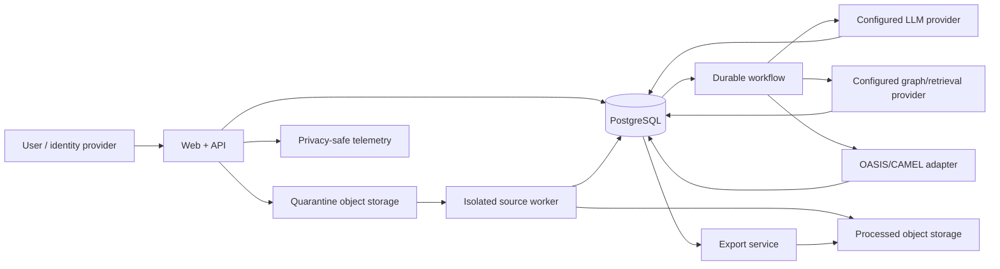

# Data Map

> **Document authority.** The capitalized terms **MUST**, **MUST NOT**, **SHOULD**,
> **SHOULD NOT**, and **MAY** are normative. A feature is not complete merely
> because the interface resembles the design; it must satisfy the domain,
> methodological, security, accessibility, and evidence requirements in this
> documentation system. Where this document conflicts with generated output,
> legacy copy, or an implementation convenience, this document controls until
> superseded through an approved architecture or product decision record.
> **Research status.** This document distinguishes binding product policy from
> external standards and research. External sources inform the requirements but
> do not automatically make the product compliant, valid, accurate, or fit for a
> particular legal jurisdiction. Legal and human-subject review remain separate
> launch responsibilities.

## Purpose

This data map records what the product processes, why, where it flows, who can
access it, and how it is deleted. It is an engineering and governance control.
It does not by itself establish a lawful basis or satisfy a jurisdiction's
privacy notice, DPIA, contract, or data-subject-right process.

ASKTHEPEOPLE follows data minimization: process the least data needed to explore
a decision and prepare research. The product is not designed to build long-term
profiles of real people.

## Roles and configurable legal basis

The product operator's role—controller, processor, service provider, contractor,
or other classification—depends on the deployment and contract. The
organization MUST configure and document:

- operating legal entity;
- customer/controller relationship;
- purpose and instructions;
- applicable jurisdictions;
- lawful basis where required;
- sensitive-data conditions;
- international transfer mechanism;
- privacy contact and escalation route.

Production MUST remain disabled for a region/customer class when these facts are
unresolved.

## Data-flow overview

## Privacy data map

Create and maintain a data map for:

| Data class | Examples | Sensitivity | Storage | Retention | Model exposure |
|---|---|---|---|---|---|
| Account data | name, email, role | Personal | Identity/DB | account life + policy | none/minimal |
| Source material | uploaded documents | potentially confidential/high | object storage | project life or workspace policy | minimum required segments |
| Extracted text | normalized source spans | same as source | DB/index | source life | scoped |
| Decision data | question, assumptions | confidential | DB | project life | scoped |
| Generated artifacts | profiles, paths, brief | confidential/synthetic | DB | project life | scoped |
| Invocation metadata | model, tokens, latency | operational | observability/DB | 30–90 days | n/a |
| Audit events | actor/action/time | security | immutable log | policy-defined | none |
| External human evidence | research results [Phase 2] | potentially sensitive/high | separate DB/storage | method/policy-defined | off by default |

Do not duplicate raw customer content in analytics or error tools.

## Canonical identity, membership, and adoption data

**CURRENT:** production identity is not yet organization/workspace scoped; the
project-specific status section below remains controlling evidence.

**TARGET:** the minimum canonical identity boundary stores:

| Record | Minimum fields | Purpose | Access and logging boundary |
|---|---|---|---|
| User | server UUIDv7, immutable public alias, bounded display name, status | stable internal identity | no password, token, email requirement, or complete provider claim |
| Identity subject | exact OIDC issuer, exact opaque subject, user ID, creation time | authenticate an existing user | bootstrap function only; never ordinary table reads, logs, telemetry, or evidence bundles |
| Organization membership | organization ID, user ID, closed role, status, version, actor/time | legal-policy tenancy and organization administration | scoped administrators/security; changes audited |
| Workspace membership | organization ID, workspace ID, user ID, closed role, status, version, actor/time | collaboration and project authorization | requires active organization membership; changes audited |
| Actor context | user/actor ID, organization/workspace/project scope, derived roles/capabilities, request ID, authentication method/time | one request or command | ephemeral; not copied into tokens or retained as a customer-content blob |
| Schema adoption | expected/observed schema hashes, revision, database identity hash, operator role, tool/version/time, evidence hash | prove safe migration lineage | operator only; no URL, credential, subject, alias, or customer name |
| Backfill batch/binding | input and legacy-tree hashes, counts, immutable public aliases, status/times, evidence hash | reconcile operator-approved legacy identity mapping | encrypted operator manifest stored outside ordinary logs; no source/decision/generated content copied |
| Cutover/audit | subsystem, state, release/evidence hashes, bounded actor/reason/request metadata, time | accountable activation, rollback boundary, investigation | append-only; privacy-safe metadata only |

Roles and capabilities are derived server-side from active memberships. OIDC
claims authenticate only `(issuer, subject)` and never establish organization,
workspace, project, role, or capability. Public aliases are operational
identifiers and remain confidential in ordinary telemetry; physical UUIDs are
never logged or exposed.

**TRANSITION:** adoption is operator-owned, dry-run first, hash bound, and
idempotent. The sensitive mapping manifest is not committed. It may contain
bounded organization/workspace names, exact issuer subjects, membership lists,
and legacy public aliases only for the adoption purpose. It MUST NOT be used to
infer customer relationships from filenames, directory ownership, email
domains, token claims, or aliases, and it MUST NOT copy source bytes, extracted
text, decisions, runs, reports, prompts, model output, or generated artifacts.
After reconciliation, temporary backfill access is revoked and the encrypted
manifest follows its approved retention class.

Identity and membership deletion or suspension is not implemented by silently
removing audit history. Status, retention, legal-hold, and account-rights
workflows determine whether identity links are disabled, anonymized, retained,
or deleted. Restore procedures must replay deletion obligations and must not
re-activate revoked memberships or credentials.

## Data minimization

- Ask only for information necessary to construct the decision.
- Do not require demographics.
- Do not infer protected or sensitive attributes.
- Redact secrets and obvious personal identifiers before model calls where they are not needed.
- Allow users to exclude source sections.
- Let users preview exactly what will be sent to the model for elevated-risk runs.
- Avoid provider-side conversation state for stage calls that do not need it.
- Store canonical artifacts once; do not copy full request bodies into logs.

## Retention and deletion

Implement configurable workspace policy. Recommended baseline:

- source assets and canonical project artifacts: retained until project/workspace deletion;
- soft-deleted items: recoverable for 30 days;
- hard deletion: queued after recovery period;
- operational logs: 30 days unless security policy requires longer;
- audit/security events: policy-defined, separated from content logs;
- temporary parsing artifacts: delete within 24 hours after successful processing;
- signed URLs: minutes, not days;
- backups: documented rolling window with eventual deletion guarantees;
- provider request retention: minimize using available controls and document actual provider behavior.

OpenAI states that API/business data is not used to train models by default and offers retention controls for eligible uses, but the build must verify current provider terms and endpoint behavior before launch.([OpenAI business data privacy](https://openai.com/business-data/))

Deletion must cover:

- database rows;
- object storage;
- vector/search indexes;
- caches;
- derived previews;
- exports under product control;
- queued jobs;
- provider-stored state where applicable;
- backup expiry documentation.

## PII and sensitive-data handling

- Show a pre-upload warning for personal, health, financial, legal, employment, education, and children’s data.
- Add optional detection/redaction before model use.
- Do not market the tool for regulated records without a separately approved compliance architecture and contracts.
- Flag highly sensitive content for elevated review.
- Do not expose PII in run titles, notifications, URLs, analytics properties, or email subjects.
- Make access to source text auditable.
- Allow workspace policy to disable source retention or external model use.

## Transparency and regulatory triggers

### EU AI Act Article 50

Beginning August 2, 2026, Article 50 transparency obligations apply to covered providers and deployers, including explicit notice for direct AI interaction and machine-readable marking of certain AI-generated content; public-interest AI-generated text can trigger deployer disclosure duties subject to human editorial-control exceptions and other scope details. ([EU AI Act Article 50](https://ai-act-service-desk.ec.europa.eu/en/ai-act/article-50))([European Commission Article 50 transparency guidance](https://digital-strategy.ec.europa.eu/en/library/guidelines-transparency-obligations-providers-and-deployers-ai-systems))

Product response:

- inform users when they interact with AI;
- visibly label generated artifacts;
- include machine-readable origin metadata;
- preserve human editorial approval records;
- conduct jurisdiction-specific legal review before EU launch;
- do not assume C2PA alone establishes compliance.

### California privacy and ADMT

California’s final privacy regulations became effective January 1, 2026, with certain ADMT significant-decision requirements beginning January 1, 2027.([California Privacy Protection Agency ADMT regulations](https://cppa.ca.gov/announcements/2025/20250923.html)) The product should remain outside significant-decision automation by policy, but privacy, risk-assessment, access, and opt-out obligations must be reviewed against actual use and business thresholds.

### Consumer-protection claims

No marketing or in-product claim of accuracy, efficacy, human equivalence, representativeness, bias freedom, or prediction may ship without competent, reliable, use-specific evidence. FTC actions against unsupported AI performance and substitution claims make this a release concern, not merely copy preference.([FTC Workado accuracy-claims order](https://www.ftc.gov/news-events/news/press-releases/2025/08/ftc-approves-final-order-against-workado-llc-which-misrepresented-accuracy-its-artificial))([FTC DoNotPay order](https://www.ftc.gov/news-events/news/press-releases/2025/02/ftc-finalizes-order-donotpay-prohibits-deceptive-ai-lawyer-claims-imposes-monetary-relief-requires))
## Data inventory

| Category | Examples | Source | Purpose | Primary stores | External recipients | Default privacy class |
|---|---|---|---|---|---|---|
| Account identity | name, work email, IdP subject | user/IdP | authentication, authorization, support | IdP, PostgreSQL | identity provider, email provider if configured | Personal |
| Organization metadata | organization, role, policy configuration | admin | tenancy, access, governance | PostgreSQL | none by default | Business confidential |
| Decision data | question, owner, constraints, intended use | user | scenario exploration | PostgreSQL | model provider only when stage requires | Business confidential |
| Source files | TXT in the first controlled slice; PDF/DOCX/Markdown/HTML/CSV/URL/OCR/image/archive unavailable | user upload | reviewed starting-condition extraction only | private quarantine/processed object storage | isolated scanner/parser; approved model provider only when explicitly enabled | Potentially sensitive |
| Source segments | normalized text, page/section | parser/user | reviewed provenance and retrieval | PostgreSQL/object store | configured providers as needed | Same as source |
| Assumptions and uncertainties | reviewed statements | user/model proposal | scenario construction | PostgreSQL | model provider | Business confidential |
| Generated profiles | functional constraints and criteria | model/user review | decision-lens application | PostgreSQL | model/simulation provider | Synthetic; may reflect sensitive context |
| Synthetic events and paths | actions, considerations, questions | model/simulation | scenario exploration | PostgreSQL/object store | model provider for later stages | Synthetic business data |
| Human research metadata | method, sample, dates, findings | optional future import | separate external-evidence register | PostgreSQL/object store | no provider by default | Potentially sensitive human data |
| Run metadata | model/prompt/schema IDs, timestamps, status, usage | system/provider | audit, reproducibility, operations | PostgreSQL | telemetry backend | Operational |
| Audit/security logs | actor, action, IP/security metadata, IDs | system | security, compliance, incident response | append-only log/telemetry | security provider | Security confidential |
| Support data | ticket, diagnostic bundle | user/support | support | support system | support provider | Varies; minimize |
| Billing data | plan, usage totals, payment reference | system/customer | billing | billing system | payment provider | Personal/financial metadata |
| Export/share data | artifact, recipient/share token | user/system | delivery | object store/PostgreSQL | authorized recipient | Same as artifact |
| Consent/attestation | authority, rights, policy acknowledgment | user | governance | PostgreSQL/audit | none by default | Personal/business |

## Purpose limitation

Data collected for a source-processing or run purpose MUST NOT be repurposed for:

- training a general model without explicit authorization;
- advertising or sale;
- building a real-person behavior profile;
- unrelated cross-customer retrieval;
- public benchmarking;
- employee/customer monitoring;
- political targeting;
- new product analytics requiring raw content.

A new purpose requires data-map, notice/contract, risk, retention, and
subprocessor review.

## Data minimization

### Decision and source intake

- Ask for functional context, not unnecessary identities.
- Warn before upload of regulated, confidential, or personal data.
- Provide redaction and source removal before model invocation.
- Do not infer protected traits.
- Do not make geographic or demographic detail mandatory unless materially
  relevant and approved.
- Keep original source only as long as the configured purpose requires.

### Generated profiles

Profiles MUST not contain real names, contact details, portraits, biographies,
or links to identifiable people. Sensitive attributes require justification and
review.

### Telemetry

Routine telemetry may include IDs, status, duration, error code, version, usage,
and hashed organization scope. It MUST NOT include:

- raw source text;
- full prompts;
- generated biographies or fictional quotations;
- credentials;
- access tokens;
- unredacted user email;
- human-research responses;
- hidden chain-of-thought.

## Access matrix

| Role | Decision/source content | Run outputs | Export | Audit/security | Privacy operations |
|---|---:|---:|---:|---:|---:|
| Owner/Admin | yes | yes | yes | limited org audit | request/manage |
| Editor | yes | yes | yes if granted | no | request own/project actions |
| Reviewer | reviewed inputs/outputs | yes | review only | no | no |
| Viewer | approved content only | yes | download if granted | no | no |
| Security | incident-scoped, just-in-time | incident-scoped | revoke | yes | hold |
| Privacy | request-scoped, minimized | request-scoped | revoke/delete | privacy events | yes |
| Support | masked by default; JIT approval | masked | no direct export | limited | no |
| Worker service | exact IDs and required objects | stage-specific | no | write safe telemetry | deletion-specific |
| Model provider | stage payload only | stage response | no | provider request ID | provider deletion where supported |

## Storage and encryption

- TLS for data in transit.
- Managed encryption at rest for databases/object storage.
- Separate production and nonproduction environments.
- Customer-managed keys MAY be offered; the key lifecycle and loss implications
  must be explicit.
- Backup encryption and restore permissions are reviewed.
- Export/share URLs use high-entropy, scoped, expiring tokens.
- Sensitive diagnostic data uses separate access and shorter retention.

## Data-subject and customer rights operations

The product MUST support authenticated workflows to:

- access/export account and project data;
- correct identity and user-authored data;
- delete or restrict processing subject to legal/contractual constraints;
- revoke shares;
- identify providers and storage locations involved;
- record identity verification, scope, decision, actions, and completion.

Generated synthetic data is still customer data and is included in project
export/deletion when applicable. Third-party source data may require separate
authority analysis.

## Sensitive and regulated data

V1 SHOULD prohibit or strongly restrict processing of:

- health records;
- financial account records;
- precise location histories;
- government identifiers;
- biometric templates;
- children's data;
- criminal/legal case files;
- employment evaluation records;
- confidential data without authority.

A regulated-data mode requires an approved deployment profile, contract,
provider configuration, security controls, incident obligations, and DPIA/risk
assessment. Marketing MUST NOT imply HIPAA, FERPA, GLBA, GDPR, or other
compliance merely because a provider advertises a certification.

## Privacy risk assessment triggers

Complete a DPIA or equivalent review when:

- sensitive data is processed at scale;
- systematic monitoring or profiling is proposed;
- real-person or human-research evidence is introduced;
- a new jurisdiction or residency pattern is enabled;
- a new provider receives source content;
- profiles use sensitive attributes;
- automated decision support moves toward high-impact use;
- cross-project retrieval is introduced;
- data is used to train or improve models;
- retention materially increases.

## International transfers

Before enabling a provider or region, record:

- data origin and destination;
- legal entities and roles;
- transfer mechanism;
- supplementary measures;
- subprocessor locations;
- access request/government disclosure terms;
- customer controls;
- data residency limitations.

## Privacy acceptance

- data inventory matches code, providers, and telemetry;
- every field has purpose, class, owner, and retention;
- no raw content appears in analytics by default;
- provider transfers are documented and configurable;
- access and deletion workflows are tested;
- sensitive-data warnings and blocks work;
- privacy notices and contracts match actual behavior;
- unresolved region/legal-basis/provider facts block production enablement.

## References

- [NIST Privacy Framework](https://www.nist.gov/privacy-framework) - Privacy risk-management framework; version 1.1 remained a draft/coming-soon work item at the research cutoff.
- [NIST AI Risk Management Framework 1.0 and GenAI Profile](https://www.nist.gov/itl/ai-risk-management-framework) - Voluntary framework and GenAI profile for governing, mapping, measuring, and managing AI risk.
- [European Commission Article 50 transparency guidelines](https://digital-strategy.ec.europa.eu/en/library/guidelines-transparency-obligations-providers-and-deployers-ai-systems) - Final July 2026 guidance on transparency obligations that apply from 2 August 2026.

---

## Project-specific data-map status (baseline `8b616dc7`)

The current code processes the data flows below. Gate 3 (multi-tenant
isolation + canonical persistence + object storage) and gate 0
(zero-trust source ingestion) are required to land before the data
map is complete in production. Items are marked **CURRENT**,
**PARTIAL**, or **TARGET**. See
[`docs/architecture/index.md`](../architecture/index.md) for the
legend.

### Source material — PARTIAL (gate 0)

- User uploads to `backend/uploads/projects/{project_id}/files/...`
  via [`api/graph.py`](../../backend/app/api/graph.py) +
  [`models/project.py:247-278`](../../backend/app/models/project.py:247).
- Original filename is captured but not exposed downstream.
- Extracted text written to `extracted_text.txt`
  ([`models/project.py:280-296`](../../backend/app/models/project.py:280)).
- No quarantine, no MIME/signature check, no malware scan. The
  full
  [`adr/ADR-0005-zero-trust-source-ingestion.md`](../architecture/adr/ADR-0005-zero-trust-source-ingestion.md)
  state machine is TARGET.

### Subprocessor calls — PARTIAL

The repo README and the
[`SUBPROCESSORS.md`](SUBPROCESSORS.md) doc list configured
subprocessors. Each LLM call goes through
[`utils/llm_client.py`](../../backend/app/utils/llm_client.py) and
the provider config; each ZEP call goes through
[`services/zep_tools.py`](../../backend/app/services/zep_tools.py).
The current code does not record which subprocessor was used for
which call in a per-attempt manifest. That is **TARGET** and is
part of gate 3.

### Generated artifacts — CURRENT (storage) / TARGET (tenant isolation)

- Profile artifacts:
  [`services/oasis_profile_generator.py`](../../backend/app/services/oasis_profile_generator.py)
  writes to the simulation directory.
- Config artifacts:
  [`services/simulation_config_generator.py`](../../backend/app/services/simulation_config_generator.py)
  writes the YAML/JSON config used by the runner.
- Action records: per-platform SQLite DBs
  (`backend/uploads/simulations/{simulation_id}/*.db`).
- Reports:
  [`services/report_agent.py`](../../backend/app/services/report_agent.py)
  writes a JSON/Markdown report per `report_id` directory.

The storage substrate is filesystem. Reaching the contract requires
private object storage with environment/workspace-scoped keys,
quarantine/approved prefixes, and short-lived authorized URLs. Gate 3.

### No tenant boundary — TARGET (audit P1)

A valid `APP_TOKEN` can read and write every project, simulation,
report, and export. There is no `organization_id` or `workspace_id`
on any aggregate. The fix is
[`adr/ADR-0009-multi-tenant-isolation.md`](../architecture/adr/ADR-0009-multi-tenant-isolation.md)
plus
[`adr/ADR-0012-canonical-transactional-and-object-persistence.md`](../architecture/adr/ADR-0012-canonical-transactional-and-object-persistence.md).

### Deletion — PARTIAL

`ProjectManager.delete_project`
([`models/project.py:227-244`](../../backend/app/models/project.py:227))
calls `shutil.rmtree` synchronously. There is no retention policy,
no LEGAL_HOLD state, no provider-deletion step, and no backup aging
record. Reaching the deletion state machine in
[`docs/architecture/state-machines.md`](../architecture/state-machines.md)
requires the canonical persistence layer.

### Sensitive content in logs and traces — CURRENT (by design)

The `log_request` middleware never logs request bodies
([`app/__init__.py:111-123`](../../backend/app/__init__.py:111)).
The production stripping of tracebacks and 5xx error strings is in
place
([`app/__init__.py:198-226`](../../backend/app/__init__.py:198)).
The current behavior satisfies the doc's "no PII in logs" objective
at the wire today.

### Jurisdiction and lawful basis — PARTIAL

`config.py` exposes
[`CORS_ORIGINS`](../../backend/app/config.py),
`REQUIRE_APP_AUTH`, `APP_TOKEN`, `SECRET_KEY`, and
`TRUST_X_REAL_IP` (line 30-39 of `app/__init__.py`). The current
configuration does not carry an explicit jurisdiction, a lawful
basis, or a per-region data-residency policy. These are
**TARGET** and land with gate 3.
