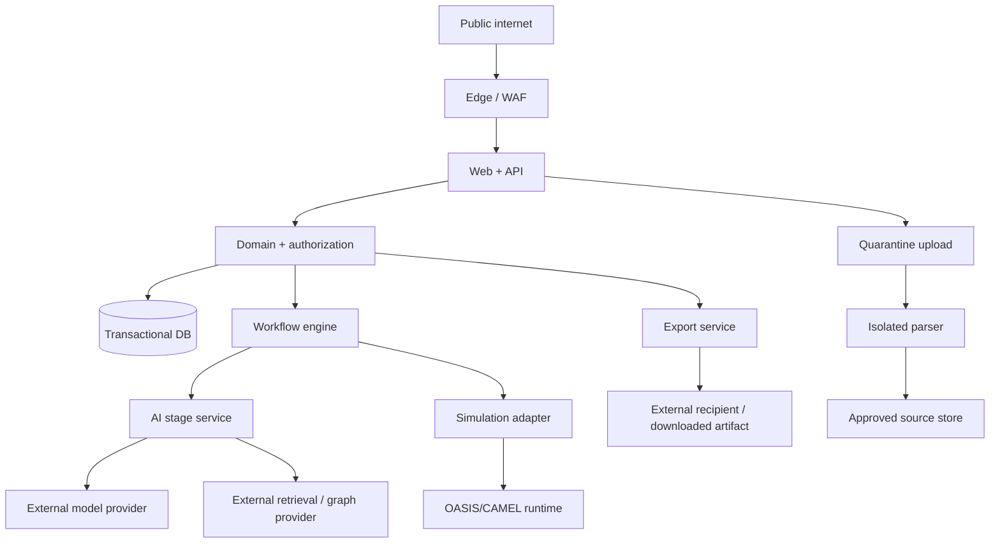

# Threat Model

> **Document authority.** The capitalized terms **MUST**, **MUST NOT**, **SHOULD**,
> **SHOULD NOT**, and **MAY** are normative. A feature is not complete merely
> because the interface resembles the design; it must satisfy the domain,
> methodological, security, accessibility, and evidence requirements in this
> documentation system. Where this document conflicts with generated output,
> legacy copy, or an implementation convenience, this document controls until
> superseded through an approved architecture or product decision record.
> **Research status.** This document distinguishes binding product policy from
> external standards and research. External sources inform the requirements but
> do not automatically make the product compliant, valid, accurate, or fit for a
> particular legal jurisdiction. Legal and human-subject review remain separate
> launch responsibilities.

## Scope

This threat model covers:

- authenticated web application and APIs;
- source upload, quarantine, parsing, OCR, and extraction;
- model, retrieval, graph-memory, and simulation providers;
- durable run orchestration and workers;
- PostgreSQL, object storage, caches, and observability;
- exports, clipboard, shared links, and social previews;
- administration, support, CI/CD, secrets, and dependencies;
- misuse that turns synthetic output into deceptive human evidence.

It does not assume that model prompts, RAG, or model safety features are security
boundaries.

## Security objectives

1. Prevent unauthorized access across organizations, projects, runs, and sources.
2. Prevent untrusted source content from becoming instruction or code.
3. Prevent model output from executing or invoking unauthorized actions.
4. Preserve the Product Truth Contract and provenance.
5. Keep secrets and sensitive content out of logs and analytics.
6. Bound cost, concurrency, output size, and provider exposure.
7. Detect, contain, recover from, and learn from incidents.
8. Keep completed run history tamper-evident and auditable.

## Assets

| Asset | Impact if compromised |
|---|---|
| Uploaded source material | confidentiality, rights, commercial sensitivity |
| Decision questions and assumptions | strategic confidentiality |
| Generated profiles, paths, and briefs | manipulation, deception, reputation |
| Identity, membership, and role data | account takeover, tenant access |
| Provider/API credentials | data exfiltration, cost abuse |
| Prompt, policy, schema, and validator releases | systemic behavior manipulation |
| Run/event/provenance history | audit and claim integrity |
| Exports and share links | detached misinformation |
| Deletion and retention records | privacy and contractual breach |
| CI/CD and deployment controls | supply-chain compromise |

## Trust boundaries

Crossing any boundary requires authentication, authorization, validation,
least privilege, safe serialization, and audit evidence appropriate to the
data class.

## Threat actors

- malicious or curious tenant user;
- compromised tenant account;
- external attacker;
- source-document author controlling indirect prompt content;
- malicious or compromised model/provider/subprocessor;
- compromised dependency or CI account;
- insider with support/admin access;
- accidental operator error;
- downstream recipient stripping disclosure;
- customer attempting prohibited political, high-impact, or deceptive use.

## Threat methodology

Use STRIDE for technical security and LINDDUN-style privacy analysis. AI-specific
review also covers prompt injection, sensitive-information disclosure, supply
chain, data/model poisoning, improper output handling, excessive agency,
embedding weakness, misinformation, and unbounded consumption.

## Threat model

Document the system using assets, actors, trust boundaries, abuse cases, mitigations, detection, and residual risk.

### High-value assets

- confidential source material;
- personal data in uploads;
- decision and strategy records;
- workspace membership and permissions;
- prompts and evaluation datasets;
- run artifacts and exports;
- signing keys and provenance manifests;
- provider credentials;
- audit records;
- billing and usage data.

### Threat actors

- malicious user in the same workspace;
- malicious user from another tenant;
- external attacker;
- compromised dependency or provider;
- malicious content author whose document is uploaded;
- careless authorized user;
- insider with excessive access;
- automated abuse or cost-exhaustion actor.

### Trust boundaries

- browser to web server;
- web server to database;
- web server to object storage;
- web server to queue;
- worker to source files;
- worker to model provider;
- model output to renderer;
- export service to downloadable artifact;
- tenant to tenant;
- product to external human-research process.

## Prompt-injection defenses

Prompt injection cannot be “solved” by telling the model to ignore it. Use defense in depth.

Required:

1. Treat source text, filenames, metadata, and user text as untrusted.
2. Separate system instructions from source content using explicit typed fields.
3. Never allow source content to define tools, URLs, callbacks, output schemas, or tenant identifiers.
4. Do not give source-processing stages external tools.
5. Disable worker outbound network access unless a narrowly required allowlist is documented.
6. Detect suspicious instruction patterns and surface them as source flags.
7. Use strict structured output and post-validation.
8. Restrict provider context to the minimum required source segments.
9. Prevent prompt or secret disclosure through response filters and evals.
10. Require human approval before extracted content becomes a run input.
11. Test direct, indirect, multilingual, encoded, hidden, table-based, and image/OCR injection cases.
12. Log detections and affected asset hashes.

OWASP explicitly describes indirect injection through attacker-controlled files or external content and recommends least privilege, input separation, output validation, and adversarial testing.([OWASP LLM01:2025 Prompt Injection](https://genai.owasp.org/llmrisk/llm01-prompt-injection/))

## File-upload security

Required controls:

- allowlisted extensions;
- MIME and file-signature validation;
- randomized object keys;
- file-size and page limits;
- decompression limits;
- malware scanning;
- isolated parsing;
- no execution permissions;
- no public bucket access;
- short-lived signed URLs;
- authorization checked before signing and downloading;
- strip active content where possible;
- quarantine until checks complete;
- safe failure and deletion;
- audit events for upload, parse, access, and removal.

Reject password-protected or encrypted documents in v1 unless a secure, separately designed flow exists.

## Tenant isolation

Tenant isolation is a P0 requirement.

- All tenant-owned records include `workspace_id`.
- Use row-level security where compatible with the stack and still keep explicit application authorization.
- Every job rehydrates workspace scope from the run record.
- Every object-storage key is namespaced by environment and workspace.
- Embeddings and retrieval indexes are partitioned or filtered by server-controlled tenant keys.
- Cache keys include tenant and authorization scope.
- Search indexes do not contain globally queryable customer text.
- Shared links use unguessable tokens, explicit artifact scope, expiration, and revocation.
- Cross-tenant integration and security tests are mandatory.

## Model-output handling

Never:

- execute generated code;
- interpolate generated SQL;
- build shell commands from output;
- trust generated file paths;
- render raw generated HTML;
- use generated URLs for server fetching;
- use output to select an unrestricted tool;
- allow output to change authorization;
- allow a generated role or policy to become executable configuration.

Render model strings as text inside trusted components. Parameterize database operations. If Markdown is supported, parse through an allowlist renderer with raw HTML disabled.

## Web application security

At minimum:

- secure, `HttpOnly`, `SameSite` cookies where cookie auth is used;
- CSRF protection for state-changing requests;
- strict Content Security Policy with no unnecessary `unsafe-inline` or `unsafe-eval`;
- output encoding and XSS defenses;
- secure headers;
- server-side validation for all payloads;
- rate limiting by user, workspace, IP risk, and expensive operation;
- brute-force and credential-stuffing defenses delegated to a mature identity provider;
- session revocation and device/session visibility;
- authorization on every object read/write;
- SSRF defenses and outbound egress restrictions;
- dependency and container scanning;
- lockfile integrity;
- secret scanning;
- signed webhooks with replay protection;
- audit logging for privileged changes;
- backup encryption and restore testing.

## Excessive agency boundary

The production model may propose and generate content. It may not autonomously:

- publish a brief;
- send email;
- recruit or contact people;
- create external studies;
- change workspace policy;
- invite members;
- delete data;
- purchase services;
- fetch arbitrary URLs;
- execute code;
- update the final decision;
- import human evidence;
- approve its own outputs.

OWASP identifies excessive functionality, permissions, and autonomy as root causes of damaging agent behavior.([OWASP LLM06:2025 Excessive Agency](https://genai.owasp.org/llmrisk/llm062025-excessive-agency/))
## Priority threat register

| ID | Threat | Attack path | Required controls | Residual-risk owner |
|---|---|---|---|---|
| T-01 | Cross-tenant read | guessed ID, missing query scope, worker payload | domain authz, RLS, scoped object keys, negative tests | Security |
| T-02 | Cross-tenant generation | injected/retrieved foreign segment | tenant filter before retrieval, allowlisted IDs, validator | AI Security |
| T-03 | Indirect prompt injection | uploaded PDF/HTML/image | quarantine, isolation, delimiting, no tools, review, red-team | AI Security |
| T-04 | Parser compromise | crafted PDF/DOCX/archive | sandbox, no network, limits, patched parsers, CDR | Security |
| T-05 | Model-output XSS/SSRF | generated Markdown/URL/HTML | text-first render, sanitizer, URL allowlist, no execution | AppSec |
| T-06 | Excessive agency | model tool invocation | deny-by-default tools, no writes in V1, code authorization | Architecture |
| T-07 | Truth-layer stripping | crop/copy/export/API consumer | component labels, clipboard suffix, manifest, export validation | Product Truth |
| T-08 | Provider data leak | provider terms/config/incident | minimization, provider review, regional config, kill switch | Privacy |
| T-09 | Cost denial of service | huge files, paths, retries | quotas, page/token limits, budgets, rate limits | SRE |
| T-10 | Workflow replay/duplication | repeated queue/event | idempotency, event sequence, unique constraints | Platform |
| T-11 | Prompt/model supply-chain change | alias drift or compromised release | immutable releases, signed CI, eval canary, rollback | AI Platform |
| T-12 | Audit tampering | admin/database change | append-only events, restricted roles, hashes, external log sink | Security |
| T-13 | Secret disclosure | logs, errors, prompt, client bundle | secret manager, redaction, scanning, safe errors | SRE |
| T-14 | Formula injection | CSV export | neutralize leading formula characters, content disposition | AppSec |
| T-15 | Share-link enumeration | weak token or long lifetime | high-entropy token, scope, expiry, revocation, no indexing | AppSec |
| T-16 | Malicious support access | broad internal tooling | just-in-time access, approval, audit, data masking | Security |
| T-17 | Deletion overclaim | backups/provider copies remain | deletion state machine, truthful status, provider confirmation | Privacy |
| T-18 | Unsupported accuracy claim | marketing or UI drift | claim registry, copy lint, approval, incident playbook | Legal/Product |

## Web and API requirements

- OIDC/OAuth session with secure, HTTP-only, same-site cookies or equivalent.
- CSRF protection for cookie-authenticated mutations.
- Strict CORS allowlist.
- Content Security Policy; no unsafe inline script unless nonce/hash controlled.
- Output encoding and safe Markdown renderer.
- Request body, header, query, and file size limits.
- Per-user, per-organization, per-IP, and per-provider rate controls.
- Idempotency keys for mutating commands.
- Object-level authorization on every request.
- Stable safe error responses.
- Secrets from an approved secret manager.
- SAST, dependency, container, IaC, and secret scanning in CI.
- Signed or attestable build artifacts where supported.
- Production admin endpoints are private, strongly authenticated, and audited.

## AI-specific security requirements

- Source material is data, never instruction.
- The model receives no broad database query, shell, email, browser, or network
  tool in V1.
- Tool calls pass through code authorization and schema validation.
- Retrieved content is scoped by organization, project, source version, and
  approved segment IDs before similarity ranking.
- Output is not directly rendered as HTML, used as SQL, file path, shell
  command, URL fetch target, or authorization decision.
- A model cannot decide use-policy outcome, tenant scope, retention, deletion,
  or export disclosure.
- Prompts and tools are immutable releases.
- Cross-model critics do not share secrets or expand permissions.
- Security detectors are defense in depth; no detector is described as
  foolproof.

## Security testing

## Security test suites

- direct prompt injection;
- indirect injection in PDF, DOCX, TXT, tables, filenames, OCR images, and metadata;
- system-prompt exfiltration attempts;
- cross-tenant vector retrieval;
- malicious Markdown/HTML output;
- oversized and compressed upload attacks;
- path traversal filenames;
- MIME spoofing;
- SSRF through generated URLs;
- job replay and duplicate idempotency keys;
- share-token guessing/reuse;
- privilege escalation;
- CSRF;
- stored and reflected XSS;
- rate-limit and cost-exhaustion abuse;
- dependency and secret scanning.

## Accessibility testing

CI:

- semantic lint;
- automated axe checks on key routes;
- color-token contrast tests;
- keyboard-focused component tests;
- reduced-motion tests;
- export heading/reading-order checks where automatable.

Manual before release:

- keyboard traversal with visible focus;
- NVDA/Firefox or Chrome;
- VoiceOver/Safari;
- 320px and 200% zoom;
- route map/list parity;
- dialog focus containment and restoration;
- live status announcements;
- forced-colors mode;
- PDF or share-view reading order.

Zero critical or serious accessibility defects are permitted at launch.
## Secrets and key management

- Separate keys by environment and provider.
- Scope keys to required endpoints/models where provider supports it.
- Rotate on schedule and immediately after suspected exposure.
- Do not store keys in `.env` in deployed environments, repository, database,
  prompts, or client bundle.
- Workers receive short-lived scoped credentials.
- Signing keys are separated from application credentials.
- Break-glass access requires two-person approval and expires automatically.

## Security review gates

A security review is required for:

- a new file type or parser;
- new provider or model;
- any model tool with write/network capability;
- new cross-project or cross-run search;
- new public share/export format;
- new sensitive attribute;
- change to tenant model or admin tooling;
- change to retention/deletion;
- new external human-evidence integration;
- a critical dependency or framework migration.

## Security acceptance

- no open critical or high vulnerability without time-bounded approved exception;
- 100% tenant-isolation suite pass;
- 100% critical prompt-injection containment on maintained corpus;
- no unauthorized tool execution;
- parser sandbox denies outbound network;
- secrets scan clean;
- critical incident kill switches tested;
- backup restore and access controls tested;
- export/disclosure stripping tests pass;
- penetration test findings remediated or explicitly accepted by accountable
  security owner.

## References

- [OWASP LLM01:2025 Prompt Injection](https://genai.owasp.org/llmrisk/llm01-prompt-injection/) — Direct, indirect, and multimodal prompt-injection risks and defense-in-depth recommendations.
- [OWASP Application Security Verification Standard](https://owasp.org/www-project-application-security-verification-standard/) — Web-application security verification baseline.
- [NIST AI Risk Management Framework 1.0 and GenAI Profile](https://www.nist.gov/itl/ai-risk-management-framework) — Voluntary framework and GenAI profile for governing, mapping, measuring, and managing AI risk.
- [NIST SP 800-61 Rev. 3](https://csrc.nist.gov/pubs/sp/800/61/r3/final) — Final incident-response recommendations aligned with CSF 2.0.
